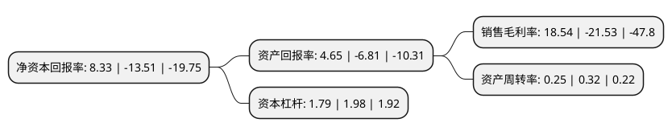

> 本页面由自动化程序生成于 2022年5月20日 01:09
> 内容可能存在错误，如有bug请提交issue至：https://github.com/Eroleice/doc-pi/issues
{.is-warning}

# 上市公司基本情况

## 基本资料

江苏辉丰生物农业股份有限公司（以下简称“辉丰股份”）成立于1989年05月26日，盐城市。于2010年11月09日在深交所中小板上市。

辉丰股份注册资本150,758.968万元，从事化学农药产品的研发，生产及销售，主要产品包括二氰蒽醌，咪鲜胺，辛酰溴苯腈，氟环唑原药，吡氟酰草胺，三氟氯氰酸，联苯菊酯和烯酰吗啉等。以下是详细信息：

- 公司名称: 江苏辉丰生物农业股份有限公司
- 股票代码: 002496.SZ
- 所在地: 江苏 - 盐城市
- 成立日期: 1989年05月26日
- 注册资本: 150,758.968万元
- 法定代表人: 仲汉根
- 主营业务: 从事化学农药产品的研发，生产及销售，主要产品包括二氰蒽醌，咪鲜胺，辛酰溴苯腈，氟环唑原药，吡氟酰草胺，三氟氯氰酸，联苯菊酯和烯酰吗啉等
- 公司官网: www.hfagro.com
- 公司介绍: 公司系国家农药定点骨干生产企业、国家火炬计划重点高新技术企业。经过多年的拼搏发展，已成为集研发、生产、国内国际贸易于一体的全国知名农药企业，具有合成原药、加工、复配制剂数万吨的生产能力，成为行业领先的咪鲜胺原药、辛酰溴苯腈原药、氟环唑原药等研发和产业化基地。公司在行业内率先通过ISO9001标准质量体系认证、ISO14001环保管理体系认证以及OHSAS18001职业健康安全管理体系认证，成为亚太地率先通过跨国公司着力推行的以Q/EHS为核心的责任关怀体系认证的企业，并与多家全球农药行业排名前几位的跨国公司建立了战略合作关系。

## 股东及高管情况

上市公司第一大股东为仲汉根，持股482,631,953股，占比32.01%，为上市公司实际控制人。

截至2022年03月31日，上市公司的前十大股东中，共有9名自然人股东，1个产品账户，其中5%以上大股东共有3名。上市公司前十大股东明细如下：

> 截至2022年03月31日，上市公司前十大股东信息如下：

| 股东名称 | 持股数量（股） | 持股比例 |
| --- | --- | --- |
| 仲汉根 | 482,631,953 | 32.01% |
| 苏仕 | 78,000,000 | 5.17% |
| 张宏德 | 76,000,000 | 5.04% |
| 仲玉容 | 35,249,300 | 2.34% |
| 江苏辉丰农化股份有限公司-第一期员工持股计划 | 30,595,320 | 2.03% |
| 唐中义 | 12,606,576 | 0.84% |
| 余峰 | 8,322,540 | 0.55% |
| 刘军 | 6,265,900 | 0.42% |
| 季自汉 | 5,604,100 | 0.37% |
| 余秋芬 | 5,313,050 | 0.35% |

## 利润表分析

上市公司2021年总收入为10.95亿元，净利润为2.03亿元，实现盈利。

## 杜邦分析

> 数据列示周期：2021年 | 2020年 | 2019年
{.is-info}

上市公司的净资产收益率在近一年有所下降，下降幅度为-161.66%，其变化情况分解如下：
- 上市公司的销售毛利率在近一年下降了-186.11%，可能是生产效率的下降、商品原材料价格上涨或商品价格的下跌所致。
- 上市公司的资产周转率在近一年下降了-21.87%，可能是源自于更慢的销售回款或库存管理效果下降。
- 上市公司的财务杠杆比率在近一年下降了-9.6%，可能是减少负债降低财务费用。

