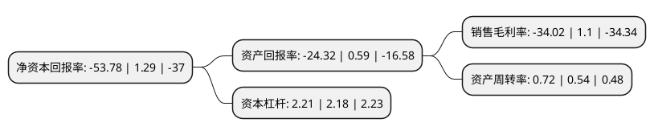

> 本页面由自动化程序生成于 2022年5月20日 01:09
> 内容可能存在错误，如有bug请提交issue至：https://github.com/Eroleice/doc-pi/issues
{.is-warning}

# 上市公司基本情况

## 基本资料

江苏蓝丰生物化工股份有限公司（以下简称“蓝丰生化”）成立于1990年10月11日，徐州市。于2010年12月03日在深交所中小板上市。

蓝丰生化注册资本34,008.628万元，主要产品:多菌灵，甲基硫菌灵，苯菌灵，环嗪酮，吡唑草胺，精胺，氯甲酸甲酯，氯甲酸乙酯等。主营业务:杀虫剂原药及剂型，杀菌剂原药及剂型，除草剂原药及剂型，精细化工中间体的生产，销售，出口。以下是详细信息：

- 公司名称: 江苏蓝丰生物化工股份有限公司
- 股票代码: 002513.SZ
- 所在地: 江苏 - 徐州市
- 成立日期: 1990年10月11日
- 注册资本: 34,008.628万元
- 法定代表人: 刘智
- 主营业务: 主要产品:多菌灵，甲基硫菌灵，苯菌灵，环嗪酮，吡唑草胺，精胺，氯甲酸甲酯，氯甲酸乙酯等主营业务:杀虫剂原药及剂型，杀菌剂原药及剂型，除草剂原药及剂型，精细化工中间体的生产，销售，出口
- 公司官网: www.jslanfeng.com
- 公司介绍: 公司是国内较大的以光气为原料生产农药的企业，在国内率先研发并生产甲基硫菌灵、环嗪酮、苯菌灵等产品。公司主要生产杀虫剂、杀菌剂、除草剂及精细化工中间体四大系列产品。公司在苏州建立研发中心，发挥公司拥有“省级工程技术研究中心和博士后创新实践基地”的优势，大力引进和培养创新型人才，实施科技进步和技术创新战略，以提升蓝丰的品牌价值、增强国内外市场的竞争力。

## 股东及高管情况

上市公司第一大股东为江苏苏化集团有限公司，持股34,334,137股，占比10.1%，**疑似为**上市公司实际控制人。

截至2022年03月31日，上市公司的前十大股东中，共有1名自然人股东，8名机构股东，1个海外主体，其中5%以上大股东共有5名。上市公司前十大股东明细如下：

> 未能通过持股比例判定出上市公司实际控制人（持股30%以上）
> 可能存在通过间接持股、联合持股、协议控制等方式拥有实际控制权的主体，具体请参考上市公司定期公告！
{.is-warning}

> 截至2022年03月31日，上市公司前十大股东信息如下：

| 股东名称 | 持股数量（股） | 持股比例 |
| --- | --- | --- |
| 江苏苏化集团有限公司 | 34,334,137 | 10.1% |
| 海南锦穗国际控股有限公司 | 34,000,000 | 10% |
| 王宇 | 33,610,001 | 9.88% |
| 苏州格林投资管理有限公司 | 33,123,295 | 9.74% |
| 新沂市华益投资管理有限公司 | 31,437,620 | 9.24% |
| TBP Noah Medical Holdings (H.K.) Limited | 11,601,123 | 3.41% |
| 长城国融投资管理有限公司 | 11,235,955 | 3.3% |
| 上海金重投资合伙企业(有限合伙) | 5,798,700 | 1.71% |
| 北京中金国联盈泰投资发展中心(有限合伙) | 4,682,247 | 1.38% |
| 东吴证券股份有限公司 | 4,681,647 | 1.38% |

## 利润表分析

上市公司2021年总收入为14.43亿元，净利润为-4.92亿元，**未实现盈利**。

## 杜邦分析

> 数据列示周期：2021年 | 2020年 | 2019年
{.is-info}

上市公司的净资产收益率在近一年有所下降，下降幅度为-4268.99%，其变化情况分解如下：
- 上市公司的销售毛利率在近一年下降了-3192.73%，可能是生产效率的下降、商品原材料价格上涨或商品价格的下跌所致。
- 上市公司的资产周转率在近一年上升了33.33%，可能是源自于更快的销售回款或库存管理效果提升。
- 上市公司的财务杠杆比率在近一年上升了1.38%，可能是增加负债扩大生产规模。

