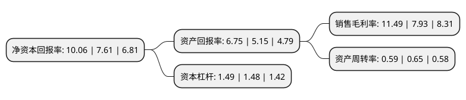

> 本页面由自动化程序生成于 2022年5月20日 01:10
> 内容可能存在错误，如有bug请提交issue至：https://github.com/Eroleice/doc-pi/issues
{.is-warning}

# 上市公司基本情况

## 基本资料

安徽省司尔特肥业股份有限公司（以下简称“司尔特”）成立于1997年11月05日，宣城市。于2011年01月18日在深交所中小板上市。

司尔特注册资本85,355.576万元，主营业务为高浓度磷复肥及专用肥生产与销售，主要产品为NPK复合肥，磷酸一铵，可统称为磷复肥产品。以下是详细信息：

- 公司名称: 安徽省司尔特肥业股份有限公司
- 股票代码: 002538.SZ
- 所在地: 安徽 - 宣城市
- 成立日期: 1997年11月05日
- 注册资本: 85,355.576万元
- 法定代表人: 朱国全
- 主营业务: 主营业务为高浓度磷复肥及专用肥生产与销售，主要产品为NPK复合肥，磷酸一铵，可统称为磷复肥产品
- 公司官网: www.sierte.com
- 公司介绍: 公司是一家集磷复肥生产、各类化肥贸易为一体的现代化高科技股份公司。主要产品为高浓度缓释NPK复合肥系列产品以及磷酸一铵，中间产品包括硫酸、磷酸等。公司是安徽省最大的高浓度磷复肥生产和出口基地之一，中国化肥百强企业、安徽企业五十强、中国磷复肥行业十强。公司“司尔特”牌系列优质复合肥先后荣获“国家重点新产品”、“全国用户满意产品”、“全国无公害农产品生产用肥”、“全国供销合作总社名牌产品”、“安徽省名牌产品”、“安徽省高新技术产品”等称号，产品畅销全国。

## 股东及高管情况

上市公司第一大股东为国购产业控股有限公司，持股182,050,800股，占比21.33%，**疑似为**上市公司实际控制人。

截至2022年04月11日，上市公司的前十大股东中，共有5名自然人股东，4名机构股东，1个产品账户，其中5%以上大股东共有3名。上市公司前十大股东明细如下：

> 未能通过持股比例判定出上市公司实际控制人（持股30%以上）
> 可能存在通过间接持股、联合持股、协议控制等方式拥有实际控制权的主体，具体请参考上市公司定期公告！
{.is-warning}

> 截至2022年04月11日，上市公司前十大股东信息如下：

| 股东名称 | 持股数量（股） | 持股比例 |
| --- | --- | --- |
| 国购产业控股有限公司 | 182,050,800 | 21.33% |
| 安徽省宁国市农业生产资料有限公司 | 81,951,500 | 9.6% |
| 安徽省宁国市农业生产资料有限公司 | 74,870,000 | 8.7715% |
| 金国清 | 24,560,000 | 2.88% |
| 安徽省宁国建设投资集团有限公司 | 17,303,900 | 2.03% |
| 杨六明 | 8,953,900 | 1.05% |
| 广州市玄元投资管理有限公司-玄元元定9号私募证券投资基金 | 6,918,223 | 0.81% |
| 李文芳 | 6,020,882 | 0.71% |
| 汤耀光 | 5,438,500 | 0.64% |
| 张万 | 3,597,500 | 0.42% |

## 利润表分析

上市公司2021年总收入为39.89亿元，净利润为4.58亿元，实现盈利。

## 杜邦分析

> 数据列示周期：2021年 | 2020年 | 2019年
{.is-info}

上市公司的净资产收益率在近一年有所上升，上升幅度为32.19%，其变化情况分解如下：
- 上市公司的销售毛利率在近一年上升了44.89%，可能是生产效率的提升、商品原材料价格下跌或商品价格的上涨所致。
- 上市公司的资产周转率在近一年下降了-9.23%，可能是源自于更慢的销售回款或库存管理效果下降。
- 上市公司的财务杠杆比率在近一年上升了0.68%，可能是增加负债扩大生产规模。

