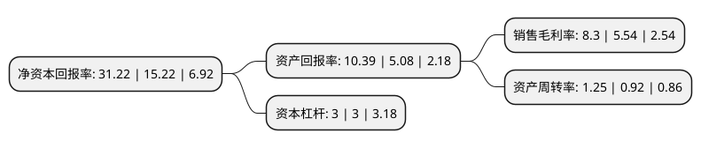

> 本页面由自动化程序生成于 2022年5月20日 01:10
> 内容可能存在错误，如有bug请提交issue至：https://github.com/Eroleice/doc-pi/issues
{.is-warning}

# 上市公司基本情况

## 基本资料

成都云图控股股份有限公司（以下简称“云图控股”）成立于1995年08月31日，成都市。于2011年01月18日在深交所中小板上市。

云图控股注册资本101,010万元，主营业务;主要从事复合肥，纯碱，氯化铵和盐的生产和销售。主要产品:涵盖6大系列70多个品种的复肥产品以及氯化铵，盐和纯碱等。以下是详细信息：

- 公司名称: 成都云图控股股份有限公司
- 股票代码: 002539.SZ
- 所在地: 四川 - 成都市
- 成立日期: 1995年08月31日
- 注册资本: 101,010万元
- 法定代表人: 牟嘉云
- 主营业务: 主营业务;主要从事复合肥，纯碱，氯化铵和盐的生产和销售主要产品:涵盖6大系列70多个品种的复肥产品以及氯化铵，盐和纯碱等
- 公司官网: www.wintrueholding.com
- 公司介绍: 公司自成立以来一直专注于复合肥的生产和销售，并沿着复合肥产业链进行深度开发和市场拓展，积极探索稳定发展的新思路，公司通过多年来的资源整合、品牌运营、市场网络、研发能力、生产能力建设等举措，现已形成复合肥业务、调味品业务(食用盐及川菜调味品)协同发展的产业格局。复合肥业务为公司的传统核心业务，公司先后在四川眉山、湖北应城、湖北宜城、河南宁陵、山东平原、新疆昌吉、湖北松滋等多地建立复合肥生产基地，是中国复肥行业生产基地最多的供应商之一。食用盐业务是公司复合肥业务上游“盐-碱-肥”产业链的延伸和拓展。公司自2011年并购复合肥上游盐资源以来，重点发展了食用盐业务，致力为全中国消费者提供最优质的盐生活产品，为了进一步延伸产业链，公司结合自身地理位置优势，选择主攻与食用盐渠道高度一致的川菜调味品业务。

## 股东及高管情况

上市公司第一大股东为宋睿，持股308,532,949股，占比30.54%，为上市公司实际控制人。

截至2022年03月31日，上市公司的前十大股东中，共有2名自然人股东，2名机构股东，6个产品账户，其中5%以上大股东共有2名。上市公司前十大股东明细如下：

> 截至2022年03月31日，上市公司前十大股东信息如下：

| 股东名称 | 持股数量（股） | 持股比例 |
| --- | --- | --- |
| 宋睿 | 308,532,949 | 30.54% |
| 牟嘉云 | 106,212,000 | 10.51% |
| 成都云图控股股份有限公司-第二期员工持股计划 | 16,200,000 | 1.6% |
| 前海人寿保险股份有限公司-分红保险产品 | 16,000,000 | 1.58% |
| 泰康人寿保险有限责任公司-传统-普通保险产品-019L-CT001深 | 13,114,792 | 1.3% |
| 全国社保基金一零七组合 | 10,942,296 | 1.08% |
| 泰康人寿保险有限责任公司-投连-优选成长 | 10,744,695 | 1.06% |
| 全国社保基金六零四组合 | 10,661,400 | 1.06% |
| 泰康人寿保险有限责任公司-分红-个人分红-019L-FH002深 | 10,007,689 | 0.99% |
| 中国建设银行股份有限公司-浙商丰利增强债券型证券投资基金 | 10,000,000 | 0.99% |

## 利润表分析

上市公司2021年总收入为148.97亿元，净利润为12.37亿元，实现盈利。

## 杜邦分析

> 数据列示周期：2021年 | 2020年 | 2019年
{.is-info}

上市公司的净资产收益率在近一年有所上升，上升幅度为105.12%，其变化情况分解如下：
- 上市公司的销售毛利率在近一年上升了49.82%，可能是生产效率的提升、商品原材料价格下跌或商品价格的上涨所致。
- 上市公司的资产周转率在近一年上升了35.87%，可能是源自于更快的销售回款或库存管理效果提升。
- 上市公司的财务杠杆比率在近一年下降了0%，可能是减少负债降低财务费用。

