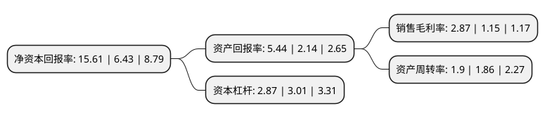

> 本页面由自动化程序生成于 2022年5月20日 01:10
> 内容可能存在错误，如有bug请提交issue至：https://github.com/Eroleice/doc-pi/issues
{.is-warning}

# 上市公司基本情况

## 基本资料

安徽辉隆农资集团股份有限公司（以下简称“辉隆股份”）成立于1990年07月04日，合肥市。于2011年03月02日在深交所中小板上市。

辉隆股份注册资本95,399.298万元，主营业务为各类化肥，农药及种子等重要农资的连锁经营业务。以下是详细信息：

- 公司名称: 安徽辉隆农资集团股份有限公司
- 股票代码: 002556.SZ
- 所在地: 安徽 - 合肥市
- 成立日期: 1990年07月04日
- 注册资本: 95,399.298万元
- 法定代表人: 刘贵华
- 主营业务: 主营业务为各类化肥，农药及种子等重要农资的连锁经营业务
- 公司官网: www.ahamp.com
- 公司介绍: 公司专业从事农资流通业务，主营业务为各类化肥、农药及种子等重要农资的连锁经营业务。公司将服务模式拓展至“配送中心+加盟店+农村新型经营主体”，着力把科技服务打造成核心竞争力。公司投融资围绕农资主业，有效发掘投资机会，参与发起隆华汇产业并购基金、省政府“壹号基金”项目等，进一步优化产业布局，努力实现产业经营和资本经营相结合，效益良好。公司是安徽省政府重点培育的流通企业之一，农业部确定的农资连锁经营重点企业，商务部“万村千乡市场工程”首批优秀试点企业，国家和省级化肥淡季商业储备单位。

## 股东及高管情况

上市公司第一大股东为安徽辉隆投资集团有限公司，持股357,244,325股，占比37.45%，为上市公司实际控制人。

截至2022年04月27日，上市公司的前十大股东中，共有3名自然人股东，3名机构股东，4个产品账户，其中5%以上大股东共有1名。上市公司前十大股东明细如下：

> 截至2022年04月27日，上市公司前十大股东信息如下：

| 股东名称 | 持股数量（股） | 持股比例 |
| --- | --- | --- |
| 安徽辉隆投资集团有限公司 | 357,244,325 | 37.45% |
| 解凤贤 | 24,548,006 | 2.57% |
| 安徽辉隆农资集团股份有限公司-2021年员工持股计划 | 19,694,276 | 2.06% |
| 安徽省农业产业化发展基金有限公司 | 18,470,000 | 1.94% |
| 余荣琳 | 18,213,718 | 1.91% |
| 解凤苗 | 11,527,155 | 1.21% |
| 中信建投证券股份有限公司 | 11,100,100 | 1.16% |
| 海螺创投控股(珠海)有限公司 | 10,275,035 | 1.08% |
| 安徽明泽投资管理有限公司-明泽碳中和持续价值2号私募证券投资基金 | 8,335,000 | 0.87% |
| 中国民生银行股份有限公司-东方红创新趋势混合型证券投资基金 | 6,809,077 | 0.71% |

## 杜邦分析

> 数据列示周期：2021年 | 2020年 | 2019年
{.is-info}

上市公司的净资产收益率在近一年有所上升，上升幅度为142.77%，其变化情况分解如下：
- 上市公司的销售毛利率在近一年上升了149.57%，可能是生产效率的提升、商品原材料价格下跌或商品价格的上涨所致。
- 上市公司的资产周转率在近一年上升了2.15%，可能是源自于更快的销售回款或库存管理效果提升。
- 上市公司的财务杠杆比率在近一年下降了-4.65%，可能是减少负债降低财务费用。

