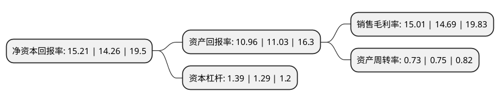

> 本页面由自动化程序生成于 2022年5月20日 01:11
> 内容可能存在错误，如有bug请提交issue至：https://github.com/Eroleice/doc-pi/issues
{.is-warning}

# 上市公司基本情况

## 基本资料

四川国光农化股份有限公司（以下简称“国光股份”）成立于1985年12月30日，成都市。于2015年03月20日在深交所中小板上市。

国光股份注册资本43,563.428万元，主营业务;公司主要从事植物生长调节剂，杀菌剂为主的农药制剂和水溶性肥料的研发，生产和销售业务。以下是详细信息：

- 公司名称: 四川国光农化股份有限公司
- 股票代码: 002749.SZ
- 所在地: 四川 - 成都市
- 成立日期: 1985年12月30日
- 注册资本: 43,563.428万元
- 法定代表人: 颜亚奇
- 主营业务: 主营业务;公司主要从事植物生长调节剂，杀菌剂为主的农药制剂和水溶性肥料的研发，生产和销售业务
- 公司官网: www.scggic.com
- 公司介绍: 公司专业从事植物生长调节剂和高效水溶性肥料的研发、生产和销售，公司产品广泛应用于农业种植、园艺生产、园林养护、林业植保等领域。公司通过了国际质量管理体系、环境管理体系、职业健康与安全管理体系认证，被认定(评定)为四川省诚信建设先进单位、四川百强企业、中国农药百强企业、国家知识产权优势培育企业、高新技术企业、中国农药工业协会第十届理事会理事单位。

## 股东及高管情况

上市公司第一大股东为颜昌绪，持股161,102,605股，占比36.98%，为上市公司实际控制人。

截至2022年03月31日，上市公司的前十大股东中，共有10名自然人股东，其中5%以上大股东共有2名。上市公司前十大股东明细如下：

> 截至2022年03月31日，上市公司前十大股东信息如下：

| 股东名称 | 持股数量（股） | 持股比例 |
| --- | --- | --- |
| 颜昌绪 | 161,102,605 | 36.98% |
| 颜亚奇 | 40,898,340 | 9.39% |
| 颜秋实 | 13,995,565 | 3.21% |
| 颜昌立 | 13,995,565 | 3.21% |
| 颜昌成 | 13,927,690 | 3.2% |
| 李汝 | 8,127,880 | 1.87% |
| 颜玲 | 7,827,005 | 1.8% |
| 颜铭 | 6,909,545 | 1.59% |
| 颜丽 | 6,827,105 | 1.57% |
| 颜小燕 | 6,827,105 | 1.57% |

## 利润表分析

上市公司2021年总收入为13.58亿元，净利润为2.03亿元，实现盈利。

## 杜邦分析

> 数据列示周期：2021年 | 2020年 | 2019年
{.is-info}

上市公司的净资产收益率在近一年有所上升，上升幅度为6.66%，其变化情况分解如下：
- 上市公司的销售毛利率在近一年上升了2.18%，可能是生产效率的提升、商品原材料价格下跌或商品价格的上涨所致。
- 上市公司的资产周转率在近一年下降了-2.67%，可能是源自于更慢的销售回款或库存管理效果下降。
- 上市公司的财务杠杆比率在近一年上升了7.75%，可能是增加负债扩大生产规模。

