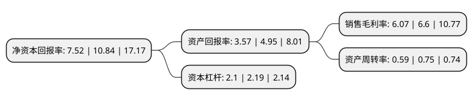

> 本页面由自动化程序生成于 2022年5月20日 01:14
> 内容可能存在错误，如有bug请提交issue至：https://github.com/Eroleice/doc-pi/issues
{.is-warning}

# 上市公司基本情况

## 基本资料

山东中农联合生物科技股份有限公司（以下简称“中农联合”）成立于2006年12月19日，济南市。于2021年04月06日在深交所中小板上市。

中农联合注册资本10,960万元，专业从事农药中间体，原药及制剂产品的研发，生产和销售，主要产品有吡虫啉，啶虫脒，烯啶虫胺，哒螨灵等农药原药，中间体及杀虫剂，杀菌剂，除草剂产品。以下是详细信息：

- 公司名称: 山东中农联合生物科技股份有限公司
- 股票代码: 003042.SZ
- 所在地: 山东 - 济南市
- 成立日期: 2006年12月19日
- 注册资本: 10,960万元
- 法定代表人: 王春林
- 主营业务: 专业从事农药中间体，原药及制剂产品的研发，生产和销售，主要产品有吡虫啉，啶虫脒，烯啶虫胺，哒螨灵等农药原药，中间体及杀虫剂，杀菌剂，除草剂产品
- 公司官网: www.sdznlh.com
- 公司介绍: 公司隶属于供销总社，是其专业从事农药中间体、原药及制剂产品的研发、生产和销售的全产业链农药生产企业。公司主要产品有吡虫啉、啶虫脒、烯啶虫胺、哒螨灵等农药原药、中间体及杀虫剂、杀菌剂、除草剂产品。公司是中国农药工业协会副会长单位、山东省农药行业协会理事长单位、山东省高端化工产业发展促进会副会长单位、中国农药发展与应用协会会员单位，位列“2019年中国农药行业销售百强排名”第35名。公司子公司山东联合、潍坊中农为国家定点农药生产企业。

## 股东及高管情况

上市公司第一大股东为中国农业生产资料上海公司，持股33,500,000股，占比30.57%，为上市公司实际控制人。

截至2022年03月31日，上市公司的前十大股东中，共有4名自然人股东，5名机构股东，1个产品账户，其中5%以上大股东共有3名。上市公司前十大股东明细如下：

> 截至2022年03月31日，上市公司前十大股东信息如下：

| 股东名称 | 持股数量（股） | 持股比例 |
| --- | --- | --- |
| 中国农业生产资料上海公司 | 33,500,000 | 30.57% |
| 许辉 | 10,500,000 | 9.58% |
| 中国农业生产资料集团公司 | 7,380,000 | 6.73% |
| 司勇 | 2,600,000 | 2.37% |
| 宁波永格股权投资合伙企业(有限合伙) | 2,570,000 | 2.34% |
| 江苏省高科技产业投资股份有限公司 | 2,400,000 | 2.19% |
| 北京中合国能投资管理合伙企业(有限合伙) | 2,000,000 | 1.82% |
| 青岛创信海洋经济创业投资基金中心(有限合伙) | 2,000,000 | 1.82% |
| 齐来成 | 2,000,000 | 1.82% |
| 肖昌海 | 2,000,000 | 1.82% |

## 利润表分析

上市公司2021年总收入为16.25亿元，净利润为0.98亿元，实现盈利。

## 杜邦分析

> 数据列示周期：2021年 | 2020年 | 2019年
{.is-info}

上市公司的净资产收益率在近一年有所下降，下降幅度为-30.63%，其变化情况分解如下：
- 上市公司的销售毛利率在近一年下降了-8.03%，可能是生产效率的下降、商品原材料价格上涨或商品价格的下跌所致。
- 上市公司的资产周转率在近一年下降了-21.33%，可能是源自于更慢的销售回款或库存管理效果下降。
- 上市公司的财务杠杆比率在近一年下降了-4.11%，可能是减少负债降低财务费用。

