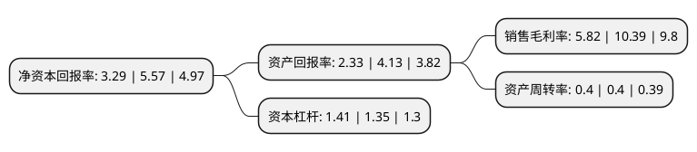

> 本页面由自动化程序生成于 2022年5月20日 01:17
> 内容可能存在错误，如有bug请提交issue至：https://github.com/Eroleice/doc-pi/issues
{.is-warning}

# 上市公司基本情况

## 基本资料

湖北富邦科技股份有限公司（以下简称“富邦股份”）成立于2007年01月22日，孝感市。于2014年07月02日在深交所创业板上市。

富邦股份注册资本28,978.902万元，化肥助剂产品的研发，生产，销售和服务。主要产品为化肥助剂以下是详细信息：

- 公司名称: 湖北富邦科技股份有限公司
- 股票代码: 300387.SZ
- 所在地: 湖北 - 孝感市
- 成立日期: 2007年01月22日
- 注册资本: 28,978.902万元
- 法定代表人: 王仁宗
- 主营业务: 化肥助剂产品的研发，生产，销售和服务主要产品为化肥助剂
- 公司官网: www.forbon.com
- 公司介绍: 公司是一家利用新材料、新工艺、新技术服务现代农业的国家火炬计划重点高新技术企业。公司依托多年行业应用经验，从化肥助剂的生产、销售，逐步延伸到与化肥产业链关联极高的相关技术研发与服务，已发展成为集磷矿石综合利用、生产过程节能降耗、含磷工业废水回收、化肥利用率提高、减少农业面源污染等整体方案的提供者。公司技术中心被评为湖北省企业技术中心、湖北省矿石浮选工程技术研究中心，已取得多项专利。

## 股东及高管情况

上市公司第一大股东为应城市富邦科技有限公司，持股93,820,080股，占比32.38%，为上市公司实际控制人。

截至2022年03月31日，上市公司的前十大股东中，共有4名自然人股东，5名机构股东，1个海外主体，其中5%以上大股东共有3名。上市公司前十大股东明细如下：

> 截至2022年03月31日，上市公司前十大股东信息如下：

| 股东名称 | 持股数量（股） | 持股比例 |
| --- | --- | --- |
| 应城市富邦科技有限公司 | 93,820,080 | 32.38% |
| NORTHLAND CHEMICALS INVESTMENT LIMITED | 16,214,046 | 5.6% |
| 武汉长江创富投资有限公司 | 15,765,672 | 5.44% |
| 上海有洲贸易合伙企业(有限合伙) | 3,048,600 | 1.05% |
| 刘浩 | 2,437,056 | 0.84% |
| 正鸿发展有限公司 | 1,703,253 | 0.59% |
| 郑锭藩 | 1,531,000 | 0.53% |
| 华泰证券股份有限公司 | 1,346,190 | 0.46% |
| 潘笑 | 1,260,000 | 0.43% |
| 吴君友 | 1,215,900 | 0.42% |

## 利润表分析

上市公司2021年总收入为6.83亿元，净利润为0.39亿元，实现盈利。

## 杜邦分析

> 数据列示周期：2021年 | 2020年 | 2019年
{.is-info}

上市公司的净资产收益率在近一年有所下降，下降幅度为-40.93%，其变化情况分解如下：
- 上市公司的销售毛利率在近一年下降了-43.98%，可能是生产效率的下降、商品原材料价格上涨或商品价格的下跌所致。
- 上市公司的资产周转率在近一年下降了0%，可能是源自于更慢的销售回款或库存管理效果下降。
- 上市公司的财务杠杆比率在近一年上升了4.44%，可能是增加负债扩大生产规模。

