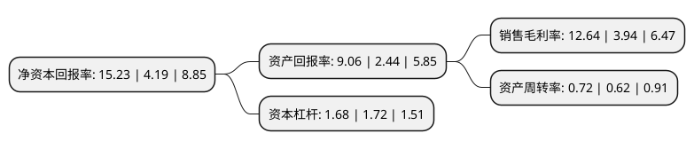

> 本页面由自动化程序生成于 2022年5月20日 01:18
> 内容可能存在错误，如有bug请提交issue至：https://github.com/Eroleice/doc-pi/issues
{.is-warning}

# 上市公司基本情况

## 基本资料

昆明川金诺化工股份有限公司（以下简称“川金诺”）成立于2005年06月02日，昆明市。于2016年03月15日在深交所创业板上市。

川金诺注册资本14,979.407万元，主营业务为湿法磷酸的研究，生产及分级利用，公司的主要产品为湿法磷酸和磷酸盐系列产品。以下是详细信息：

- 公司名称: 昆明川金诺化工股份有限公司
- 股票代码: 300505.SZ
- 所在地: 云南 - 昆明市
- 成立日期: 2005年06月02日
- 注册资本: 14,979.407万元
- 法定代表人: 刘甍
- 主营业务: 主营业务为湿法磷酸的研究，生产及分级利用，公司的主要产品为湿法磷酸和磷酸盐系列产品
- 公司官网: www.cjnphos.com
- 公司介绍: 公司是专业从事磷化工产业链的股份制企业。目前昆明东川生产基地以生产饲料级磷酸盐、肥料级磷酸盐、工业级湿法净化磷酸三大系列产品为主，正在建设的广西防城港生产基地，未来将以生产湿法净化磷酸、食品级及电子级精细磷酸盐为主。公司通过对中低品位磷矿石浮选、硫铁矿制酸的附加功能延伸、能量梯级利用、湿法磷酸的分级利用等关键技术不断创新、改进，完善从硫铁矿制酸、磷矿石的浮选至磷酸盐、磷肥产品生产、销售一体化产业链，实现了低成本高品质的湿法磷酸生产，形成了适合自身发展的“酸+肥+盐”相结合的独特产品线模式，保证企业的可持续发展。

## 股东及高管情况

上市公司第一大股东为刘甍，持股48,243,000股，占比32.21%，为上市公司实际控制人。

截至2022年03月31日，上市公司的前十大股东中，共有6名自然人股东，1名机构股东，3个产品账户，其中5%以上大股东共有1名。上市公司前十大股东明细如下：

> 截至2022年03月31日，上市公司前十大股东信息如下：

| 股东名称 | 持股数量（股） | 持股比例 |
| --- | --- | --- |
| 刘甍 | 48,243,000 | 32.21% |
| 上海浦东发展银行股份有限公司-中欧创新未来18个月封闭运作混合型证券投资基金 | 3,846,118 | 2.57% |
| 魏家贵 | 2,830,727 | 1.89% |
| 刘明义 | 2,645,248 | 1.77% |
| 太平资管-招商银行-太平资产量化17号资管产品 | 2,095,861 | 1.4% |
| 唐加普 | 1,941,124 | 1.3% |
| 深圳修能资本管理有限公司 | 1,386,969 | 0.93% |
| 刘和明 | 1,279,185 | 0.85% |
| 沈玲华 | 1,000,000 | 0.67% |
| 中国建设银行股份有限公司-广发科技创新混合型证券投资基金 | 911,800 | 0.61% |

## 利润表分析

上市公司2021年总收入为15.35亿元，净利润为1.94亿元，实现盈利。

## 杜邦分析

> 数据列示周期：2021年 | 2020年 | 2019年
{.is-info}

上市公司的净资产收益率在近一年有所上升，上升幅度为263.48%，其变化情况分解如下：
- 上市公司的销售毛利率在近一年上升了220.81%，可能是生产效率的提升、商品原材料价格下跌或商品价格的上涨所致。
- 上市公司的资产周转率在近一年上升了16.13%，可能是源自于更快的销售回款或库存管理效果提升。
- 上市公司的财务杠杆比率在近一年下降了-2.33%，可能是减少负债降低财务费用。

