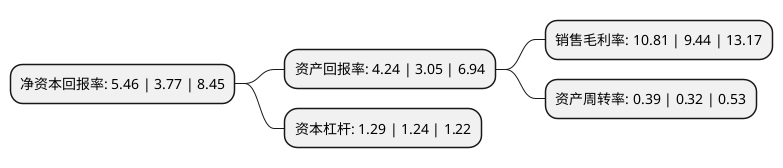

> 本页面由自动化程序生成于 2022年5月20日 01:20
> 内容可能存在错误，如有bug请提交issue至：https://github.com/Eroleice/doc-pi/issues
{.is-warning}

# 上市公司基本情况

## 基本资料

绍兴贝斯美化工股份有限公司（以下简称“贝斯美”）成立于2003年03月31日，绍兴市。于2019年11月15日在深交所创业板上市。

贝斯美注册资本12,115万元，专注于环保型农药医药中间体，农药原药及农药制剂的研发，生产和销售的国家级高新技术企业。以下是详细信息：

- 公司名称: 绍兴贝斯美化工股份有限公司
- 股票代码: 300796.SZ
- 所在地: 浙江 - 绍兴市
- 成立日期: 2003年03月31日
- 注册资本: 12,115万元
- 法定代表人: 陈峰
- 主营业务: 专注于环保型农药医药中间体，农药原药及农药制剂的研发，生产和销售的国家级高新技术企业
- 公司官网: www.bsmchem.com
- 公司介绍: 公司是一家专注于环保型农药医药中间体、农药原药及农药制剂的研发、生产和销售的国家级高新技术企业。公司主要产品为环保、高效、低毒农药二甲戊灵的原药、中间体、制剂，是国内仅有的具备二甲戊灵原药、中间体、制剂全产业链生产研发能力的农药企业,目前是国内最大的二甲戊灵原药生产企业。公司“新型医药中间体研究开发中心”于2016年12月22日被浙江省科技厅认定为省级高新技术企业研究开发中心。目前公司正在进行的研发项目共计14项，涵盖了甲氧虫酰肼、苯唑草酮等新品种，为公司未来的发展打下坚实的基础。

## 股东及高管情况

上市公司第一大股东为宁波贝斯美投资控股有限公司，持股32,983,722股，占比23.02%，**疑似为**上市公司实际控制人。

截至2022年05月18日，上市公司的前十大股东中，共有7名机构股东，3个产品账户，其中5%以上大股东共有10名。上市公司前十大股东明细如下：

> 未能通过持股比例判定出上市公司实际控制人（持股30%以上）
> 可能存在通过间接持股、联合持股、协议控制等方式拥有实际控制权的主体，具体请参考上市公司定期公告！
{.is-warning}

> 截至2022年05月18日，上市公司前十大股东信息如下：

| 股东名称 | 持股数量（股） | 持股比例 |
| --- | --- | --- |
| 宁波贝斯美投资控股有限公司 | 32,983,722 | 23.02% |
| 宁波贝斯美投资控股有限公司 | 32,983,722 | 27.23% |
| 嘉兴保航股权投资基金合伙企业(有限合伙) | 11,501,700 | 8.03% |
| 新余吉源投资管理合伙企业(有限合伙) | 9,945,000 | 6.94% |
| 新余吉源投资管理合伙企业(有限合伙) | 9,945,000 | 8.21% |
| 新余鼎石创业投资合伙企业(有限合伙) | 9,100,000 | 6.35% |
| 新余鼎石创业投资合伙企业(有限合伙) | 9,100,000 | 7.51% |
| 新余鼎石创业投资合伙企业(有限合伙) | 9,100,000 | 7.51% |
| 嘉兴保航股权投资基金合伙企业(有限合伙) | 8,654,700 | 7.1438% |
| 嘉兴保航股权投资基金合伙企业(有限合伙) | 8,556,300 | 7.0626% |

## 杜邦分析

> 数据列示周期：2021年 | 2020年 | 2019年
{.is-info}

上市公司的净资产收益率在近一年有所上升，上升幅度为44.83%，其变化情况分解如下：
- 上市公司的销售毛利率在近一年上升了14.51%，可能是生产效率的提升、商品原材料价格下跌或商品价格的上涨所致。
- 上市公司的资产周转率在近一年上升了21.88%，可能是源自于更快的销售回款或库存管理效果提升。
- 上市公司的财务杠杆比率在近一年上升了4.03%，可能是增加负债扩大生产规模。

