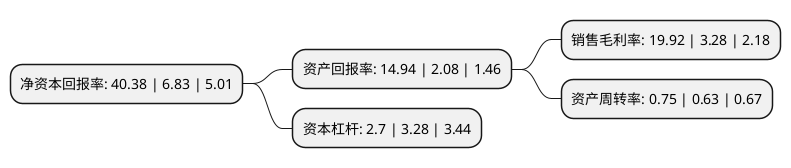

> 本页面由自动化程序生成于 2022年5月20日 01:24
> 内容可能存在错误，如有bug请提交issue至：https://github.com/Eroleice/doc-pi/issues
{.is-warning}

# 上市公司基本情况

## 基本资料

湖北兴发化工集团股份有限公司（以下简称“兴发集团”）成立于1994年08月17日，宜昌市。于1999年06月16日在上交所主板上市。

兴发集团注册资本111,172.466万元，主要业务:三聚磷酸钠和六偏磷酸钠等磷酸盐产品的生产和销售。以下是详细信息：

- 公司名称: 湖北兴发化工集团股份有限公司
- 股票代码: 600141.SH
- 所在地: 湖北 - 宜昌市
- 成立日期: 1994年08月17日
- 注册资本: 111,172.466万元
- 法定代表人: 李国璋
- 主营业务: 三聚磷酸钠和六偏磷酸钠等磷酸盐产品的生产和销售
- 公司官网: www.xingfagroup.com
- 公司介绍: 公司是一家以磷化工系列产品和精细化工产品的开发、生产和销售为主业的上市公司。公司长期专注于精细磷化工产品开发，形成了品种多、规模大、门类齐全、精细化程度、产品附加值和技术含量较高的产品链，现拥有工业级、食品级、医药级、电子级、肥料级产品多个系列品种。公司持续推进磷化工资源和企业的重组整合，在国内率先建立起“矿电化”运行模式，实现了磷矿全部自给，电力自给率达50%以上。近年来公司大力实施“走出去”发展战略，通过跨区域重组扩张，相继在湖北宜昌、宜都、襄阳以及重庆、新疆、贵州、河南等省份和地区建设规模化生产基地，基本形成了在全国同行业的主导地位。公司坚持以国际化引领走出去战略，按照“国际市场先行，国内市场跟进”的思路，通过了欧洲化学品Reach等资质认证，同宝洁、陶氏、联合利华等全球500强企业建立战略合作伙伴关系，营销网络遍布亚欧美非等多个国家和地区，先后在美国、巴西、中国香港、广州、上海、武汉等地设立子公司，市场销售网络日益完善。

## 股东及高管情况

上市公司第一大股东为宜昌兴发集团有限责任公司，持股215,478,565股，占比19.38%，**疑似为**上市公司实际控制人。

截至2022年03月31日，上市公司的前十大股东中，共有3名自然人股东，4名机构股东，2个产品账户，1个海外主体，其中5%以上大股东共有2名。上市公司前十大股东明细如下：

> 未能通过持股比例判定出上市公司实际控制人（持股30%以上）
> 可能存在通过间接持股、联合持股、协议控制等方式拥有实际控制权的主体，具体请参考上市公司定期公告！
{.is-warning}

> 截至2022年03月31日，上市公司前十大股东信息如下：

| 股东名称 | 持股数量（股） | 持股比例 |
| --- | --- | --- |
| 宜昌兴发集团有限责任公司 | 215,478,565 | 19.38% |
| 浙江金帆达生化股份有限公司 | 162,397,372 | 14.61% |
| 香港中央结算有限公司(陆股通) | 46,778,614 | 4.21% |
| 中国工商银行股份有限公司-海富通改革驱动灵活配置混合型证券投资基金 | 9,318,835 | 0.84% |
| 宜昌国有资本投资控股集团有限公司 | 8,010,542 | 0.72% |
| 陈雅萍 | 7,345,900 | 0.66% |
| 中欧基金-中国人寿保险股份有限公司-分红险-中欧基金国寿股份均衡股票型组合单一资产管理计划(可供出售) | 7,168,500 | 0.64% |
| 中国华融资产管理股份有限公司 | 7,023,442 | 0.63% |
| 胡雪坤 | 5,995,277 | 0.54% |
| 胡雪龙 | 5,504,100 | 0.5% |

## 利润表分析

上市公司2021年总收入为236.06亿元，净利润为47.02亿元，实现盈利。

## 杜邦分析

> 数据列示周期：2021年 | 2020年 | 2019年
{.is-info}

上市公司的净资产收益率在近一年有所上升，上升幅度为491.22%，其变化情况分解如下：
- 上市公司的销售毛利率在近一年上升了507.32%，可能是生产效率的提升、商品原材料价格下跌或商品价格的上涨所致。
- 上市公司的资产周转率在近一年上升了19.05%，可能是源自于更快的销售回款或库存管理效果提升。
- 上市公司的财务杠杆比率在近一年下降了-17.68%，可能是减少负债降低财务费用。

