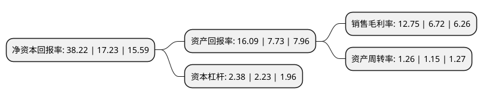

> 本页面由自动化程序生成于 2022年5月20日 01:26
> 内容可能存在错误，如有bug请提交issue至：https://github.com/Eroleice/doc-pi/issues
{.is-warning}

# 上市公司基本情况

## 基本资料

南通江山农药化工股份有限公司（以下简称“江山股份”）成立于1990年10月18日，南通市。于2001年01月10日在上交所主板上市。

江山股份注册资本29,700万元，主营业务为农药化工产品的生产销售。主要产品包括:草甘膦，敌敌畏，敌百虫，丁乙草胺等农药产品及烧碱，树脂，三氯化磷，双甘膦，氯甲烷等化工产品以及热电联产蒸汽。以下是详细信息：

- 公司名称: 南通江山农药化工股份有限公司
- 股票代码: 600389.SH
- 所在地: 江苏 - 南通市
- 成立日期: 1990年10月18日
- 注册资本: 29,700万元
- 法定代表人: 薛健
- 主营业务: 主营业务为农药化工产品的生产销售主要产品包括:草甘膦，敌敌畏，敌百虫，丁乙草胺等农药产品及烧碱，树脂，三氯化磷，双甘膦，氯甲烷等化工产品以及热电联产蒸汽
- 公司官网: www.jsac.com.cn
- 公司介绍: 公司地处扬子江畔苏通长江公路大桥北首，是中国历史最悠久的国家农药重点骨干企业之一。公司新区以农药产业为主线，建有电厂、水厂、长江码头、氯碱化工、农药及其中间体、三废治理等配套齐全的工业设施，是农药行业第一家完成整体搬迁的企业。公司一直致力于HSE管理的改善和提高，积极倡导清洁生产、循环利用、节能减排、责任关怀的理念。公司在实施生产区域整体搬迁中，通过结构调整、技术革新、加大HSE投入、引进吸收国内外先进的生产工艺技术等方式，不断优化现有产品的生产工艺。公司是中国农药工业协会副理事长单位、中国监控化学品协会副理事长单位，先后荣获全国首批守合同重信用企业、全国质量管理先进企业、全国“五一劳动奖状”、全国综合利用先进企业、农药行业植保科技服务下乡十佳企业等称号。

## 股东及高管情况

上市公司第一大股东为南通产业控股集团有限公司，持股87,019,707股，占比29.3%，**疑似为**上市公司实际控制人。

截至2022年05月09日，上市公司的前十大股东中，共有10名机构股东，其中5%以上大股东共有10名。上市公司前十大股东明细如下：

> 未能通过持股比例判定出上市公司实际控制人（持股30%以上）
> 可能存在通过间接持股、联合持股、协议控制等方式拥有实际控制权的主体，具体请参考上市公司定期公告！
{.is-warning}

> 截至2022年05月09日，上市公司前十大股东信息如下：

| 股东名称 | 持股数量（股） | 持股比例 |
| --- | --- | --- |
| 南通产业控股集团有限公司 | 87,019,707 | 29.3% |
| 南通产业控股集团有限公司 | 87,019,707 | 29.3% |
| 南通产业控股集团有限公司 | 87,019,707 | 29.3% |
| 四川省乐山市福华作物保护科技投资有限公司 | 71,834,127 | 24.1866% |
| 四川省乐山市福华作物保护科技投资有限公司 | 58,423,827 | 19.67% |
| 四川省乐山市福华作物保护科技投资有限公司 | 54,043,827 | 18.2% |
| 四川省乐山市福华作物保护科技投资有限公司 | 51,073,837 | 17.1966% |
| 四川省乐山市福华作物保护科技投资有限公司 | 51,073,827 | 17.2% |
| 乐山市五通桥区发展产业投资有限公司 | 17,790,300 | 5.99% |
| 乐山市五通桥区发展产业投资有限公司 | 17,790,300 | 5.99% |

## 利润表分析

上市公司2021年总收入为64.83亿元，净利润为8.26亿元，实现盈利。

## 杜邦分析

> 数据列示周期：2021年 | 2020年 | 2019年
{.is-info}

上市公司的净资产收益率在近一年有所上升，上升幅度为121.82%，其变化情况分解如下：
- 上市公司的销售毛利率在近一年上升了89.73%，可能是生产效率的提升、商品原材料价格下跌或商品价格的上涨所致。
- 上市公司的资产周转率在近一年上升了9.57%，可能是源自于更快的销售回款或库存管理效果提升。
- 上市公司的财务杠杆比率在近一年上升了6.73%，可能是增加负债扩大生产规模。

