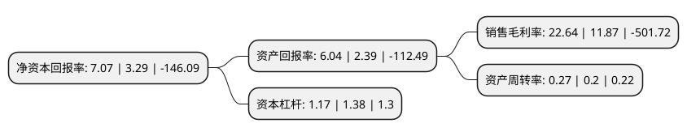

> 本页面由自动化程序生成于 2022年5月20日 01:26
> 内容可能存在错误，如有bug请提交issue至：https://github.com/Eroleice/doc-pi/issues
{.is-warning}

# 上市公司基本情况

## 基本资料

柳州化工股份有限公司（以下简称“柳化股份”）成立于2001年03月06日，柳州市。于2003年07月17日在上交所主板上市。

柳化股份注册资本79,869.503万元，主要产品有:硝酸铵，尿素，浓硝酸，甲醛，精甲醇，纯碱，氯化铵及碳酸氢铵。以下是详细信息：

- 公司名称: 柳州化工股份有限公司
- 股票代码: 600423.SH
- 所在地: 广西 - 柳州市
- 成立日期: 2001年03月06日
- 注册资本: 79,869.503万元
- 法定代表人: 陆胜云
- 主营业务: 主要产品有:硝酸铵，尿素，浓硝酸，甲醛，精甲醇，纯碱，氯化铵及碳酸氢铵
- 公司官网: www.lzhg.cn
- 公司介绍: 公司是一家集化肥化工生产销售为一体的大中型制造企业。公司形成了产品多元化的格局。公司主要产品有合成氨、浓硝酸、硝酸铵、尿素、甲醇、双氧水、硝基复合肥等多个品种，产品质量稳定优质，品牌可靠，产品硝酸铵、尿素、浓硝酸、多孔粒状硝铵、工业甲醛均为广西壮族自治区名牌产品；在华南、西南地区优势明显，具有较高的市场占有率和认可度，产品畅销区内外，部分产品远销国外。公司拥有便利的地理优势、有完善的治理结构、高效的融资平台、先进的技术优势、优秀的人才团队，形成了快速反应的研发机制。公司秉承“团结、求实、创新、进取”的企业文化精髓，诚信经营。

## 股东及高管情况

上市公司第一大股东为柳州元通投资发展有限公司，持股201,452,434股，占比25.22%，**疑似为**上市公司实际控制人。

截至2022年03月31日，上市公司的前十大股东中，共有1名自然人股东，8名机构股东，1个产品账户，其中5%以上大股东共有2名。上市公司前十大股东明细如下：

> 未能通过持股比例判定出上市公司实际控制人（持股30%以上）
> 可能存在通过间接持股、联合持股、协议控制等方式拥有实际控制权的主体，具体请参考上市公司定期公告！
{.is-warning}

> 截至2022年03月31日，上市公司前十大股东信息如下：

| 股东名称 | 持股数量（股） | 持股比例 |
| --- | --- | --- |
| 柳州元通投资发展有限公司 | 201,452,434 | 25.22% |
| 中国建设银行股份有限公司广西壮族自治区分行 | 49,256,529 | 6.17% |
| 中国银行股份有限公司柳州分行 | 25,237,843 | 3.16% |
| 柳州化学工业集团有限公司 | 22,826,167 | 2.86% |
| 中国工商银行股份有限公司柳州分行 | 21,541,277 | 2.7% |
| 中国农业银行股份有限公司广西壮族自治区分行 | 20,838,531 | 2.61% |
| 柳州化工股份有限公司破产企业财产处置专用账户 | 19,147,231 | 2.4% |
| 中国光大银行股份有限公司柳州分行 | 10,880,767 | 1.36% |
| 郑俊生 | 9,053,038 | 1.13% |
| 广西柳州发电有限责任公司 | 8,710,109 | 1.09% |

## 利润表分析

上市公司2021年总收入为1.27亿元，净利润为0.28亿元，实现盈利。

## 杜邦分析

> 数据列示周期：2021年 | 2020年 | 2019年
{.is-info}

上市公司的净资产收益率在近一年有所上升，上升幅度为114.89%，其变化情况分解如下：
- 上市公司的销售毛利率在近一年上升了90.73%，可能是生产效率的提升、商品原材料价格下跌或商品价格的上涨所致。
- 上市公司的资产周转率在近一年上升了35%，可能是源自于更快的销售回款或库存管理效果提升。
- 上市公司的财务杠杆比率在近一年下降了-15.22%，可能是减少负债降低财务费用。

