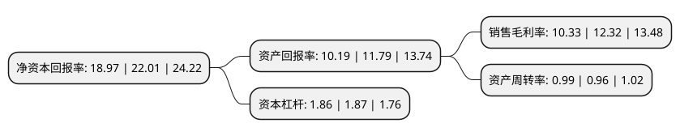

> 本页面由自动化程序生成于 2022年5月20日 01:26
> 内容可能存在错误，如有bug请提交issue至：https://github.com/Eroleice/doc-pi/issues
{.is-warning}

# 上市公司基本情况

## 基本资料

江苏扬农化工股份有限公司（以下简称“扬农化工”）成立于1999年12月10日，扬州市。于2002年04月25日在上交所主板上市。

扬农化工注册资本30,989.891万元，主要产品:卫生用菊酯，农用菊酯。以下是详细信息：

- 公司名称: 江苏扬农化工股份有限公司
- 股票代码: 600486.SH
- 所在地: 江苏 - 扬州市
- 成立日期: 1999年12月10日
- 注册资本: 30,989.891万元
- 法定代表人: 覃衡德
- 主营业务: 主要产品:卫生用菊酯，农用菊酯
- 公司官网: www.yangnongchem.com
- 公司介绍: 公司为国家重点高新技术企业，中国拟除虫菊酯类农药生产基地，全国化工企业环境保护先进单位。公司积极发展环境友好型农药，现拥有省拟除虫菊酯类农药工程研究中心、省农药清洁生产技术重点实验室、全国农药标准化技术委员会拟除虫菊酯工作组等创新平台。公司以振兴民族菊酯工业为己任，坚持自主创新，实施名牌战略，积极推进我国农药产业结构升级。现已形成以菊酯为核心，农药为主导，精细化学品为补充的多元化产品格局。“墨菊”被认定为“江苏省重点培育和发展的国际知名品牌”，入选“江苏省双百品牌”产品，子公司获得“绿色工厂”称号。

## 股东及高管情况

上市公司第一大股东为先正达集团股份有限公司，持股112,084,812股，占比36.17%，为上市公司实际控制人。

截至2022年03月31日，上市公司的前十大股东中，共有3名机构股东，6个产品账户，1个海外主体，其中5%以上大股东共有2名。上市公司前十大股东明细如下：

> 截至2022年03月31日，上市公司前十大股东信息如下：

| 股东名称 | 持股数量（股） | 持股比例 |
| --- | --- | --- |
| 先正达集团股份有限公司 | 112,084,812 | 36.17% |
| 扬州福源化工科技有限公司 | 17,012,013 | 5.49% |
| 香港中央结算有限公司(陆股通) | 9,889,526 | 3.19% |
| 全国社保基金一零六组合 | 9,617,846 | 3.1% |
| 全国社保基金一零三组合 | 6,150,000 | 1.98% |
| 中国邮政储蓄银行股份有限公司-易方达新收益灵活配置混合型证券投资基金 | 5,590,202 | 1.8% |
| 招商银行股份有限公司-易方达高质量严选三年持有期混合型证券投资基金 | 4,837,585 | 1.56% |
| 基本养老保险基金三零八组合 | 3,671,463 | 1.18% |
| 泰康人寿保险有限责任公司-投连-行业配置 | 3,589,334 | 1.16% |
| 上海浦东发展银行股份有限公司-易方达裕丰回报债券型证券投资基金 | 3,062,331 | 0.99% |

## 利润表分析

上市公司2021年总收入为118.41亿元，净利润为12.23亿元，实现盈利。

## 杜邦分析

> 数据列示周期：2021年 | 2020年 | 2019年
{.is-info}

上市公司的净资产收益率在近一年有所下降，下降幅度为-13.81%，其变化情况分解如下：
- 上市公司的销售毛利率在近一年下降了-16.15%，可能是生产效率的下降、商品原材料价格上涨或商品价格的下跌所致。
- 上市公司的资产周转率在近一年上升了3.13%，可能是源自于更快的销售回款或库存管理效果提升。
- 上市公司的财务杠杆比率在近一年下降了-0.53%，可能是减少负债降低财务费用。

