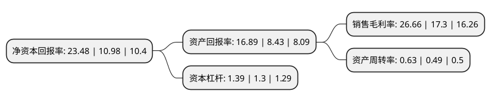

> 本页面由自动化程序生成于 2022年5月20日 01:34
> 内容可能存在错误，如有bug请提交issue至：https://github.com/Eroleice/doc-pi/issues
{.is-warning}

# 上市公司基本情况

## 基本资料

安徽广信农化股份有限公司（以下简称“广信股份”）成立于2000年03月15日，宣城市。于2015年05月13日在上交所主板上市。

广信股份注册资本46,456.414万元，主要从事以光气为原料的农药原药，制剂及精细化工中间体的研发，生产与销售，主营产品包括多菌灵，甲基硫菌灵等杀菌剂，敌草隆，草甘膦等除草剂以及氨基甲酸甲酯，异氰酸酯等精细化工中间体。以下是详细信息：

- 公司名称: 安徽广信农化股份有限公司
- 股票代码: 603599.SH
- 所在地: 安徽 - 宣城市
- 成立日期: 2000年03月15日
- 注册资本: 46,456.414万元
- 法定代表人: 黄金祥
- 主营业务: 主要从事以光气为原料的农药原药，制剂及精细化工中间体的研发，生产与销售，主营产品包括多菌灵，甲基硫菌灵等杀菌剂，敌草隆，草甘膦等除草剂以及氨基甲酸甲酯，异氰酸酯等精细化工中间体
- 公司官网: www.chinaguangxin.com
- 公司介绍: 公司是国内较大的以光气为原料的农药及精细化工中间体生产企业，目前公司是国内多菌灵产品、甲基硫菌灵产品、敌草隆产品的主要生产企业之一，生产能力位居全国前列。公司依托光气资源优势，通过持续优化产品的生产工艺，不断提高产品的质量和稳定性，在业内形成了较为明显的技术和产品质量优势，并与美国杜邦公司、日本曹达公司、中国台湾兴农公司等国内外知名农化产品生产厂家建立了长期稳定的合作关系。此外，公司多菌灵产品DAP/HAP两项重要指标优于联合国粮食及农业组织(FAO)的标准，从而打破了高品质多菌灵生产工艺和技术的国外垄断，进入欧美高端农药市场。未来，公司将充分利用公司生产技术的先进性、产品的优异性等各项竞争优势，加大技术投入，积极创新，有效调整产品结构，不断开发出高附加值的新产品以满足现代农业生产不断发展的新需求，将公司发展成为国内外具有一定影响力的现代化大型农化企业，为全球的农业发展提供高效、低毒、环境友好的创新型农药产品。

## 股东及高管情况

上市公司第一大股东为安徽广信集团有限公司，持股188,459,646股，占比40.57%，为上市公司实际控制人。

截至2022年03月31日，上市公司的前十大股东中，共有3名自然人股东，2名机构股东，4个产品账户，1个海外主体，其中5%以上大股东共有3名。上市公司前十大股东明细如下：

> 截至2022年03月31日，上市公司前十大股东信息如下：

| 股东名称 | 持股数量（股） | 持股比例 |
| --- | --- | --- |
| 安徽广信集团有限公司 | 188,459,646 | 40.57% |
| 香港中央结算有限公司(陆股通) | 26,526,049 | 5.71% |
| 黄金祥 | 25,090,016 | 5.4% |
| 翁仁源 | 21,900,000 | 4.71% |
| 交通银行-汇丰晋信动态策略混合型证券投资基金 | 8,382,503 | 1.8% |
| 张端时 | 6,822,771 | 1.47% |
| 中国农业银行股份有限公司-富国价值优势混合型证券投资基金 | 6,500,098 | 1.4% |
| 中国工商银行股份有限公司-广发多因子灵活配置混合型证券投资基金 | 5,958,111 | 1.28% |
| 深圳前海万通融资租赁有限公司 | 4,561,095 | 0.98% |
| 交通银行股份有限公司-汇丰晋信核心成长混合型证券投资基金 | 4,404,365 | 0.95% |

## 利润表分析

上市公司2021年总收入为55.49亿元，净利润为14.79亿元，实现盈利。

## 杜邦分析

> 数据列示周期：2021年 | 2020年 | 2019年
{.is-info}

上市公司的净资产收益率在近一年有所上升，上升幅度为113.84%，其变化情况分解如下：
- 上市公司的销售毛利率在近一年上升了54.1%，可能是生产效率的提升、商品原材料价格下跌或商品价格的上涨所致。
- 上市公司的资产周转率在近一年上升了28.57%，可能是源自于更快的销售回款或库存管理效果提升。
- 上市公司的财务杠杆比率在近一年上升了6.92%，可能是增加负债扩大生产规模。

