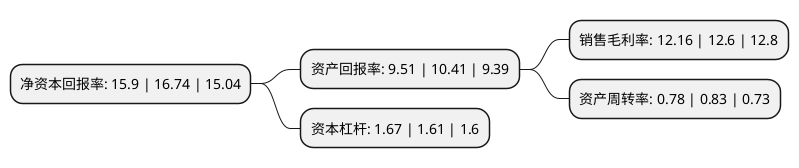

> 本页面由自动化程序生成于 2022年5月20日 01:34
> 内容可能存在错误，如有bug请提交issue至：https://github.com/Eroleice/doc-pi/issues
{.is-warning}

# 上市公司基本情况

## 基本资料

海利尔药业集团股份有限公司（以下简称“海利尔”）成立于1999年12月01日，青岛市。于2017年01月12日在上交所主板上市。

海利尔注册资本34,082.747万元，主营业务为农药制剂，原药及中间体的研发，生产和销售。产品以农药制剂为主，同时具备相应的农药原药及中间体的生产能力。以下是详细信息：

- 公司名称: 海利尔药业集团股份有限公司
- 股票代码: 603639.SH
- 所在地: 山东 - 青岛市
- 成立日期: 1999年12月01日
- 注册资本: 34,082.747万元
- 法定代表人: 葛家成
- 主营业务: 主营业务为农药制剂，原药及中间体的研发，生产和销售产品以农药制剂为主，同时具备相应的农药原药及中间体的生产能力
- 公司官网: www.hailir.cn
- 公司介绍: 公司是集农药和功能性肥料研发、生产、销售为一体的大型农化集团，属国家定点农药生产企业。公司坚持走科技兴企之路，集团研发中心被认定为国家级企业技术中心，承担国家863计划、国家十二五科技支撑计划、国家星火计划和国家火炬计划，拥有发明专利多项，参与制定国家标准多项，多次荣获国家、省、市科技进步奖。集团先后被认定为国家级高新技术企业、国家火炬计划重点高新技术企业和国家创新型试点企业。公司的产品先后获得“青岛名牌产品”、“山东名牌产品”、“中国农民最喜爱的农药品牌”、“中国市场公认十佳品牌”称号。集团先后被评为山东省十优农药经营单位、质量信誉双优示范单位等称号。

## 股东及高管情况

上市公司第一大股东为张爱英，持股127,253,000股，占比37.34%，为上市公司实际控制人。

截至2022年03月31日，上市公司的前十大股东中，共有4名自然人股东，3名机构股东，3个产品账户，其中5%以上大股东共有3名。上市公司前十大股东明细如下：

> 截至2022年03月31日，上市公司前十大股东信息如下：

| 股东名称 | 持股数量（股） | 持股比例 |
| --- | --- | --- |
| 张爱英 | 127,253,000 | 37.34% |
| 葛尧伦 | 62,010,588 | 18.19% |
| 青岛合意投资中心(有限合伙) | 17,849,951 | 5.24% |
| 葛家成 | 12,725,300 | 3.73% |
| 中国工商银行股份有限公司-诺安先锋混合型证券投资基金 | 6,648,375 | 1.95% |
| 宁波银行股份有限公司-中泰星元价值优选灵活配置混合型证券投资基金 | 6,276,320 | 1.84% |
| 青岛良新投资中心(有限合伙) | 3,901,002 | 1.14% |
| 青岛豪润商业运营管理有限公司 | 3,300,098 | 0.97% |
| 平安银行股份有限公司-中庚价值品质一年持有期混合型证券投资基金 | 3,286,048 | 0.96% |
| 许利民 | 3,235,761 | 0.95% |

## 利润表分析

上市公司2021年总收入为36.98亿元，净利润为4.49亿元，实现盈利。

## 杜邦分析

> 数据列示周期：2021年 | 2020年 | 2019年
{.is-info}

上市公司的净资产收益率在近一年有所下降，下降幅度为-5.02%，其变化情况分解如下：
- 上市公司的销售毛利率在近一年下降了-3.49%，可能是生产效率的下降、商品原材料价格上涨或商品价格的下跌所致。
- 上市公司的资产周转率在近一年下降了-6.02%，可能是源自于更慢的销售回款或库存管理效果下降。
- 上市公司的财务杠杆比率在近一年上升了3.73%，可能是增加负债扩大生产规模。

