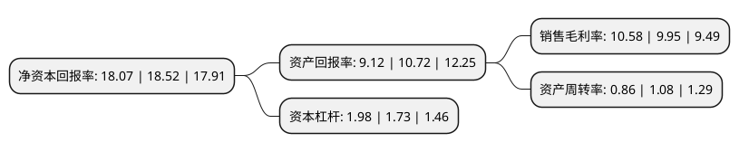

> 本页面由自动化程序生成于 2022年5月20日 01:02
> 内容可能存在错误，如有bug请提交issue至：https://github.com/Eroleice/doc-pi/issues
{.is-warning}

# 上市公司基本情况

## 基本资料

广东广弘控股股份有限公司（以下简称“广弘控股”）成立于1985年11月05日，广州市。于1993年11月18日在深交所主板上市。

广弘控股注册资本58,379.033万元，主营业务:食品冷藏，食品冷藏设备。以下是详细信息：

- 公司名称: 广东广弘控股股份有限公司
- 股票代码: 000529.SZ
- 所在地: 广东 - 广州市
- 成立日期: 1985年11月05日
- 注册资本: 58,379.033万元
- 法定代表人: 蔡飚
- 主营业务: 主营业务:食品冷藏，食品冷藏设备
- 公司官网: www.ghkg000529.com
- 公司介绍: 公司是大型省属国有控股上市公司。主要经营肉类食品供应和教育出版物发行等业务。公司以冷冻食品仓储和销售为基础，大力发展上游养殖、屠宰和深加工以及下游货运物流，建立了以广州为中心，覆盖珠三角和港澳市场的肉类冷冻食品物流配送网络，培育出了“狮山牌南海黄鸡”系列省名牌产品和“狮山牌”省著名商标。公司还拥有华南地区最大的食品冷藏库和最大的肉类冷冻食品批发市场。

## 股东及高管情况

上市公司第一大股东为广东省广弘资产经营有限公司，持股312,018,687股，占比53.45%，为上市公司实际控制人。

截至2022年03月31日，上市公司的前十大股东中，共有3名自然人股东，3名机构股东，1个产品账户，2个海外主体，1名其他股东，其中5%以上大股东共有1名。上市公司前十大股东明细如下：

> 截至2022年03月31日，上市公司前十大股东信息如下：

| 股东名称 | 持股数量（股） | 持股比例 |
| --- | --- | --- |
| 广东省广弘资产经营有限公司 | 312,018,687 | 53.45% |
| 广东省丝绸纺织集团有限公司 | 10,470,950 | 1.79% |
| 广东广弘创业投资有限公司 | 6,768,834 | 1.16% |
| 鹤山毛纺织总厂床上用品厂 | 5,810,651 | 1% |
| 刘保瑶 | 5,000,000 | 0.86% |
| UBS   AG | 3,633,929 | 0.62% |
| 曾松 | 3,536,841 | 0.61% |
| 方奕忠 | 2,797,006 | 0.48% |
| 元达信资本-工商银行-元达信腾飞1号资产管理计划 | 2,510,200 | 0.43% |
| JPMORGAN CHASE BANK,NATIONAL ASSOCIATION | 2,399,579 | 0.41% |

## 利润表分析

上市公司2021年总收入为36.37亿元，净利润为3.84亿元，实现盈利。

## 杜邦分析

> 数据列示周期：2021年 | 2020年 | 2019年
{.is-info}

上市公司的净资产收益率在近一年有所下降，下降幅度为-2.43%，其变化情况分解如下：
- 上市公司的销售毛利率在近一年上升了6.33%，可能是生产效率的提升、商品原材料价格下跌或商品价格的上涨所致。
- 上市公司的资产周转率在近一年下降了-20.37%，可能是源自于更慢的销售回款或库存管理效果下降。
- 上市公司的财务杠杆比率在近一年上升了14.45%，可能是增加负债扩大生产规模。

