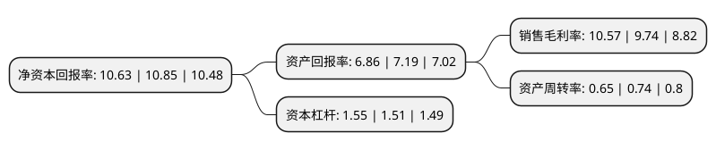

> 本页面由自动化程序生成于 2022年5月20日 01:03
> 内容可能存在错误，如有bug请提交issue至：https://github.com/Eroleice/doc-pi/issues
{.is-warning}

# 上市公司基本情况

## 基本资料

中原大地传媒股份有限公司（以下简称“中原传媒”）成立于1996年12月19日，焦作市。于1997年03月31日在深交所主板上市。

中原传媒注册资本102,320.375万元，主营业务:新闻，出版，文化教育产业以下是详细信息：

- 公司名称: 中原大地传媒股份有限公司
- 股票代码: 000719.SZ
- 所在地: 河南 - 焦作市
- 成立日期: 1996年12月19日
- 注册资本: 102,320.375万元
- 法定代表人: 王庆
- 主营业务: 主营业务:新闻，出版，文化教育产业
- 公司官网: www.zyddcm.com
- 公司介绍: 公司是一家主用从事对新闻、出版、教育、文化、广播、电影、电视节目等进行互联网信息服务；国内广告策划、代理、制作、发布的公司。公司主要从事出版物的编辑、生产和市场推广，通过形式多样、门类齐全的出版产品，为广大消费者提供知识、信息和精神文化需求服务。业务涵盖出版、发行、印刷及印刷物资供应、媒体、数字教育及服务、文化产品贸易等领域。

## 股东及高管情况

上市公司第一大股东为中原出版传媒投资控股集团有限公司，持股614,231,684股，占比60.03%，为上市公司实际控制人。

截至2022年03月31日，上市公司的前十大股东中，共有1名自然人股东，3名机构股东，5个产品账户，1个海外主体，其中5%以上大股东共有2名。上市公司前十大股东明细如下：

> 截至2022年03月31日，上市公司前十大股东信息如下：

| 股东名称 | 持股数量（股） | 持股比例 |
| --- | --- | --- |
| 中原出版传媒投资控股集团有限公司 | 614,231,684 | 60.03% |
| 中原出版传媒-国泰君安证券-18中原EB担保及信托财产专户 | 175,000,000 | 17.1% |
| 全国社保基金六零四组合 | 17,795,300 | 1.74% |
| 焦作通良资产经营有限公司 | 11,795,225 | 1.15% |
| 易方达基金-中央汇金资产管理有限责任公司-易方达基金-汇金资管单一资产管理计划 | 8,319,350 | 0.81% |
| 广发证券股份有限公司-中庚小盘价值股票型证券投资基金 | 4,986,525 | 0.49% |
| 华泰证券股份有限公司-中庚价值领航混合型证券投资基金 | 3,414,218 | 0.33% |
| 中国农业银行股份有限公司-工银瑞信战略转型主题股票型证券投资基金 | 3,384,357 | 0.33% |
| 陈锦容 | 2,300,020 | 0.22% |
| 上海虢实投资合伙企业(有限合伙) | 2,186,621 | 0.21% |

## 利润表分析

上市公司2021年总收入为92.61亿元，净利润为9.79亿元，实现盈利。

## 杜邦分析

> 数据列示周期：2021年 | 2020年 | 2019年
{.is-info}

上市公司的净资产收益率在近一年有所下降，下降幅度为-2.03%，其变化情况分解如下：
- 上市公司的销售毛利率在近一年上升了8.52%，可能是生产效率的提升、商品原材料价格下跌或商品价格的上涨所致。
- 上市公司的资产周转率在近一年下降了-12.16%，可能是源自于更慢的销售回款或库存管理效果下降。
- 上市公司的财务杠杆比率在近一年上升了2.65%，可能是增加负债扩大生产规模。

