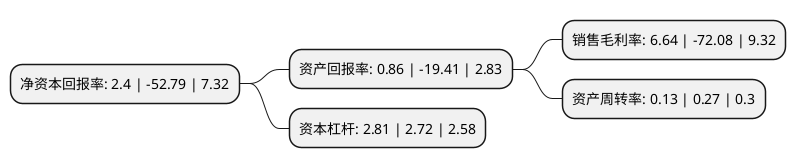

> 本页面由自动化程序生成于 2022年5月20日 01:03
> 内容可能存在错误，如有bug请提交issue至：https://github.com/Eroleice/doc-pi/issues
{.is-warning}

# 上市公司基本情况

## 基本资料

华闻传媒投资集团股份有限公司（以下简称“华闻集团”）成立于1991年09月13日，海口市。于1997年07月29日在深交所主板上市。

华闻集团注册资本199,724.546万元，主营业务:传媒业务的经营，国际台国内广播频率广告经营业务，提供高端留学咨询服务及出国英语考试辅导服务，提供手机音/视频业务的内容集成，产品维护，业务营销管理及内容技术性筛选服务，提供运营商视频内容的分销和推广等服务，提供楼宇电梯广告服务，提供舆情监测，舆情管理服务，销售动漫产品及提供动漫服务，游戏研发及运营。以下是详细信息：

- 公司名称: 华闻传媒投资集团股份有限公司
- 股票代码: 000793.SZ
- 所在地: 海南 - 海口市
- 成立日期: 1991年09月13日
- 注册资本: 199,724.546万元
- 法定代表人: 汪方怀
- 主营业务: 主营业务:传媒业务的经营，国际台国内广播频率广告经营业务，提供高端留学咨询服务及出国英语考试辅导服务，提供手机音/视频业务的内容集成，产品维护，业务营销管理及内容技术性筛选服务，提供运营商视频内容的分销和推广等服务，提供楼宇电梯广告服务，提供舆情监测，舆情管理服务，销售动漫产品及提供动漫服务，游戏研发及运营
- 公司官网: www.000793.com
- 公司介绍: 公司主要从事传媒业务的经营，独家承担《证券时报》、《华商报》、《新文化报》、《华商晨报》、《重庆时报》等经营业务的经营管理，独家承担国际台国内广播频率广告经营业务，提供高端留学咨询服务及出国英语考试辅导服务，提供手机音/视频业务的内容集成、产品维护、业务营销管理及内容技术性筛选服务，提供运营商视频内容的分销和推广等服务，提供楼宇电梯广告服务，提供舆情监测、舆情管理服务，销售动漫产品及提供动漫服务，游戏研发及运营。

## 股东及高管情况

上市公司第一大股东为国广环球资产管理有限公司，持股142,300,244股，占比7.12%，**疑似为**上市公司实际控制人。

截至2022年03月31日，上市公司的前十大股东中，共有7名机构股东，3个产品账户，其中5%以上大股东共有3名。上市公司前十大股东明细如下：

> 未能通过持股比例判定出上市公司实际控制人（持股30%以上）
> 可能存在通过间接持股、联合持股、协议控制等方式拥有实际控制权的主体，具体请参考上市公司定期公告！
{.is-warning}

> 上市公司第一大股东持股不超过10%，请检查是否存在公司控制权风险！
{.is-danger}

> 截至2022年03月31日，上市公司前十大股东信息如下：

| 股东名称 | 持股数量（股） | 持股比例 |
| --- | --- | --- |
| 国广环球资产管理有限公司 | 142,300,244 | 7.12% |
| 前海开源基金-浦发银行-渤海国际信托-渤海信托·煦沁聚和1号集合资金信托计划 | 122,721,037 | 6.14% |
| 长信基金-浦发银行-长信-浦发-粤信2号资产管理计划 | 102,561,435 | 5.14% |
| 四川信托有限公司-四川信托·星光5号单一资金信托 | 78,506,261 | 3.93% |
| 方正东亚信托有限责任公司-腾翼投资1号单一资金信托 | 59,088,209 | 2.96% |
| 前海开源基金-浦发银行-前海开源聚和资产管理计划 | 30,515,332 | 1.53% |
| 云南国际信托有限公司-峻茂15号单一资金信托 | 25,605,883 | 1.28% |
| 江苏省无锡蠡园经济开发区发展总公司 | 19,999,964 | 1% |
| 四川信托有限公司-四川信托·星光3号单一资金信托 | 19,554,622 | 0.98% |
| 中国民生银行股份有限公司北京分行 | 17,954,736 | 0.9% |

## 利润表分析

上市公司2021年总收入为10.09亿元，净利润为0.67亿元，实现盈利。

## 杜邦分析

> 数据列示周期：2021年 | 2020年 | 2019年
{.is-info}

上市公司的净资产收益率在近一年有所下降，下降幅度为-104.55%，其变化情况分解如下：
- 上市公司的销售毛利率在近一年下降了-109.21%，可能是生产效率的下降、商品原材料价格上涨或商品价格的下跌所致。
- 上市公司的资产周转率在近一年下降了-51.85%，可能是源自于更慢的销售回款或库存管理效果下降。
- 上市公司的财务杠杆比率在近一年上升了3.31%，可能是增加负债扩大生产规模。

