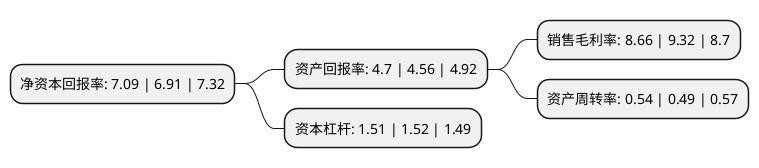

> 本页面由自动化程序生成于 2022年5月20日 01:19
> 内容可能存在错误，如有bug请提交issue至：https://github.com/Eroleice/doc-pi/issues
{.is-warning}

# 上市公司基本情况

## 基本资料

世纪天鸿教育科技股份有限公司（以下简称“世纪天鸿”）成立于2004年04月27日，淄博市。于2017年09月26日在深交所创业板上市。

世纪天鸿注册资本18,203.25万元，主要产品:以中小学教辅图书为主的中小学生助学读物，面向中小学教学各个环节的数字化产品和相关教学和学习软件。主营业务:助学读物的策划，设计，制作与发行。以下是详细信息：

- 公司名称: 世纪天鸿教育科技股份有限公司
- 股票代码: 300654.SZ
- 所在地: 山东 - 淄博市
- 成立日期: 2004年04月27日
- 注册资本: 18,203.25万元
- 法定代表人: 任志鸿
- 主营业务: 主要产品:以中小学教辅图书为主的中小学生助学读物，面向中小学教学各个环节的数字化产品和相关教学和学习软件主营业务:助学读物的策划，设计，制作与发行
- 公司官网: www.sjthedu.com
- 公司介绍: 公司始创于1994年，是志鸿教育集团旗下的全资主业子公司，主要从事文教图书以及教育信息化产品的策划、研发、发行。公司每年策划、发行图书7000余种，塑造了“志鸿优化”这一文教图书，在全国首创了由民营代理、新华书店、直营渠道以及电子商务组成的立体化教育图书服务网络，涵盖30个省市自治区拥有150余家二级代理机构和1500余家三级代理机构。20年来，世纪天鸿在全国出版发行业具有较大的影响力，是山东省重点文化企业，也被公认为全国民营书业的标杆企业。

## 股东及高管情况

上市公司第一大股东为北京志鸿教育投资有限公司，持股100,606,797股，占比47.48%，为上市公司实际控制人。

截至2022年03月31日，上市公司的前十大股东中，共有6名自然人股东，1名机构股东，3个产品账户，其中5%以上大股东共有1名。上市公司前十大股东明细如下：

> 截至2022年03月31日，上市公司前十大股东信息如下：

| 股东名称 | 持股数量（股） | 持股比例 |
| --- | --- | --- |
| 北京志鸿教育投资有限公司 | 100,606,797 | 47.48% |
| 任伦 | 7,605,000 | 3.59% |
| 巴学芳 | 3,500,320 | 1.65% |
| 李玉新 | 3,499,500 | 1.65% |
| 张建飞 | 3,422,982 | 1.62% |
| 王立新 | 2,048,400 | 0.97% |
| 北京创富金泰投资基金管理有限公司-金泰吉祥贰号私募证券投资基金 | 1,955,990 | 0.92% |
| 北京泰德圣投资有限公司-泰德圣投资德来1号私募证券投资基金 | 1,833,740 | 0.87% |
| 北京泰德圣投资有限公司-泰德圣投资泰来2号私募证券投资基金 | 1,833,740 | 0.87% |
| 陈文洁 | 1,810,000 | 0.85% |

## 利润表分析

上市公司2021年总收入为4.11亿元，净利润为0.35亿元，实现盈利。

## 杜邦分析

> 数据列示周期：2021年 | 2020年 | 2019年
{.is-info}

上市公司的净资产收益率在近一年有所上升，上升幅度为2.6%，其变化情况分解如下：
- 上市公司的销售毛利率在近一年下降了-7.08%，可能是生产效率的下降、商品原材料价格上涨或商品价格的下跌所致。
- 上市公司的资产周转率在近一年上升了10.2%，可能是源自于更快的销售回款或库存管理效果提升。
- 上市公司的财务杠杆比率在近一年下降了-0.66%，可能是减少负债降低财务费用。

