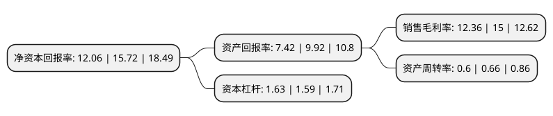

> 本页面由自动化程序生成于 2022年5月20日 01:20
> 内容可能存在错误，如有bug请提交issue至：https://github.com/Eroleice/doc-pi/issues
{.is-warning}

# 上市公司基本情况

## 基本资料

中信出版集团股份有限公司（以下简称“中信出版”）成立于1993年02月16日，北京市。于2019年07月05日在深交所创业板上市。

中信出版注册资本19,015.152万元，图书出版与发行，书店零售业务及其他文化增值服务以下是详细信息：

- 公司名称: 中信出版集团股份有限公司
- 股票代码: 300788.SZ
- 所在地: 北京 - 北京市
- 成立日期: 1993年02月16日
- 注册资本: 19,015.152万元
- 法定代表人: 王斌
- 主营业务: 图书出版与发行，书店零售业务及其他文化增值服务
- 公司官网: press.citic
- 公司介绍: 公司是一家在国内具有较强影响力和较大规模的综合文化服务提供商，公司定位于为社会大众提供知识服务及文化消费，主营图书出版与发行、书店零售及其他文化增值服务，致力于以优质内容和创意资源垂直整合文化、生活、教育及娱乐等领域，打造以“内容+”为核心的优质知识产权服务生态集群，建立以用户为中心的立体知识服务体系和聚焦于都市人群阅读与文化生活需求的智慧生活服务体系，公司具有国家新闻出版署颁发的图书出版、发行、零售以及网络传播全牌照，坚持把社会效益放在首位，实现社会效益和经济效益相统一，积极策划了“中国道路”系列、“一带一路”系列、“投资中国”书系等主题图书与重点项目，所出版的《薛暮桥年谱》、《丝绸之路文化丛书》入选国家“十三五”重点图书、音像、电子出版物出版规划项目，《南京大屠杀》入选中宣部与原国家新闻出版广电总局纪念中国人民抗日战争暨世界反法西斯战争胜利70周年重点主题出版工程项目。

## 股东及高管情况

上市公司第一大股东为中国中信有限公司，持股119,225,000股，占比62.7%，为上市公司实际控制人。

截至2022年03月31日，上市公司的前十大股东中，共有2名自然人股东，4名机构股东，4个产品账户，其中5%以上大股东共有2名。上市公司前十大股东明细如下：

> 截至2022年03月31日，上市公司前十大股东信息如下：

| 股东名称 | 持股数量（股） | 持股比例 |
| --- | --- | --- |
| 中国中信有限公司 | 119,225,000 | 62.7% |
| 中信投资控股有限公司 | 20,536,364 | 10.8% |
| 大成基金管理有限公司-社保基金17011组合 | 1,438,436 | 0.76% |
| 申万宏源证券有限公司 | 1,390,000 | 0.73% |
| 上海浦东发展银行股份有限公司-交银施罗德成长动力一年持有期混合型证券投资基金 | 1,252,657 | 0.66% |
| 中国工商银行股份有限公司-信达澳银优势价值混合型证券投资基金 | 1,034,612 | 0.54% |
| 光大证券股份有限公司 | 875,813 | 0.46% |
| 创金合信基金-中国银行-创金合信鼎泰32号集合资产管理计划 | 823,038 | 0.43% |
| 皇甫翎 | 773,000 | 0.41% |
| 熊冰 | 720,000 | 0.38% |

## 利润表分析

上市公司2021年总收入为19.22亿元，净利润为2.37亿元，实现盈利。

## 杜邦分析

> 数据列示周期：2021年 | 2020年 | 2019年
{.is-info}

上市公司的净资产收益率在近一年有所下降，下降幅度为-23.28%，其变化情况分解如下：
- 上市公司的销售毛利率在近一年下降了-17.6%，可能是生产效率的下降、商品原材料价格上涨或商品价格的下跌所致。
- 上市公司的资产周转率在近一年下降了-9.09%，可能是源自于更慢的销售回款或库存管理效果下降。
- 上市公司的财务杠杆比率在近一年上升了2.52%，可能是增加负债扩大生产规模。

