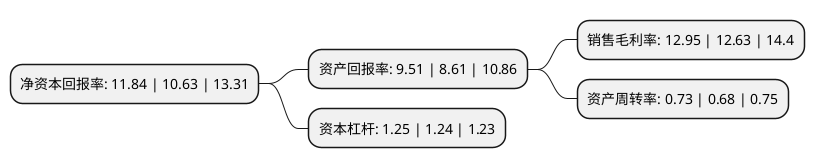

> 本页面由自动化程序生成于 2022年5月20日 01:22
> 内容可能存在错误，如有bug请提交issue至：https://github.com/Eroleice/doc-pi/issues
{.is-warning}

# 上市公司基本情况

## 基本资料

读客文化股份有限公司（以下简称“读客文化”）成立于2009年05月27日，上海市。于2021年07月19日在深交所创业板上市。

读客文化注册资本40,001万元，主营业务为图书的策划与发行及相关文化增值服务。以下是详细信息：

- 公司名称: 读客文化股份有限公司
- 股票代码: 301025.SZ
- 所在地: 上海 - 上海市
- 成立日期: 2009年05月27日
- 注册资本: 40,001万元
- 法定代表人: 华楠
- 主营业务: 主营业务为图书的策划与发行及相关文化增值服务
- 公司官网: www.dookbook.com
- 公司介绍: 公司是国内各大数字阅读平台的战略合作伙伴和重要内容供应商。主营业务为图书的策划与发行及相关文化增值服务。公司致力于以独特的创意方法和人才培养制度，成为领先的创意文化企业；公司定位于“全版权”运营商，以“激发个人成长”为宗旨，整合文艺、社科以及少儿等领域的优质版权，综合多种载体形式为大众提供以图书为主体的精品内容。公司策划的图书从“精神成长”、“知识结构成长”和“工作技能成长”出发，确保为大众提供的每本书都有正面导向的阅读价值。公司在“配合国家政策，发扬传统文化”的同时，积极践行中国文化“走出去”战略，成功向日本、韩国、泰国、越南、印尼、欧美等国家输出版权共计50余次。如“藏地密码”系列被转授权到泰国和越南，《好妈妈胜过好老师2》被转授权到韩国和越南，《超级符号就是超级创意》被转授权至英国。这些转授版权内容并非对于中华文化的机械宣传，而是以灵活的方式带动国外读者主动了解中华文化，打造出中国的文化软实力。

## 股东及高管情况

上市公司第一大股东为华楠，持股164,211,547股，占比41.05%，为上市公司实际控制人。

截至2022年03月31日，上市公司的前十大股东中，共有4名自然人股东，5名机构股东，1个产品账户，其中5%以上大股东共有2名。上市公司前十大股东明细如下：

> 截至2022年03月31日，上市公司前十大股东信息如下：

| 股东名称 | 持股数量（股） | 持股比例 |
| --- | --- | --- |
| 华楠 | 164,211,547 | 41.05% |
| 华杉 | 118,394,278 | 29.6% |
| 刘迪 | 19,732,380 | 4.93% |
| 北京君联亦同股权投资合伙企业(有限合伙) | 18,168,753 | 4.54% |
| 宁波梅山保税港区读客投资管理合伙企业(有限合伙) | 16,443,650 | 4.11% |
| 知合资本管理有限公司-知合上银(固安)股权投资基金合伙企业(有限合伙) | 9,084,294 | 2.27% |
| 朱筱筱 | 6,577,460 | 1.64% |
| 天津孚惠资产管理有限公司-孚惠映画(天津)企业管理中心(有限合伙) | 4,542,229 | 1.14% |
| 襄阳市磐石创业投资管理中心(有限合伙)有限合伙企业 | 1,439,970 | 0.36% |
| 杭州反求诸己投资管理有限公司-宁波梅山保税港区内向悦读投资合伙企业(有限合伙) | 1,405,439 | 0.35% |

## 利润表分析

上市公司2021年总收入为5.19亿元，净利润为0.67亿元，实现盈利。

## 杜邦分析

> 数据列示周期：2021年 | 2020年 | 2019年
{.is-info}

上市公司的净资产收益率在近一年有所上升，上升幅度为11.38%，其变化情况分解如下：
- 上市公司的销售毛利率在近一年上升了2.53%，可能是生产效率的提升、商品原材料价格下跌或商品价格的上涨所致。
- 上市公司的资产周转率在近一年上升了7.35%，可能是源自于更快的销售回款或库存管理效果提升。
- 上市公司的财务杠杆比率在近一年上升了0.81%，可能是增加负债扩大生产规模。

