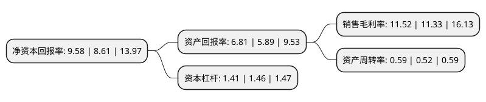

> 本页面由自动化程序生成于 2022年5月20日 01:25
> 内容可能存在错误，如有bug请提交issue至：https://github.com/Eroleice/doc-pi/issues
{.is-warning}

# 上市公司基本情况

## 基本资料

青岛城市传媒股份有限公司（以下简称“城市传媒”）成立于1994年06月14日，青岛市。于2000年03月09日在上交所主板上市。

城市传媒注册资本70,209.601万元，主要业务:从事图书，期刊，电子音像等出版物的出版发行业务以及新兴媒体的开发运营业务。以下是详细信息：

- 公司名称: 青岛城市传媒股份有限公司
- 股票代码: 600229.SH
- 所在地: 山东 - 青岛市
- 成立日期: 1994年06月14日
- 注册资本: 70,209.601万元
- 法定代表人: 王为达
- 主营业务: 从事图书，期刊，电子音像等出版物的出版发行业务以及新兴媒体的开发运营业务
- 公司官网: www.citymedia.cn
- 公司介绍: 公司是青岛市第一家国有股份制文化企业。公司主要从事图书、期刊、电子音像等出版物的出版发行业务以及新兴媒体的开发运营业务，是具有区域竞争优势和本土亲和力的城市特色出版传媒公司。公司旗下拥有青岛出版社有限责任公司、青岛新华书店有限责任公司等14家控股参股公司，是覆盖出版物出版、发行、物流等业态，集编、印、发、供、贸于一体，具备完整产业链的出版企业。公司在多年的经营过程中，形成了具有城市特色的市场化出版模式，实现了文化、市场、资本和科技要素在城市出版平台上的聚合发展。

## 股东及高管情况

上市公司第一大股东为青岛出版集团有限公司，持股374,191,691股，占比53.3%，为上市公司实际控制人。

截至2022年03月31日，上市公司的前十大股东中，共有5名自然人股东，3名机构股东，2个产品账户，其中5%以上大股东共有1名。上市公司前十大股东明细如下：

> 截至2022年03月31日，上市公司前十大股东信息如下：

| 股东名称 | 持股数量（股） | 持股比例 |
| --- | --- | --- |
| 青岛出版集团有限公司 | 374,191,691 | 53.3% |
| 青岛出版置业有限公司 | 35,034,590 | 4.99% |
| 罗予频 | 7,000,000 | 1% |
| 青岛国信发展(集团)有限责任公司 | 6,797,174 | 0.97% |
| 朱善永 | 6,495,254 | 0.93% |
| 赵双梅 | 5,440,000 | 0.77% |
| 中航信托股份有限公司-中航信托·天启【2017】323号集合资金信托计划 | 2,668,670 | 0.38% |
| 中信建投证券-青岛华通创业投资有限责任公司-中信建投市值管理华通创投单一资产管理计划 | 2,460,925 | 0.35% |
| 胡森 | 2,350,000 | 0.33% |
| 东翰 | 2,319,000 | 0.33% |

## 利润表分析

上市公司2021年总收入为24.15亿元，净利润为2.78亿元，实现盈利。

## 杜邦分析

> 数据列示周期：2021年 | 2020年 | 2019年
{.is-info}

上市公司的净资产收益率在近一年有所上升，上升幅度为11.27%，其变化情况分解如下：
- 上市公司的销售毛利率在近一年上升了1.68%，可能是生产效率的提升、商品原材料价格下跌或商品价格的上涨所致。
- 上市公司的资产周转率在近一年上升了13.46%，可能是源自于更快的销售回款或库存管理效果提升。
- 上市公司的财务杠杆比率在近一年下降了-3.42%，可能是减少负债降低财务费用。

