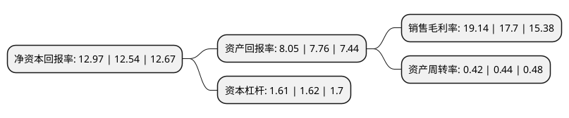

> 本页面由自动化程序生成于 2022年5月20日 01:26
> 内容可能存在错误，如有bug请提交issue至：https://github.com/Eroleice/doc-pi/issues
{.is-warning}

# 上市公司基本情况

## 基本资料

中文天地出版传媒集团股份有限公司（以下简称“中文传媒”）成立于1998年11月30日，上饶市。于2002年03月04日在上交所主板上市。

中文传媒注册资本135,506.372万元，主营业务:书刊和音像电子出版物编辑出版，印刷发行，物资供应等传统出版业务;国内外贸易，现代物流和物联网技术应用等产业链延伸业务;新媒体，在线教育，互联网游戏，数字出版，影视剧生产，艺术品经营，文化综合体和投融资等新业态业务。以下是详细信息：

- 公司名称: 中文天地出版传媒集团股份有限公司
- 股票代码: 600373.SH
- 所在地: 江西 - 上饶市
- 成立日期: 1998年11月30日
- 注册资本: 135,506.372万元
- 法定代表人: 吴信根
- 主营业务: 主营业务:书刊和音像电子出版物编辑出版，印刷发行，物资供应等传统出版业务;国内外贸易，现代物流和物联网技术应用等产业链延伸业务;新媒体，在线教育，互联网游戏，数字出版，影视剧生产，艺术品经营，文化综合体和投融资等新业态业务
- 公司官网: www.600373.com.cn
- 公司介绍: 公司主营业务包括书刊和音像电子出版物编辑出版、印刷发行、物资供应等传统出版业务；国内外贸易和供应链业务、现代物流和物联网技术应用等产业链延伸业务；新媒体、在线教育、互联网游戏、数字出版、影视剧生产、艺术品经营、文化综合体和投融资等新业态业务，是一家具有多介质、平台化、全产业链特征的大型出版传媒公司。

## 股东及高管情况

上市公司第一大股东为江西省出版传媒集团有限公司，持股755,541,032股，占比55.76%，为上市公司实际控制人。

截至2022年03月31日，上市公司的前十大股东中，共有5名自然人股东，1名机构股东，3个产品账户，1个海外主体，其中5%以上大股东共有2名。上市公司前十大股东明细如下：

> 截至2022年03月31日，上市公司前十大股东信息如下：

| 股东名称 | 持股数量（股） | 持股比例 |
| --- | --- | --- |
| 江西省出版传媒集团有限公司 | 755,541,032 | 55.76% |
| 香港中央结算有限公司(陆股通) | 115,710,593 | 8.54% |
| 谢贤林 | 19,598,400 | 1.45% |
| 徐新 | 19,464,198 | 1.44% |
| 周雨 | 8,775,819 | 0.65% |
| 吴凌江 | 6,402,442 | 0.47% |
| 中国工商银行股份有限公司-广发中证传媒交易型开放式指数证券投资基金 | 6,340,204 | 0.47% |
| 招商证券股份有限公司-天弘中证500指数增强型证券投资基金 | 6,045,300 | 0.45% |
| 高志勇 | 5,626,078 | 0.42% |
| 中欧基金-农业银行-中欧中证金融资产管理计划 | 5,035,300 | 0.37% |

## 利润表分析

上市公司2021年总收入为107.14亿元，净利润为20.5亿元，实现盈利。

## 杜邦分析

> 数据列示周期：2021年 | 2020年 | 2019年
{.is-info}

上市公司的净资产收益率在近一年有所上升，上升幅度为3.43%，其变化情况分解如下：
- 上市公司的销售毛利率在近一年上升了8.14%，可能是生产效率的提升、商品原材料价格下跌或商品价格的上涨所致。
- 上市公司的资产周转率在近一年下降了-4.55%，可能是源自于更慢的销售回款或库存管理效果下降。
- 上市公司的财务杠杆比率在近一年下降了-0.62%，可能是减少负债降低财务费用。

