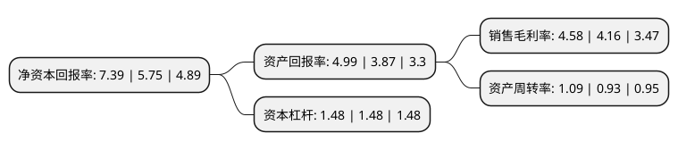

> 本页面由自动化程序生成于 2022年5月20日 01:27
> 内容可能存在错误，如有bug请提交issue至：https://github.com/Eroleice/doc-pi/issues
{.is-warning}

# 上市公司基本情况

## 基本资料

时代出版传媒股份有限公司（以下简称“时代出版”）成立于1999年12月12日，合肥市。于2002年09月05日在上交所主板上市。

时代出版注册资本48,432.517万元，主营业务:图书，期刊，全媒体出版策划经营及印刷复制，传媒科技研发，股权投资等业务。以下是详细信息：

- 公司名称: 时代出版传媒股份有限公司
- 股票代码: 600551.SH
- 所在地: 安徽 - 合肥市
- 成立日期: 1999年12月12日
- 注册资本: 48,432.517万元
- 法定代表人: 董磊
- 主营业务: 主营业务:图书，期刊，全媒体出版策划经营及印刷复制，传媒科技研发，股权投资等业务
- 公司官网: www.press-mart.com
- 公司介绍: 公司是安徽出版集团以其所持有的出版、印刷等文化传媒类资产，认购科大创新定向发行股份，成为上市公司第一大股东，在全国率先以出版业务整体上市，成为出版主营业务净资产收益率最高、极具成长潜力和投资价值的文化传媒类上市公司。主要经营图书、期刊、全媒体出版策划经营及印刷复制、传媒科技研发、股权投资等业务。公司坚持全面推进传统出版和新兴出版融合发展战略，大力推动数字出版向在线教育、知识服务、数字印刷、文化电子商务等新业态发展，目前已形成数字教育、数字出版、数字生活、数字印刷四大产业方向，拥有国家认定企业技术中心、博士后科研工作站、国家融合发展实验室、出版传媒专业工程硕士培养点、新媒体技术联盟等多个国家级产学研技术平台、产业平台。

## 股东及高管情况

上市公司第一大股东为安徽出版集团有限责任公司，持股300,725,557股，占比62.09%，为上市公司实际控制人。

截至2022年03月31日，上市公司的前十大股东中，共有3名自然人股东，5名机构股东，1个海外主体，1名其他股东，其中5%以上大股东共有2名。上市公司前十大股东明细如下：

> 截至2022年03月31日，上市公司前十大股东信息如下：

| 股东名称 | 持股数量（股） | 持股比例 |
| --- | --- | --- |
| 安徽出版集团有限责任公司 | 300,725,557 | 62.09% |
| 中科大资产经营有限责任公司 | 26,899,106 | 5.55% |
| 合肥科聚高技术有限责任公司 | 6,693,516 | 1.38% |
| 中国国际金融香港资产管理有限公司-客户资金2 | 2,544,289 | 0.53% |
| 中国科学院合肥物质科学研究院 | 2,443,901 | 0.5% |
| 华泰证券股份有限公司 | 1,623,525 | 0.34% |
| JPMORGAN CHASE BANK,NATIONAL   ASSOCIATION | 1,512,008 | 0.31% |
| 黄彪 | 1,490,539 | 0.31% |
| 许建妹 | 1,440,600 | 0.3% |
| 俞雄伟 | 1,308,900 | 0.27% |

## 利润表分析

上市公司2021年总收入为78.93亿元，净利润为3.61亿元，实现盈利。

## 杜邦分析

> 数据列示周期：2021年 | 2020年 | 2019年
{.is-info}

上市公司的净资产收益率在近一年有所上升，上升幅度为28.52%，其变化情况分解如下：
- 上市公司的销售毛利率在近一年上升了10.1%，可能是生产效率的提升、商品原材料价格下跌或商品价格的上涨所致。
- 上市公司的资产周转率在近一年上升了17.2%，可能是源自于更快的销售回款或库存管理效果提升。
- 上市公司的财务杠杆比率在近一年下降了0%，可能是减少负债降低财务费用。

