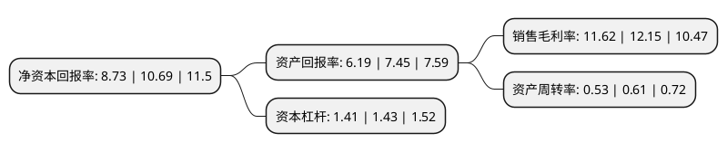

> 本页面由自动化程序生成于 2022年5月20日 01:28
> 内容可能存在错误，如有bug请提交issue至：https://github.com/Eroleice/doc-pi/issues
{.is-warning}

# 上市公司基本情况

## 基本资料

长江出版传媒股份有限公司（以下简称“长江传媒”）成立于1996年09月26日，武汉市。于1996年10月03日在上交所主板上市。

长江传媒注册资本121,365.027万元，主营业务:图书，期刊，报纸，音像制品，电子出版物的出版，发行，印制，物资贸易等。以下是详细信息：

- 公司名称: 长江出版传媒股份有限公司
- 股票代码: 600757.SH
- 所在地: 湖北 - 武汉市
- 成立日期: 1996年09月26日
- 注册资本: 121,365.027万元
- 法定代表人: 陈义国
- 主营业务: 主营业务:图书，期刊，报纸，音像制品，电子出版物的出版，发行，印制，物资贸易等
- 公司官网: www.600757.com.cn
- 公司介绍: 公司是湖北长江出版集团有限公司的控股子公司，是一家在上交所上市的文化企业。公司拥有书、报、刊、网、音像、电子等多介质出版业务，拥有出版、印制、发行、版权贸易全流程业务，并逐步向影视、动漫、网游、文化服务、地产物业等领域拓展。公司所属的出版社每年出版图书万余种，在不同的细分市场上形成了各自的经营特色和优势，文学类、美术类和少儿类图书居中国图书市场领先地位。公司拥有数十种报刊，在中国出版集团中是报刊品类最多的之一。公司所属湖北省新华书店(集团)有限公司是从事教材、一般图书发行业务的大型文化产业集团，在湖北省各市、州、县设有多家分公司，分销网点数百家，占有湖北省中小学教材独家发行权。公司所属湖北新华印务有限公司是中南地区最大的书报刊印刷企业之一。

## 股东及高管情况

上市公司第一大股东为湖北长江出版传媒集团有限公司，持股685,196,237股，占比56.46%，为上市公司实际控制人。

截至2022年03月31日，上市公司的前十大股东中，共有5名自然人股东，5名机构股东，其中5%以上大股东共有1名。上市公司前十大股东明细如下：

> 截至2022年03月31日，上市公司前十大股东信息如下：

| 股东名称 | 持股数量（股） | 持股比例 |
| --- | --- | --- |
| 湖北长江出版传媒集团有限公司 | 685,196,237 | 56.46% |
| 中央汇金资产管理有限责任公司 | 29,138,800 | 2.4% |
| 梁盛谊 | 16,000,000 | 1.32% |
| 上工申贝(集团)股份有限公司 | 10,298,534 | 0.85% |
| 吴春 | 5,938,207 | 0.49% |
| 吴明珍 | 5,868,800 | 0.48% |
| 中国国际金融香港资产管理有限公司-客户资金2 | 3,663,234 | 0.3% |
| 谢新荣 | 3,107,711 | 0.26% |
| 上海医药(集团)有限公司 | 2,807,946 | 0.23% |
| 王饶钢 | 2,561,000 | 0.21% |

## 利润表分析

上市公司2021年总收入为60.23亿元，净利润为7亿元，实现盈利。

## 杜邦分析

> 数据列示周期：2021年 | 2020年 | 2019年
{.is-info}

上市公司的净资产收益率在近一年有所下降，下降幅度为-18.33%，其变化情况分解如下：
- 上市公司的销售毛利率在近一年下降了-4.36%，可能是生产效率的下降、商品原材料价格上涨或商品价格的下跌所致。
- 上市公司的资产周转率在近一年下降了-13.11%，可能是源自于更慢的销售回款或库存管理效果下降。
- 上市公司的财务杠杆比率在近一年下降了-1.4%，可能是减少负债降低财务费用。

