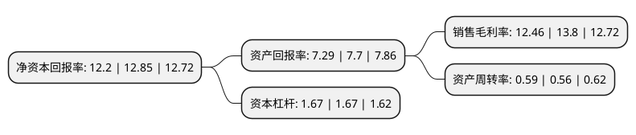

> 本页面由自动化程序生成于 2022年5月20日 01:31
> 内容可能存在错误，如有bug请提交issue至：https://github.com/Eroleice/doc-pi/issues
{.is-warning}

# 上市公司基本情况

## 基本资料

新华文轩出版传媒股份有限公司（以下简称“新华文轩”）成立于2005年06月11日，成都市。于2016年08月08日在上交所主板上市。

新华文轩注册资本123,384.1万元，主要业务:出版业务，阅读服务业务和教育服务业务，销售的商品包括自有出版物和外采商品。以下是详细信息：

- 公司名称: 新华文轩出版传媒股份有限公司
- 股票代码: 601811.SH
- 所在地: 四川 - 成都市
- 成立日期: 2005年06月11日
- 注册资本: 123,384.1万元
- 法定代表人: 罗勇
- 主营业务: 出版业务，阅读服务业务和教育服务业务，销售的商品包括自有出版物和外采商品
- 公司官网: www.winshare.com.cn
- 公司介绍: 公司是我国第一家按照上市公众公司标准规范设立的大型股份制出版发行企业。公司作为以出版发行为主业的全国一流文化企业，以传承中华文化为使命，是集出版物编辑、出版、销售及多元文化产业投资于一体的文化产业经营实体，主营业务包括出版业务、阅读服务业务和教育服务业务，销售的商品包括自有出版物和外采商品。为抓紧作为出版商与图书零售商及批发商之间中介服务单位的新市场机会，公司开展中盘业务并使其发展成为第三项业务的重要补充部分。公司负责发行四川省小学及初中政府资助和非政府资助教材、高中非政府资助教材，同时为四川省在校学生及部分大学、图书馆及其它机构发行教辅。同时还向多家出版商提供辅助支持及服务，协助编制大众图书、教材及教辅，包括选择合适的作者及题材、印刷和付运。公司先后被授予“中国出版政府奖先进出版单位”、“全国新闻出版系统先进集体”、“全国文化体制改革工作先进单位”、“国家文化出口重点企业”、“数字出版转型示范单位”等荣誉称号。

## 股东及高管情况

上市公司第一大股东为四川新华出版发行集团有限公司，持股682,687,525股，占比55.33%，为上市公司实际控制人。

截至2022年03月31日，上市公司的前十大股东中，共有4名机构股东，1个产品账户，4个海外主体，1名其他股东，其中5%以上大股东共有3名。上市公司前十大股东明细如下：

> 截至2022年03月31日，上市公司前十大股东信息如下：

| 股东名称 | 持股数量（股） | 持股比例 |
| --- | --- | --- |
| 四川新华出版发行集团有限公司 | 682,687,525 | 55.33% |
| 香港中央结算(代理人)有限公司 | 277,181,099 | 22.46% |
| 香港中央结算有限公司(陆股通) | 277,181,099 | 22.46% |
| 成都市华盛(集团)实业有限公司 | 53,336,000 | 4.32% |
| Brown Brothers Harriman & Co. | 38,626,617 | 3.13% |
| 四川文化产业投资集团有限责任公司 | 36,896,945 | 2.99% |
| 四川日报报业集团 | 9,264,513 | 0.75% |
| 辽宁博鸿投资有限公司 | 6,485,160 | 0.53% |
| YUM FUNG KING | 2,000,000 | 0.16% |
| 领航投资澳洲有限公司-领航新兴市场股指基金(交易所) | 1,796,153 | 0.15% |

## 利润表分析

上市公司2021年总收入为104.6亿元，净利润为13.03亿元，实现盈利。

## 杜邦分析

> 数据列示周期：2021年 | 2020年 | 2019年
{.is-info}

上市公司的净资产收益率在近一年有所下降，下降幅度为-5.06%，其变化情况分解如下：
- 上市公司的销售毛利率在近一年下降了-9.71%，可能是生产效率的下降、商品原材料价格上涨或商品价格的下跌所致。
- 上市公司的资产周转率在近一年上升了5.36%，可能是源自于更快的销售回款或库存管理效果提升。
- 上市公司的财务杠杆比率在近一年下降了0%，可能是减少负债降低财务费用。

