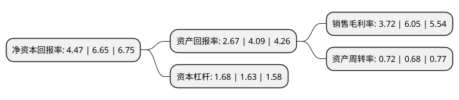

> 本页面由自动化程序生成于 2022年5月20日 01:32
> 内容可能存在错误，如有bug请提交issue至：https://github.com/Eroleice/doc-pi/issues
{.is-warning}

# 上市公司基本情况

## 基本资料

北方联合出版传媒(集团)股份有限公司（以下简称“出版传媒”）成立于2006年08月29日，沈阳市。于2007年12月21日在上交所主板上市。

出版传媒注册资本55,091.47万元，主要业务:图书，期刊，电子音像出版物的出版，发行，印刷以及印刷物资供应业务。以下是详细信息：

- 公司名称: 北方联合出版传媒(集团)股份有限公司
- 股票代码: 601999.SH
- 所在地: 辽宁 - 沈阳市
- 成立日期: 2006年08月29日
- 注册资本: 55,091.47万元
- 法定代表人: 杨建军
- 主营业务: 图书，期刊，电子音像出版物的出版，发行，印刷以及印刷物资供应业务
- 公司官网: www.nupmg.com
- 公司介绍: 公司是国内最著名的出版集团之一——辽宁出版集团有限公司控股的大型综合性出版传媒公司，于2007年12月21日成为国内第一家实现编辑业务和经营业务整体上市的出版企业。公司的主营业务为图书、期刊、电子音像出版物的出版、发行,印刷以及印刷物资供应业务。公司聚合图书、期刊、电子音像、新媒体等多种介质，形成了集传统出版发行业务与数字阅读、在线教育等业务于一体的综合性传媒业务架构，并逐步向文化创意、投资金融等领域拓展，形成了跨领域、多介质、全链条发展格局。公司以改革发展的丰硕成果，获得了中宣部，国家新闻出版总署，辽宁省委、省政府的多次表彰，先后被授予“全国文化体制改革优秀企业”、“全国重点文化出口企业”、“全国新闻出版‘走出去’先进单位”、“辽宁省十强文化企业”、“全国文化体制改革工作先进单位”等荣誉称号，成为中国出版业的著名品牌。

## 股东及高管情况

上市公司第一大股东为辽宁出版集团有限公司，持股372,000,000股，占比67.52%，为上市公司实际控制人。

截至2022年03月31日，上市公司的前十大股东中，共有7名自然人股东，2名机构股东，1个产品账户，其中5%以上大股东共有1名。上市公司前十大股东明细如下：

> 截至2022年03月31日，上市公司前十大股东信息如下：

| 股东名称 | 持股数量（股） | 持股比例 |
| --- | --- | --- |
| 辽宁出版集团有限公司 | 372,000,000 | 67.52% |
| 翁史伟 | 4,109,900 | 0.75% |
| 安伟 | 2,320,000 | 0.42% |
| 陈晓宝 | 1,975,700 | 0.36% |
| 李力华 | 1,892,928 | 0.34% |
| 王晓红 | 1,697,069 | 0.31% |
| 孟月 | 791,900 | 0.14% |
| 上海启林投资管理有限公司-启林创想量化多策略一号私募证券投资基金 | 762,200 | 0.14% |
| 辽宁广播电视广告有限公司 | 727,437 | 0.13% |
| 陶爱萍 | 700,000 | 0.13% |

## 利润表分析

上市公司2021年总收入为28.68亿元，净利润为1.06亿元，实现盈利。

## 杜邦分析

> 数据列示周期：2021年 | 2020年 | 2019年
{.is-info}

上市公司的净资产收益率在近一年有所下降，下降幅度为-32.78%，其变化情况分解如下：
- 上市公司的销售毛利率在近一年下降了-38.51%，可能是生产效率的下降、商品原材料价格上涨或商品价格的下跌所致。
- 上市公司的资产周转率在近一年上升了5.88%，可能是源自于更快的销售回款或库存管理效果提升。
- 上市公司的财务杠杆比率在近一年上升了3.07%，可能是增加负债扩大生产规模。

