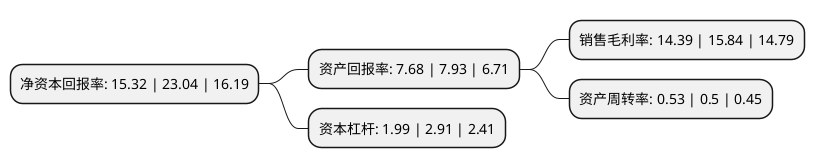

> 本页面由自动化程序生成于 2022年5月20日 01:33
> 内容可能存在错误，如有bug请提交issue至：https://github.com/Eroleice/doc-pi/issues
{.is-warning}

# 上市公司基本情况

## 基本资料

内蒙古新华发行集团股份有限公司（以下简称“内蒙新华”）成立于1999年05月28日，呼和浩特市。于2021年12月24日在上交所主板上市。

内蒙新华注册资本35,352.3万元，主要业务:出版物的批发，零售;文体用品零售;音像制品发行。出版物主要包括教材和一般图书。以下是详细信息：

- 公司名称: 内蒙古新华发行集团股份有限公司
- 股票代码: 603230.SH
- 所在地: 内蒙古 - 呼和浩特市
- 成立日期: 1999年05月28日
- 注册资本: 35,352.3万元
- 法定代表人: 秦建平
- 主营业务: 出版物的批发，零售;文体用品零售;音像制品发行出版物主要包括教材和一般图书
- 公司官网: www.nmgxhfxjt.com
- 公司介绍: 公司始终担负着自治区蒙汉文中小学教材、大中专教材、幼教读物、政治读物及一般图书、音像制品、电子出版物的发行任务，还承担着全国八省区蒙文教材及蒙文一般图书的发行任务。公司严格遵守国家有关出版发行法规和发行纪律，坚持课前到书、人手一册；坚守意识形态，弘扬正版、诚信经营，成为实现政府公共文化服务的载体，在传播先进文化和建设文化强区方面发挥着重要作用。本公司下设教材业务部，从事全自治区中小学教材发行业务。本公司具备完善的发行网络体系、高效的物流保障能力以及良好的商业品牌，每年春秋两季开学前，本公司合理调配资源，统筹安排全自治区中小学教材的采购、仓储、调运、调剂等工作，克服自治区地域广阔、气候恶劣、交通不便的特点，及时把教材送到学校和学生手里，确保了“课前到书，人手一册”，在全自治区范围赢得了广泛赞誉。

## 股东及高管情况

上市公司第一大股东为内蒙古新华控股有限公司，持股234,956,400股，占比66.46%，为上市公司实际控制人。

截至2022年03月31日，上市公司的前十大股东中，共有5名自然人股东，5名机构股东，其中5%以上大股东共有2名。上市公司前十大股东明细如下：

> 截至2022年03月31日，上市公司前十大股东信息如下：

| 股东名称 | 持股数量（股） | 持股比例 |
| --- | --- | --- |
| 内蒙古新华控股有限公司 | 234,956,400 | 66.46% |
| 安徽新华传媒股份有限公司 | 18,559,900 | 5.25% |
| 内蒙古蒙盐盐业集团有限公司 | 10,605,700 | 3% |
| 袁顺红 | 2,448,800 | 0.69% |
| 李万鹏 | 1,882,600 | 0.53% |
| 内蒙古爱信达教育印务有限责任公司 | 1,020,000 | 0.29% |
| 刘程林 | 524,000 | 0.15% |
| 华泰证券股份有限公司 | 466,282 | 0.13% |
| 陈国勇 | 450,700 | 0.13% |
| 鲍吉田 | 386,400 | 0.11% |

## 利润表分析

上市公司2021年总收入为15.91亿元，净利润为2.28亿元，实现盈利。

## 杜邦分析

> 数据列示周期：2021年 | 2020年 | 2019年
{.is-info}

上市公司的净资产收益率在近一年有所下降，下降幅度为-33.51%，其变化情况分解如下：
- 上市公司的销售毛利率在近一年下降了-9.15%，可能是生产效率的下降、商品原材料价格上涨或商品价格的下跌所致。
- 上市公司的资产周转率在近一年上升了6%，可能是源自于更快的销售回款或库存管理效果提升。
- 上市公司的财务杠杆比率在近一年下降了-31.62%，可能是减少负债降低财务费用。

