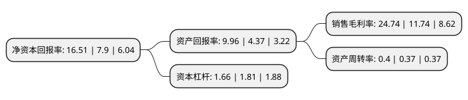

> 本页面由自动化程序生成于 2022年5月20日 01:37
> 内容可能存在错误，如有bug请提交issue至：https://github.com/Eroleice/doc-pi/issues
{.is-warning}

# 上市公司基本情况

## 基本资料

黑龙江出版传媒股份有限公司（以下简称“龙版传媒”）成立于2014年07月14日，哈尔滨市。于2021年08月24日在上交所主板上市。

龙版传媒注册资本44,444.445万元，公司拥有出版物(图书，电子音像制品，期刊与报纸等)“编，印，发”完整的产业链，具备出版物的编辑和出版，印刷，批发及零售，物资贸易等传统业务，同时融合数字出版等新兴业态于一体，是大型现代化综合性国有文化企业。以下是详细信息：

- 公司名称: 黑龙江出版传媒股份有限公司
- 股票代码: 605577.SH
- 所在地: 黑龙江 - 哈尔滨市
- 成立日期: 2014年07月14日
- 注册资本: 44,444.445万元
- 法定代表人: 李久军
- 主营业务: 公司拥有出版物(图书，电子音像制品，期刊与报纸等)“编，印，发”完整的产业链，具备出版物的编辑和出版，印刷，批发及零售，物资贸易等传统业务，同时融合数字出版等新兴业态于一体，是大型现代化综合性国有文化企业
- 公司官网: www.hljcbgf.com
- 公司介绍: 公司是一家大型现代化综合性国有文化企业。公司拥有出版物(图书、电子音像制品、期刊与报纸等)“编、印、发”完整的产业链，具备出版物的编辑和出版、印刷、批发及零售、物资贸易等传统业务，同时融合数字出版等新兴业态于一体。公司出版物品种丰富，涵盖社科、教育、文学、科技、艺术等多个细分领域，先后多次获得国家级出版奖项，拥有丰富的作者资源和广泛的读者群体，公司及旗下出版社在其各自专业领域分别取得一系列卓越成就，打造了具有区域文化特色的精品图书系列，在黑龙江省具有较强的文化影响力。新华书店集团及下属子公司主要负责公司的发行业务，是全国最早成立的省级新华书店集团之一。

## 股东及高管情况

上市公司第一大股东为黑龙江出版集团有限公司，持股256,080,000股，占比57.62%，为上市公司实际控制人。

截至2022年03月31日，上市公司的前十大股东中，共有4名自然人股东，6名机构股东，其中5%以上大股东共有2名。上市公司前十大股东明细如下：

> 截至2022年03月31日，上市公司前十大股东信息如下：

| 股东名称 | 持股数量（股） | 持股比例 |
| --- | --- | --- |
| 黑龙江出版集团有限公司 | 256,080,000 | 57.62% |
| 中国教育出版传媒股份有限公司 | 97,000,000 | 21.82% |
| 南方出版传媒股份有限公司 | 17,640,000 | 3.97% |
| 广东省出版集团有限公司 | 17,640,000 | 3.97% |
| 中国广电黑龙江网络股份有限公司 | 11,640,000 | 2.62% |
| 何江 | 780,000 | 0.18% |
| 殷巧凤 | 708,500 | 0.16% |
| 张京 | 354,900 | 0.08% |
| 代学荣 | 325,188 | 0.07% |
| 华泰证券股份有限公司 | 297,612 | 0.07% |

## 利润表分析

上市公司2021年总收入为17.9亿元，净利润为4.42亿元，实现盈利。

## 杜邦分析

> 数据列示周期：2021年 | 2020年 | 2019年
{.is-info}

上市公司的净资产收益率在近一年有所上升，上升幅度为108.99%，其变化情况分解如下：
- 上市公司的销售毛利率在近一年上升了110.73%，可能是生产效率的提升、商品原材料价格下跌或商品价格的上涨所致。
- 上市公司的资产周转率在近一年上升了8.11%，可能是源自于更快的销售回款或库存管理效果提升。
- 上市公司的财务杠杆比率在近一年下降了-8.29%，可能是减少负债降低财务费用。

