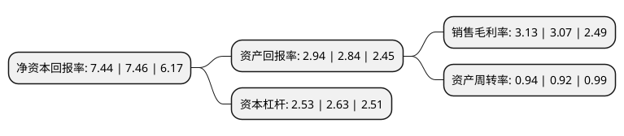

> 本页面由自动化程序生成于 2022年5月20日 01:01
> 内容可能存在错误，如有bug请提交issue至：https://github.com/Eroleice/doc-pi/issues
{.is-warning}

# 上市公司基本情况

## 基本资料

安徽丰原药业股份有限公司（以下简称“丰原药业”）成立于1997年08月30日，芜湖市。于2000年09月20日在深交所主板上市。

丰原药业注册资本31,214.123万元，主要产品:中药及其制剂，化学合成药及其制剂，生物药及其制剂。以下是详细信息：

- 公司名称: 安徽丰原药业股份有限公司
- 股票代码: 000153.SZ
- 所在地: 安徽 - 芜湖市
- 成立日期: 1997年08月30日
- 注册资本: 31,214.123万元
- 法定代表人: 何宏满
- 主营业务: 主要产品:中药及其制剂，化学合成药及其制剂，生物药及其制剂
- 公司官网: www.bbcayy.com
- 公司介绍: 公司是安徽省规模最大的医药企业、安徽医药行业首家上市公司，已构建了药品研发、生产、销售三位一体的联盟体系，主要涉及生物药、化学药及中药的研发、生产和销售。公司产品涵盖解热镇痛感冒类、妇儿类、神经系统、心血管系统、泌尿系统、营养类、抗生素等系列。可生产大容量注射剂、水针剂、粉针剂、胶囊剂、散剂、片剂、颗粒剂、膜剂、滴眼剂、贴片等10余个剂型和多种原料药。拥有多个国家级一、二类新药品种并具有多项产品及生产技术的自主知识产权，公司先后被中国科学院、科技部、安徽省认定为高新技术企业，并荣获中国“百姓放心药品牌”。

## 股东及高管情况

上市公司第一大股东为安徽省无为制药厂，持股35,842,137股，占比11.48%，**疑似为**上市公司实际控制人。

截至2022年03月31日，上市公司的前十大股东中，共有3名自然人股东，2名机构股东，2个产品账户，3名其他股东，其中5%以上大股东共有2名。上市公司前十大股东明细如下：

> 未能通过持股比例判定出上市公司实际控制人（持股30%以上）
> 可能存在通过间接持股、联合持股、协议控制等方式拥有实际控制权的主体，具体请参考上市公司定期公告！
{.is-warning}

> 截至2022年03月31日，上市公司前十大股东信息如下：

| 股东名称 | 持股数量（股） | 持股比例 |
| --- | --- | --- |
| 安徽省无为制药厂 | 35,842,137 | 11.48% |
| 安徽蚌埠涂山制药厂 | 25,521,900 | 8.18% |
| 安徽丰原集团有限公司 | 15,332,030 | 4.91% |
| 安徽省马鞍山生物化学制药厂 | 7,044,558 | 2.26% |
| 安信证券股份有限公司约定购回专用账户 | 6,242,000 | 2% |
| 尹树臣 | 6,000,000 | 1.92% |
| 国元证券股份有限公司约定购回专用账户 | 5,000,000 | 1.6% |
| 长城国融投资管理有限公司 | 4,554,100 | 1.46% |
| 李伟 | 2,390,912 | 0.77% |
| 杨德春 | 2,234,800 | 0.72% |

## 利润表分析

上市公司2021年总收入为35.01亿元，净利润为1.09亿元，实现盈利。

## 杜邦分析

> 数据列示周期：2021年 | 2020年 | 2019年
{.is-info}

上市公司的净资产收益率在近一年有所下降，下降幅度为-0.27%，其变化情况分解如下：
- 上市公司的销售毛利率在近一年上升了1.95%，可能是生产效率的提升、商品原材料价格下跌或商品价格的上涨所致。
- 上市公司的资产周转率在近一年上升了2.17%，可能是源自于更快的销售回款或库存管理效果提升。
- 上市公司的财务杠杆比率在近一年下降了-3.8%，可能是减少负债降低财务费用。

