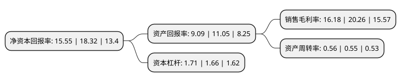

> 本页面由自动化程序生成于 2022年5月20日 01:02
> 内容可能存在错误，如有bug请提交issue至：https://github.com/Eroleice/doc-pi/issues
{.is-warning}

# 上市公司基本情况

## 基本资料

丽珠医药集团股份有限公司（以下简称“丽珠集团”）成立于1985年01月26日，珠海市。于1993年10月28日在深交所主板上市。

丽珠集团注册资本93,824.782万元，主要业务:医药产品的生产，营销及科研。主要产品:丽珠得乐系列，头孢曲松钠，抗病毒颗粒，新瑞普欣，美伐他汀，6-APA，达吉，参芪扶正注射液。以下是详细信息：

- 公司名称: 丽珠医药集团股份有限公司
- 股票代码: 000513.SZ
- 所在地: 广东 - 珠海市
- 成立日期: 1985年01月26日
- 注册资本: 93,824.782万元
- 法定代表人: 朱保国
- 主营业务: 医药产品的生产，营销及科研主要产品:丽珠得乐系列，头孢曲松钠，抗病毒颗粒，新瑞普欣，美伐他汀，6-APA，达吉，参芪扶正注射液
- 公司官网: www.livzon.com.cn
- 公司介绍: 公司是集医药研发、生产、销售为一体的综合性企业集团，全国医药行业首家A、B股上市的公司。公司建立了覆盖国内市场的营销网络，与商业主渠道和数千家医院建立了稳定、良好的业务关系；随着质量体系的持续完善和提高，随着销售的快速增长，随着产能的不断扩大，随着新厂建设步伐的加快，丽珠集团将成为国内领先、国际一流的现代化制药龙头企业。丽珠集团已经跻身中国上市企业投资10强，最佳上市企业治理10强、广东省高新技术企业、广东省医药行业杰出贡献企业、中国制药工业(销售)百强企业第46名、广东省医药工业综合实力50强。

## 股东及高管情况

上市公司第一大股东为香港中央结算(代理人)有限公司，持股312,934,017股，占比33.35%，为上市公司实际控制人。

截至2022年03月31日，上市公司的前十大股东中，共有1名自然人股东，4名机构股东，2个产品账户，2个海外主体，1名其他股东，其中5%以上大股东共有2名。上市公司前十大股东明细如下：

> 截至2022年03月31日，上市公司前十大股东信息如下：

| 股东名称 | 持股数量（股） | 持股比例 |
| --- | --- | --- |
| 香港中央结算(代理人)有限公司 | 312,934,017 | 33.35% |
| 健康元药业集团股份有限公司 | 221,376,789 | 23.59% |
| 香港中央结算有限公司(陆股通) | 30,792,857 | 3.28% |
| 广州市保科力贸易公司 | 17,306,329 | 1.84% |
| 深圳市海滨制药有限公司 | 16,830,835 | 1.79% |
| 上海瓴仁私募基金管理合伙企业(有限合伙)-瓴仁卓越长青二期私募证券投资基金 | 5,094,949 | 0.54% |
| 中信证券股份有限公司-社保基金1106组合 | 4,509,492 | 0.48% |
| 阿布达比投资局 | 3,787,831 | 0.4% |
| 何时金 | 2,494,000 | 0.27% |
| 太平人寿保险有限公司 | 2,399,952 | 0.26% |

## 利润表分析

上市公司2021年总收入为120.63亿元，净利润为19.52亿元，实现盈利。

## 杜邦分析

> 数据列示周期：2021年 | 2020年 | 2019年
{.is-info}

上市公司的净资产收益率在近一年有所下降，下降幅度为-15.12%，其变化情况分解如下：
- 上市公司的销售毛利率在近一年下降了-20.14%，可能是生产效率的下降、商品原材料价格上涨或商品价格的下跌所致。
- 上市公司的资产周转率在近一年上升了1.82%，可能是源自于更快的销售回款或库存管理效果提升。
- 上市公司的财务杠杆比率在近一年上升了3.01%，可能是增加负债扩大生产规模。

