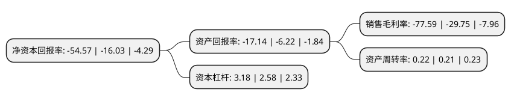

> 本页面由自动化程序生成于 2022年5月20日 01:02
> 内容可能存在错误，如有bug请提交issue至：https://github.com/Eroleice/doc-pi/issues
{.is-warning}

# 上市公司基本情况

## 基本资料

海南海药股份有限公司（以下简称“海南海药”）成立于1992年12月30日，海口市。于1994年05月25日在深交所主板上市。

海南海药注册资本129,736.513万元，主要产品:新特药(枫蓼肠胃康颗粒剂，特素等)，普药(抗生素类产品)，以及出口产品和市场推广的其他中药类产品。以下是详细信息：

- 公司名称: 海南海药股份有限公司
- 股票代码: 000566.SZ
- 所在地: 海南 - 海口市
- 成立日期: 1992年12月30日
- 注册资本: 129,736.513万元
- 法定代表人: 潘达忠
- 主营业务: 主要产品:新特药(枫蓼肠胃康颗粒剂，特素等)，普药(抗生素类产品)，以及出口产品和市场推广的其他中药类产品
- 公司官网: www.haiyao.com.cn
- 公司介绍: 公司是中国医药产业领域中的常青树，也是发展中的现代化高新技术企业。公司始终致力于药品的精益生产。海药产品线结构合理、剂型丰富，在130余品规中知名产品有：以枫蓼肠胃康颗粒为代表的中成药系列，以特素(紫杉醇注射液)为代表的抗肿瘤药物系列，以注射用头孢西丁钠、头孢唑肟钠、美罗培南、氨曲南、头孢克洛等为代表的较为完整的抗生素系列，以注射用维生素C为代表的维生素系列。公司销售网络遍布全国、通向世界，全国各大省份均有销售人员。设有普药、招商、肿瘤药、胃肠药、原料药五大销售事业部。通过市场细分、区域开拓、品牌推广等手段使公司具有很强的市场控制力和核心竞争力。公司潜心人类健康事业，造福海南经济，并回报社会和投资者，为努力成为中国一流医药现代化集团公司而不懈追求。

## 股东及高管情况

上市公司第一大股东为海南华同实业有限公司，持股296,989,889股，占比22.89%，**疑似为**上市公司实际控制人。

截至2022年03月31日，上市公司的前十大股东中，共有4名自然人股东，3名机构股东，3个产品账户，其中5%以上大股东共有3名。上市公司前十大股东明细如下：

> 未能通过持股比例判定出上市公司实际控制人（持股30%以上）
> 可能存在通过间接持股、联合持股、协议控制等方式拥有实际控制权的主体，具体请参考上市公司定期公告！
{.is-warning}

> 截至2022年03月31日，上市公司前十大股东信息如下：

| 股东名称 | 持股数量（股） | 持股比例 |
| --- | --- | --- |
| 海南华同实业有限公司 | 296,989,889 | 22.89% |
| 深圳市南方同正投资有限公司 | 138,365,787 | 10.67% |
| 云南国际信托有限公司-聚利36号单一资金信托 | 107,216,412 | 8.26% |
| 君康人寿保险股份有限公司-万能保险产品 | 40,294,844 | 3.11% |
| 胡景 | 35,845,700 | 2.76% |
| 杨西德 | 13,966,273 | 1.08% |
| 金元顺安基金-农业银行-杭州通武投资管理合伙企业(有限合伙) | 13,082,500 | 1.01% |
| 张素芬 | 9,180,000 | 0.71% |
| 郭劲松 | 8,908,010 | 0.69% |
| 国通信托有限责任公司-国通信托·方泰1号集合资金信托计划 | 7,000,000 | 0.54% |

## 利润表分析

上市公司2021年总收入为20.59亿元，净利润为-15.98亿元，**未实现盈利**。

## 杜邦分析

> 数据列示周期：2021年 | 2020年 | 2019年
{.is-info}

上市公司的净资产收益率在近一年有所上升，上升幅度为240.42%，其变化情况分解如下：
- 上市公司的销售毛利率在近一年上升了160.81%，可能是生产效率的提升、商品原材料价格下跌或商品价格的上涨所致。
- 上市公司的资产周转率在近一年上升了4.76%，可能是源自于更快的销售回款或库存管理效果提升。
- 上市公司的财务杠杆比率在近一年上升了23.26%，可能是增加负债扩大生产规模。

