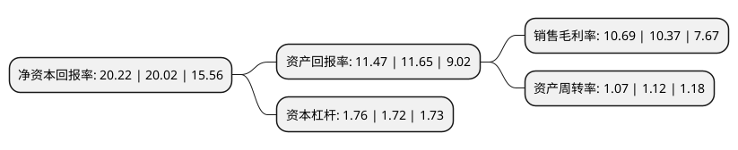

> 本页面由自动化程序生成于 2022年5月20日 01:03
> 内容可能存在错误，如有bug请提交issue至：https://github.com/Eroleice/doc-pi/issues
{.is-warning}

# 上市公司基本情况

## 基本资料

普洛药业股份有限公司（以下简称“普洛药业”）成立于1997年05月06日，金华市。于1997年05月09日在深交所主板上市。

普洛药业注册资本117,852.349万元，主要产品:原料药，制剂。以下是详细信息：

- 公司名称: 普洛药业股份有限公司
- 股票代码: 000739.SZ
- 所在地: 浙江 - 金华市
- 成立日期: 1997年05月06日
- 注册资本: 117,852.349万元
- 法定代表人: 祝方猛
- 主营业务: 主要产品:原料药，制剂
- 公司官网: www.apeloa.com
- 公司介绍: 公司是一家集研究、开发、生产原料药、制剂、医药中间体的大型综合性制药企业，为国家重点高新技术企业、浙江省医药工业重点企业。公司拥有两家省级院士工作站、两家国家级博士后科研工作站，一家手性药物及中间体技术国家工程研究中心。公司主要产品涉及抗生素类、抗病毒类、抗肿瘤类、心血管类等多个领域，拥有独特的市场竞争优势，其中抗肿瘤类药物乌苯美司胶囊、口服抗感染药物头孢克肟、阿莫西林克拉维酸钾等制剂产品占较大市场份额；头孢克肟、金刚烷胺、(伪)麻黄碱等原料药占有重要市场地位。公司具备国际化的制造能力，已有数条生产线分别通过WHO、OPCW、美国FDA、欧美COS、德国GMP和日本PMDA等官方认证。

## 股东及高管情况

上市公司第一大股东为横店集团控股有限公司，持股330,941,729股，占比28.08%，**疑似为**上市公司实际控制人。

截至2022年05月05日，上市公司的前十大股东中，共有5名机构股东，4个产品账户，1个海外主体，其中5%以上大股东共有3名。上市公司前十大股东明细如下：

> 未能通过持股比例判定出上市公司实际控制人（持股30%以上）
> 可能存在通过间接持股、联合持股、协议控制等方式拥有实际控制权的主体，具体请参考上市公司定期公告！
{.is-warning}

> 截至2022年05月05日，上市公司前十大股东信息如下：

| 股东名称 | 持股数量（股） | 持股比例 |
| --- | --- | --- |
| 横店集团控股有限公司 | 330,941,729 | 28.08% |
| 浙江横店进出口有限公司 | 156,552,903 | 13.28% |
| 横店集团康裕药业有限公司 | 59,560,488 | 5.05% |
| 横店集团家园化工有限公司 | 44,750,178 | 3.8% |
| 招商银行股份有限公司-兴全合润混合型证券投资基金 | 41,137,188 | 3.49% |
| 香港中央结算有限公司(陆股通) | 37,023,772 | 3.14% |
| 招商银行股份有限公司-兴全合宜灵活配置混合型证券投资基金(LOF) | 25,166,009 | 2.14% |
| 普洛药业股份有限公司-第一期员工持股计划 | 23,174,016 | 1.97% |
| 中国银行股份有限公司-广发医疗保健股票型证券投资基金 | 12,837,300 | 1.09% |
| 东阳市横店禹山运动休闲有限公司 | 9,241,603 | 0.78% |

## 利润表分析

上市公司2021年总收入为89.42亿元，净利润为9.55亿元，实现盈利。

## 杜邦分析

> 数据列示周期：2021年 | 2020年 | 2019年
{.is-info}

上市公司的净资产收益率在近一年有所上升，上升幅度为1%，其变化情况分解如下：
- 上市公司的销售毛利率在近一年上升了3.09%，可能是生产效率的提升、商品原材料价格下跌或商品价格的上涨所致。
- 上市公司的资产周转率在近一年下降了-4.46%，可能是源自于更慢的销售回款或库存管理效果下降。
- 上市公司的财务杠杆比率在近一年上升了2.33%，可能是增加负债扩大生产规模。

