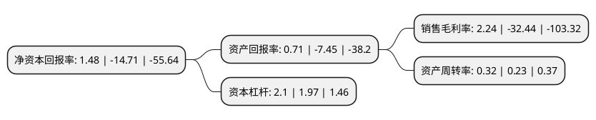

> 本页面由自动化程序生成于 2022年5月20日 01:03
> 内容可能存在错误，如有bug请提交issue至：https://github.com/Eroleice/doc-pi/issues
{.is-warning}

# 上市公司基本情况

## 基本资料

通化金马药业集团股份有限公司（以下简称“通化金马”）成立于1993年02月26日，通化市。于1997年04月30日在深交所主板上市。

通化金马注册资本96,649.471万元，主要产品:治糜灵栓，壮骨伸筋胶囊，清热通淋胶囊，脑心舒口服液。以下是详细信息：

- 公司名称: 通化金马药业集团股份有限公司
- 股票代码: 000766.SZ
- 所在地: 吉林 - 通化市
- 成立日期: 1993年02月26日
- 注册资本: 96,649.471万元
- 法定代表人: 战红君
- 主营业务: 主要产品:治糜灵栓，壮骨伸筋胶囊，清热通淋胶囊，脑心舒口服液
- 公司官网: www.thjm.cn
- 公司介绍: 公司地处长白山南麓，所在地通化市被誉为中国医药城，是中国五大药库之一。公司基本上形成了以医药为主导，多元化发展的现代企业集团，16条生产线均通过国家GMP认证。曾被国家评定为制药企业50强。公司产品先后被吉林省人民政府发展研究中心、吉林省质量管理协会、吉林省药品质量监督管理局多次评为“知名品牌”称号。公司曾被国家药监局授予全国医药系统先进集体，被省政府命名为省高新技术企业、被省科委和省药监局评为医药行业知名制药企业等称号。

## 股东及高管情况

上市公司第一大股东为北京晋商联盟投资管理有限公司，持股221,764,068股，占比22.95%，**疑似为**上市公司实际控制人。

截至2022年03月31日，上市公司的前十大股东中，共有5名自然人股东，5名机构股东，其中5%以上大股东共有6名。上市公司前十大股东明细如下：

> 未能通过持股比例判定出上市公司实际控制人（持股30%以上）
> 可能存在通过间接持股、联合持股、协议控制等方式拥有实际控制权的主体，具体请参考上市公司定期公告！
{.is-warning}

> 截至2022年03月31日，上市公司前十大股东信息如下：

| 股东名称 | 持股数量（股） | 持股比例 |
| --- | --- | --- |
| 北京晋商联盟投资管理有限公司 | 221,764,068 | 22.95% |
| 于兰军 | 190,000,000 | 19.66% |
| 于兰军 | 190,000,000 | 19.66% |
| 于兰军 | 190,000,000 | 19.66% |
| 北京晋商联盟投资管理有限公司 | 180,732,207 | 18.7% |
| 北京晋商联盟投资管理有限公司 | 180,732,207 | 18.7% |
| 上海木恺贸易有限公司 | 44,728,689 | 4.63% |
| 刘忠敏 | 7,236,900 | 0.75% |
| 武慧 | 7,130,100 | 0.74% |
| 中国国际金融香港资产管理有限公司-客户资金2 | 5,037,772 | 0.52% |

## 利润表分析

上市公司2021年总收入为15.15亿元，净利润为0.33亿元，实现盈利。

## 杜邦分析

> 数据列示周期：2021年 | 2020年 | 2019年
{.is-info}

上市公司的净资产收益率在近一年有所下降，下降幅度为-110.06%，其变化情况分解如下：
- 上市公司的销售毛利率在近一年下降了-106.91%，可能是生产效率的下降、商品原材料价格上涨或商品价格的下跌所致。
- 上市公司的资产周转率在近一年上升了39.13%，可能是源自于更快的销售回款或库存管理效果提升。
- 上市公司的财务杠杆比率在近一年上升了6.6%，可能是增加负债扩大生产规模。

