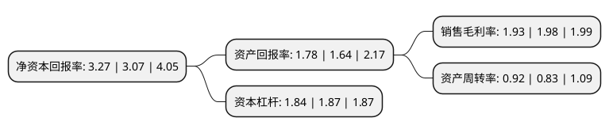

> 本页面由自动化程序生成于 2022年5月20日 01:03
> 内容可能存在错误，如有bug请提交issue至：https://github.com/Eroleice/doc-pi/issues
{.is-warning}

# 上市公司基本情况

## 基本资料

北大医药股份有限公司（以下简称“北大医药”）成立于1993年05月18日，重庆市。于1997年06月16日在深交所主板上市。

北大医药注册资本59,598.743万元，主要产品:原料药，制剂药。以下是详细信息：

- 公司名称: 北大医药股份有限公司
- 股票代码: 000788.SZ
- 所在地: 重庆 - 重庆市
- 成立日期: 1993年05月18日
- 注册资本: 59,598.743万元
- 法定代表人: 袁平东
- 主营业务: 主要产品:原料药，制剂药
- 公司官网: www.pku-hc.com
- 公司介绍: 公司是方正集团健康医疗产业---北大医疗产业集团的医药核心成员企业，拥有50余年医药制造历史，拥有国家级技术中心，是中国医药重点骨干企业，国家创新型试点企业，国家火炬计划重点高新技术企业和重庆市重点支持的出口畅销品牌企业。公司在重庆两江新区拥有按国际高标准cGMP建设的医药制造基地，产品涵盖抗肿瘤类、精神神经类、心血管类、免疫抑制类、抗微生物类、解热镇痛类等10多个大类100多个品种。公司拥有完善的质量保证体系，质量保证体系通过美国FDA和欧盟COS认证。公司拥有国家级技术中心，目前与方正医药研究院携手合作，构筑起拥有自主知识产权、仿创技术、技术创新为一体的技术核心体系，研发领域聚焦于肿瘤、精神神经、心脑血管等创新药、高端仿制药和大市场品种，为企业发展提供持续优化的产品结构和竞争力。

## 股东及高管情况

上市公司第一大股东为西南合成医药集团有限公司，持股170,356,260股，占比28.58%，**疑似为**上市公司实际控制人。

截至2022年03月31日，上市公司的前十大股东中，共有2名自然人股东，8名机构股东，其中5%以上大股东共有7名。上市公司前十大股东明细如下：

> 未能通过持股比例判定出上市公司实际控制人（持股30%以上）
> 可能存在通过间接持股、联合持股、协议控制等方式拥有实际控制权的主体，具体请参考上市公司定期公告！
{.is-warning}

> 截至2022年03月31日，上市公司前十大股东信息如下：

| 股东名称 | 持股数量（股） | 持股比例 |
| --- | --- | --- |
| 西南合成医药集团有限公司 | 170,356,260 | 28.58% |
| 西南合成医药集团有限公司 | 166,856,260 | 27.9966% |
| 西南合成医药集团有限公司 | 164,394,860 | 27.5836% |
| 西南合成医药集团有限公司 | 163,876,260 | 27.4966% |
| 北大医疗产业集团有限公司 | 70,328,949 | 11.8% |
| 北大医疗产业集团有限公司 | 70,328,949 | 11.8% |
| 北大医疗产业集团有限公司 | 70,328,949 | 11.8% |
| 北京政泉控股有限公司 | 3,225,346 | 0.54% |
| 鲍淑琴 | 1,985,000 | 0.33% |
| 黄宇华 | 1,920,100 | 0.32% |

## 杜邦分析

> 数据列示周期：2021年 | 2020年 | 2019年
{.is-info}

上市公司的净资产收益率在近一年有所上升，上升幅度为6.51%，其变化情况分解如下：
- 上市公司的销售毛利率在近一年下降了-2.53%，可能是生产效率的下降、商品原材料价格上涨或商品价格的下跌所致。
- 上市公司的资产周转率在近一年上升了10.84%，可能是源自于更快的销售回款或库存管理效果提升。
- 上市公司的财务杠杆比率在近一年下降了-1.6%，可能是减少负债降低财务费用。

