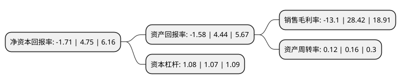

> 本页面由自动化程序生成于 2022年5月20日 01:03
> 内容可能存在错误，如有bug请提交issue至：https://github.com/Eroleice/doc-pi/issues
{.is-warning}

# 上市公司基本情况

## 基本资料

德展大健康股份有限公司（以下简称“德展健康”）成立于1981年01月01日，乌鲁木齐市。于1998年05月19日在深交所主板上市。

德展健康注册资本223,278.813万元，主营业务:药品的研发，生产和销售以下是详细信息：

- 公司名称: 德展大健康股份有限公司
- 股票代码: 000813.SZ
- 所在地: 新疆 - 乌鲁木齐市
- 成立日期: 1981年01月01日
- 注册资本: 223,278.813万元
- 法定代表人: 章红
- 主营业务: 主营业务:药品的研发，生产和销售
- 公司官网: www.dezhanhealthcare.com
- 公司介绍: 公司是我国首批也是新疆和纺织行业第一家中外合资企业。公司原是以毛纺织业务和矿业业务作为公司主营业务。2016年，公司通过重大资产重组，将原有盈利能力较弱的毛纺织及矿业业务和资产置出公司，同时置入盈利能力较强、发展潜力巨大的优质资产，转型进入医药行业，主营业务转变为药品的研发、生产和销售。公司将通过加大研发投资加强在心脑血管、肿瘤等领域新产品开发，有效缩短企业新产品的开发周期，降低新产品在技术和市场方面的风险，进一步提升公司从研发至产业化全过程的综合实力。

## 股东及高管情况

上市公司第一大股东为美林控股集团有限公司，持股448,263,156股，占比20.08%，**疑似为**上市公司实际控制人。

截至2022年04月29日，上市公司的前十大股东中，共有5名自然人股东，5名机构股东，其中5%以上大股东共有3名。上市公司前十大股东明细如下：

> 未能通过持股比例判定出上市公司实际控制人（持股30%以上）
> 可能存在通过间接持股、联合持股、协议控制等方式拥有实际控制权的主体，具体请参考上市公司定期公告！
{.is-warning}

> 截至2022年04月29日，上市公司前十大股东信息如下：

| 股东名称 | 持股数量（股） | 持股比例 |
| --- | --- | --- |
| 美林控股集团有限公司 | 448,263,156 | 20.08% |
| 上海岳野股权投资管理合伙企业(有限合伙) | 414,138,066 | 18.55% |
| 新疆凯迪投资有限责任公司 | 409,748,445 | 18.35% |
| 新疆凯迪矿业投资股份有限公司 | 104,039,367 | 4.66% |
| 曹乐生 | 23,303,358 | 1.04% |
| 新疆金融投资有限公司 | 22,801,946 | 1.02% |
| 宋湘沙 | 13,711,200 | 0.61% |
| 刘伟 | 8,618,560 | 0.39% |
| 殷世清 | 8,220,700 | 0.37% |
| 王剑 | 6,428,400 | 0.29% |

## 利润表分析

上市公司2021年总收入为7.34亿元，净利润为-0.97亿元，**未实现盈利**。

## 杜邦分析

> 数据列示周期：2021年 | 2020年 | 2019年
{.is-info}

上市公司的净资产收益率在近一年有所下降，下降幅度为-136%，其变化情况分解如下：
- 上市公司的销售毛利率在近一年下降了-146.09%，可能是生产效率的下降、商品原材料价格上涨或商品价格的下跌所致。
- 上市公司的资产周转率在近一年下降了-25%，可能是源自于更慢的销售回款或库存管理效果下降。
- 上市公司的财务杠杆比率在近一年上升了0.93%，可能是增加负债扩大生产规模。

