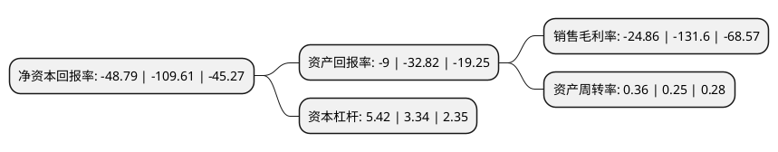

> 本页面由自动化程序生成于 2022年5月20日 01:04
> 内容可能存在错误，如有bug请提交issue至：https://github.com/Eroleice/doc-pi/issues
{.is-warning}

# 上市公司基本情况

## 基本资料

湖南景峰医药股份有限公司（以下简称“景峰医药”）成立于1998年12月18日，岳阳市。于1999年02月03日在深交所主板上市。

景峰医药注册资本87,977.435万元，主要产品:参芎葡萄糖注射液和玻璃酸钠注射液等，分别为心脑血管领域和骨科领域的知名品牌。主营业务:医药产品的研发，制造与销售。以下是详细信息：

- 公司名称: 湖南景峰医药股份有限公司
- 股票代码: 000908.SZ
- 所在地: 湖南 - 岳阳市
- 成立日期: 1998年12月18日
- 注册资本: 87,977.435万元
- 法定代表人: 叶湘武
- 主营业务: 主要产品:参芎葡萄糖注射液和玻璃酸钠注射液等，分别为心脑血管领域和骨科领域的知名品牌主营业务:医药产品的研发，制造与销售
- 公司官网: www.jfyiyao.com
- 公司介绍: 公司于2014年12月上市，公司秉承“夯实基础、技术创新、持续发展”的理念，坚持走与国际接轨的高端特色仿创药产业化道路。现拥有22家全资、控股子公司分布在上海、贵州、辽宁、江苏和海南等地。公司主营业务产品涵盖了心脑血管、肿瘤、骨科、儿科、妇科等重大疾病领域，拥有“佰塞通参芎葡萄糖注射液”、“金港榄香烯乳状注射液”、“佰备玻璃酸钠注射液”、“盐酸替罗非班氯化钠注射液”等核心大品种，“心脑宁胶囊”、“儿童回春颗粒”、“通迪胶囊”、“乐脉丸”等特色中药产品，以及“注射用兰索拉唑”、“注射用奥美拉唑钠”、“注射用泮托拉唑钠”、“注射用盐酸吉西他滨”、“注射用培美曲塞二钠”、“盐酸伊立替康注射液”、“注射用奥沙利铂”、“注射用磷酸氟达拉滨”、“注射用单磷酸阿糖腺苷”和“注射用克林霉素磷酸酯”等产品。荣获“2016年中国医药工业百强”、“2016年中国制药工业百强”、“2016中国制造业上市公司创造价值百强”、“2017中国最具影响力医药企业百强”、“2018年中国医药工业百强第28名”、“2019中国上市药企化学药综合实力排行榜第46名”等荣誉称号。

## 股东及高管情况

上市公司第一大股东为叶湘武，持股120,847,486股，占比13.74%，**疑似为**上市公司实际控制人。

截至2022年03月31日，上市公司的前十大股东中，共有5名自然人股东，3名机构股东，1个产品账户，1名其他股东，其中5%以上大股东共有2名。上市公司前十大股东明细如下：

> 未能通过持股比例判定出上市公司实际控制人（持股30%以上）
> 可能存在通过间接持股、联合持股、协议控制等方式拥有实际控制权的主体，具体请参考上市公司定期公告！
{.is-warning}

> 截至2022年03月31日，上市公司前十大股东信息如下：

| 股东名称 | 持股数量（股） | 持股比例 |
| --- | --- | --- |
| 叶湘武 | 120,847,486 | 13.74% |
| 中国长城资产管理股份有限公司 | 113,680,665 | 12.92% |
| 北京洲裕能源科技有限责任公司 | 43,988,718 | 5% |
| 平江县国有资产管理局 | 11,083,369 | 1.26% |
| 简卫光 | 8,213,117 | 0.93% |
| 陆琦 | 6,000,000 | 0.68% |
| 徐开东 | 4,101,800 | 0.47% |
| 上海古曲投资管理有限公司-古曲泉盛三号私募证券投资基金 | 3,200,000 | 0.36% |
| 王学伟 | 3,175,240 | 0.36% |
| 华泰证券股份有限公司 | 2,812,178 | 0.32% |

## 利润表分析

上市公司2021年总收入为8.11亿元，净利润为-2.02亿元，**未实现盈利**。

## 杜邦分析

> 数据列示周期：2021年 | 2020年 | 2019年
{.is-info}

上市公司的净资产收益率在近一年有所下降，下降幅度为-55.49%，其变化情况分解如下：
- 上市公司的销售毛利率在近一年下降了-81.11%，可能是生产效率的下降、商品原材料价格上涨或商品价格的下跌所致。
- 上市公司的资产周转率在近一年上升了44%，可能是源自于更快的销售回款或库存管理效果提升。
- 上市公司的财务杠杆比率在近一年上升了62.28%，可能是增加负债扩大生产规模。

