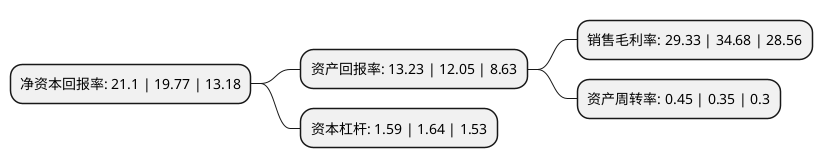

> 本页面由自动化程序生成于 2022年5月20日 01:05
> 内容可能存在错误，如有bug请提交issue至：https://github.com/Eroleice/doc-pi/issues
{.is-warning}

# 上市公司基本情况

## 基本资料

浙江新和成股份有限公司（以下简称“新和成”）成立于1999年04月05日，绍兴市。于2004年06月25日在深交所中小板上市。

新和成注册资本257,839.476万元，主要从事维生素，香料香精，医药中间体等系列产品的生产和销售。主要产品系以基础石油化工产品为原材料，通过化学合成，纯化，萃取等一系列化学反应生成，按其性质可分为三大系列:维生素系列，香料香精系列和医药中间体。以下是详细信息：

- 公司名称: 浙江新和成股份有限公司
- 股票代码: 002001.SZ
- 所在地: 浙江 - 绍兴市
- 成立日期: 1999年04月05日
- 注册资本: 257,839.476万元
- 法定代表人: 胡柏藩
- 主营业务: 主要从事维生素，香料香精，医药中间体等系列产品的生产和销售主要产品系以基础石油化工产品为原材料，通过化学合成，纯化，萃取等一系列化学反应生成，按其性质可分为三大系列:维生素系列，香料香精系列和医药中间体
- 公司官网: www.cnhu.com
- 公司介绍: 公司是一家专业生产原料药、药品、食品添加剂、饲料添加剂、香精香料的国家级重点高新技术企业，是深交所中小企业板的第一股。公司自1999年创办以来，始终专注于精细化工，坚持创新驱动和均衡、永续发展理念，在营养品、香精香料、原料药、高分子新材料等领域，为全球100多个国家和地区的客户在动物营养、人类营养、医药、生命健康、环保、工程塑料等方面提供解决方案，以优质健康和绿色环保的产品不断改善人类生活品质，为利益相关方创造可持续的价值。公司已与国内外行业龙头企业建立了紧密的合作关系，成为国际知名医药和化妆品公司信赖和认可的品牌，并跻身中国医药工业百强、中国上市公司百强，正朝着中国新和成、世界新和成的目标迈进。

## 股东及高管情况

上市公司第一大股东为新和成控股集团有限公司，持股1,251,903,644股，占比48.55%，为上市公司实际控制人。

截至2022年03月31日，上市公司的前十大股东中，共有1名自然人股东，1名机构股东，5个产品账户，2个海外主体，1名其他股东，其中5%以上大股东共有1名。上市公司前十大股东明细如下：

> 截至2022年03月31日，上市公司前十大股东信息如下：

| 股东名称 | 持股数量（股） | 持股比例 |
| --- | --- | --- |
| 新和成控股集团有限公司 | 1,251,903,644 | 48.55% |
| 香港中央结算有限公司(陆股通) | 71,338,496 | 2.77% |
| 上海重阳战略投资有限公司-重阳战略汇智基金 | 45,060,167 | 1.75% |
| JPMORGAN CHASE BANK,NATIONAL ASSOCIATION | 29,024,075 | 1.13% |
| 全国社保基金五零三组合 | 20,499,940 | 0.8% |
| 全国社保基金一一二组合 | 19,186,092 | 0.74% |
| 广东富业盛德资产管理有限公司-富业盛德盛德1号私募证券投资基金 | 13,810,354 | 0.54% |
| 胡柏剡 | 12,163,274 | 0.47% |
| 北京源峰私募基金管理合伙企业(有限合伙)-源峰价值私募证券投资基金 | 11,977,187 | 0.46% |
| 科威特政府投资局 | 11,733,502 | 0.46% |

## 利润表分析

上市公司2021年总收入为147.97亿元，净利润为43.4亿元，实现盈利。

## 杜邦分析

> 数据列示周期：2021年 | 2020年 | 2019年
{.is-info}

上市公司的净资产收益率在近一年有所上升，上升幅度为6.73%，其变化情况分解如下：
- 上市公司的销售毛利率在近一年下降了-15.43%，可能是生产效率的下降、商品原材料价格上涨或商品价格的下跌所致。
- 上市公司的资产周转率在近一年上升了28.57%，可能是源自于更快的销售回款或库存管理效果提升。
- 上市公司的财务杠杆比率在近一年下降了-3.05%，可能是减少负债降低财务费用。

