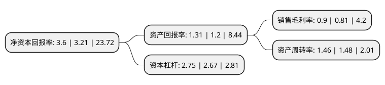

> 本页面由自动化程序生成于 2022年5月20日 01:06
> 内容可能存在错误，如有bug请提交issue至：https://github.com/Eroleice/doc-pi/issues
{.is-warning}

# 上市公司基本情况

## 基本资料

冠福控股股份有限公司（以下简称“ST冠福”）成立于2002年09月28日，泉州市。于2006年12月29日在深交所中小板上市。

ST冠福注册资本263,383.629万元，主营业务:医药中间体研发，生产，销售业务，投资性房地产租赁经营业务，黄金采矿业务，塑贸电商业务。以下是详细信息：

- 公司名称: 冠福控股股份有限公司
- 股票代码: 002102.SZ
- 所在地: 福建 - 泉州市
- 成立日期: 2002年09月28日
- 注册资本: 263,383.629万元
- 法定代表人: 姚晓琴
- 主营业务: 主营业务:医药中间体研发，生产，销售业务，投资性房地产租赁经营业务，黄金采矿业务，塑贸电商业务
- 公司官网: www.guanfu.com
- 公司介绍: 公司经过多年发展，以及近几年公司的产业重组与业务整合，已形成了以致力于成为全球医药原料、动物营养、新材料产品研发、生产一流企业的能特科技有限公司和垂直电商平台的上海塑米信息科技有限公司为两大核心子公司，及以科技创业产业园区投资性房地产租赁和黄金采矿为辅助业务的运营模式。能特科技已成为了生产医药中间体、维生素E的领军企业。塑米信息拥有创新模式的“塑米城”供应链电商平台，目前，“塑米城”积累的软件包括电子商务软件、移动电子商务云平台软件、客户保护软件、产品管理软件、报价软件及api开放平台等。

## 股东及高管情况

上市公司第一大股东为陈烈权，持股307,163,822股，占比11.66%，**疑似为**上市公司实际控制人。

截至2022年03月31日，上市公司的前十大股东中，共有5名自然人股东，5名机构股东，其中5%以上大股东共有3名。上市公司前十大股东明细如下：

> 未能通过持股比例判定出上市公司实际控制人（持股30%以上）
> 可能存在通过间接持股、联合持股、协议控制等方式拥有实际控制权的主体，具体请参考上市公司定期公告！
{.is-warning}

> 截至2022年03月31日，上市公司前十大股东信息如下：

| 股东名称 | 持股数量（股） | 持股比例 |
| --- | --- | --- |
| 陈烈权 | 307,163,822 | 11.66% |
| 汕头市金创盈投资咨询中心(有限合伙) | 231,478,254 | 8.79% |
| 林福椿 | 135,027,006 | 5.13% |
| 深圳耀捷科技合伙企业(有限合伙) | 97,517,525 | 3.7% |
| 刘飞达 | 81,031,415 | 3.08% |
| 北京天宇泽华物联科技有限公司 | 57,550,100 | 2.19% |
| 石惠芳 | 57,200,000 | 2.17% |
| 荆州城发资本运营有限公司 | 50,524,935 | 1.92% |
| 蔡鹤亭 | 50,500,055 | 1.92% |
| 汕头市金塑投资咨询中心(有限合伙) | 40,849,101 | 1.55% |

## 杜邦分析

> 数据列示周期：2021年 | 2020年 | 2019年
{.is-info}

上市公司的净资产收益率在近一年有所上升，上升幅度为12.15%，其变化情况分解如下：
- 上市公司的销售毛利率在近一年上升了11.11%，可能是生产效率的提升、商品原材料价格下跌或商品价格的上涨所致。
- 上市公司的资产周转率在近一年下降了-1.35%，可能是源自于更慢的销售回款或库存管理效果下降。
- 上市公司的财务杠杆比率在近一年上升了3%，可能是增加负债扩大生产规模。

