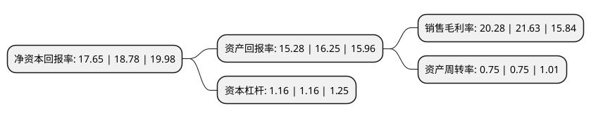

> 本页面由自动化程序生成于 2022年5月20日 01:07
> 内容可能存在错误，如有bug请提交issue至：https://github.com/Eroleice/doc-pi/issues
{.is-warning}

# 上市公司基本情况

## 基本资料

江苏恩华药业股份有限公司（以下简称“恩华药业”）成立于1999年03月29日，徐州市。于2008年07月23日在深交所中小板上市。

恩华药业注册资本100,758.809万元，主营业务为中枢神经药物制剂及原料药的生产和销售，医药商业。子公司恩华和润主营业务为药品物流，子公司恩华统一的主营业务为药品零售。子公司颐海药业的主营业务以中成药品，保健药品为主，子公司远恒药业的主营业务以妇科，皮肤科等外用药品为主。医药商业。以下是详细信息：

- 公司名称: 江苏恩华药业股份有限公司
- 股票代码: 002262.SZ
- 所在地: 江苏 - 徐州市
- 成立日期: 1999年03月29日
- 注册资本: 100,758.809万元
- 法定代表人: 孙彭生
- 主营业务: 主营业务为中枢神经药物制剂及原料药的生产和销售，医药商业子公司恩华和润主营业务为药品物流，子公司恩华统一的主营业务为药品零售子公司颐海药业的主营业务以中成药品，保健药品为主，子公司远恒药业的主营业务以妇科，皮肤科等外用药品为主医药商业
- 公司官网: www.nhwa-group.com
- 公司介绍: 公司战略定位于中枢神经药物领域市场，主要从事中枢神经系统药物的开发、生产和销售，是一家专注于中枢神经药物细分市场的企业，主要类别包括麻醉类、精神类和神经类，通过多年来在产品研发、生产和服务上的不懈努力，公司已建立起完整的中枢神经系统药物产品系列和营销网络，努力打造国内重要的中枢神经系统药物的生产商和销售商。公司是企业技术中心为国家级企业技术中心，设有企业院士工作站、国家博士后科研工作站、江苏省神经药物工程技术研究中心，与国内外一流的科研院所建立了密切的合作关系，开展了广泛的产学研合作和学术交流，包括上海医药工业研究院、军事医学科学院、华中科技大学、中国药科大学、中国协和医科大学、以色列D-Pharm公司、以色列Mapi公司、美国立博公司(LIPOSEUTICAL Inc)及努瓦克斯制药有限公司(NuvOx Pharma,LLC)等。

## 股东及高管情况

上市公司第一大股东为徐州恩华投资有限公司，持股354,126,321股，占比35.15%，为上市公司实际控制人。

截至2022年03月31日，上市公司的前十大股东中，共有6名自然人股东，1名机构股东，2个产品账户，1个海外主体，其中5%以上大股东共有1名。上市公司前十大股东明细如下：

> 截至2022年03月31日，上市公司前十大股东信息如下：

| 股东名称 | 持股数量（股） | 持股比例 |
| --- | --- | --- |
| 徐州恩华投资有限公司 | 354,126,321 | 35.15% |
| 孙彭生 | 49,500,638 | 4.91% |
| 香港中央结算有限公司(陆股通) | 41,286,414 | 4.1% |
| 陈增良 | 39,928,590 | 3.96% |
| 付卿 | 39,928,587 | 3.96% |
| 杨自亮 | 37,532,435 | 3.72% |
| 张旭 | 17,148,100 | 1.7% |
| 全国社保基金四一八组合 | 14,589,472 | 1.45% |
| 中信证券-中信银行-中信证券卓越成长两年持有期混合型集合资产管理计划 | 13,873,692 | 1.38% |
| 马武生 | 12,442,708 | 1.23% |

## 利润表分析

上市公司2021年总收入为39.35亿元，净利润为7.98亿元，实现盈利。

## 杜邦分析

> 数据列示周期：2021年 | 2020年 | 2019年
{.is-info}

上市公司的净资产收益率在近一年有所下降，下降幅度为-6.02%，其变化情况分解如下：
- 上市公司的销售毛利率在近一年下降了-6.24%，可能是生产效率的下降、商品原材料价格上涨或商品价格的下跌所致。
- 上市公司的资产周转率在近一年下降了0%，可能是源自于更慢的销售回款或库存管理效果下降。
- 上市公司的财务杠杆比率在近一年下降了0%，可能是减少负债降低财务费用。

