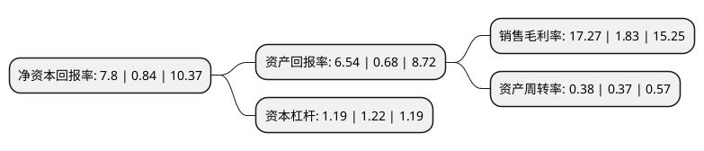

> 本页面由自动化程序生成于 2022年5月20日 01:07
> 内容可能存在错误，如有bug请提交issue至：https://github.com/Eroleice/doc-pi/issues
{.is-warning}

# 上市公司基本情况

## 基本资料

深圳信立泰药业股份有限公司（以下简称“信立泰”）成立于1998年11月03日，深圳市。于2009年09月10日在深交所中小板上市。

信立泰注册资本111,481.654万元，主要产品:硫酸氢氯吡格雷片(泰嘉)，盐酸贝那普利片(信达怡)，注射用盐酸头孢吡肟(信力威)，注射用头孢呋辛钠(信立欣)，注射用头孢西丁钠(信希汀)，注射用帕米膦酸二钠(信尔怡)等，原料药产品主要包括盐酸头孢吡肟，头孢呋辛钠，头孢西丁钠等。主营业务:心血管类，头孢类抗生素，骨吸收抑制剂类等药物的研发，生产和销售。以下是详细信息：

- 公司名称: 深圳信立泰药业股份有限公司
- 股票代码: 002294.SZ
- 所在地: 广东 - 深圳市
- 成立日期: 1998年11月03日
- 注册资本: 111,481.654万元
- 法定代表人: 叶澄海
- 主营业务: 主要产品:硫酸氢氯吡格雷片(泰嘉)，盐酸贝那普利片(信达怡)，注射用盐酸头孢吡肟(信力威)，注射用头孢呋辛钠(信立欣)，注射用头孢西丁钠(信希汀)，注射用帕米膦酸二钠(信尔怡)等，原料药产品主要包括盐酸头孢吡肟，头孢呋辛钠，头孢西丁钠等主营业务:心血管类，头孢类抗生素，骨吸收抑制剂类等药物的研发，生产和销售
- 公司官网: www.salubris.cn
- 公司介绍: 公司是集医药产品研发、生产、销售于一体的综合性医药集团。经过多年的稳健经营，公司位列中国医药工业板块股票市值前十名，先后荣膺“中国医药上市公司竞争力20强”、“中国中小板上市公司价值10强”。公司精确布局全球产业链，将业务范围覆盖至中国、美国、德国、法国、日本等全球38个国家和地区。公司以优质创新产品和循证医学推广为核心竞争力，以心脑血管领域为龙头，拓展降血糖、抗肿瘤、骨科及抗感染等目标领域，通过自主研发、技术合作、投资并购多种途径，快速丰富产品线，发展多个重磅产品，共建医药生态链。公司集团研究院下设化学药研发、生物药研发及医疗器械研发三个板块，由归国博士、资深专家、高级研究员组成的近千人研发团队，在研项目百多项。公司在国内拥有一支两千多名专业医学人员组成的销售团队，业务覆盖全国各省市上万家医院。公司拥有众多自主知识产权产品，如1.1类降血压创新药“信立坦”、3.1类首家上市化学药“泰加宁”、市场上最畅销的抗血小板凝集药物“泰嘉”等高端处方药。

## 股东及高管情况

上市公司第一大股东为信立泰药业有限公司，持股635,279,380股，占比56.99%，为上市公司实际控制人。

截至2022年03月31日，上市公司的前十大股东中，共有2名自然人股东，6名机构股东，1个产品账户，1个海外主体，其中5%以上大股东共有1名。上市公司前十大股东明细如下：

> 截至2022年03月31日，上市公司前十大股东信息如下：

| 股东名称 | 持股数量（股） | 持股比例 |
| --- | --- | --- |
| 信立泰药业有限公司 | 635,279,380 | 56.99% |
| 中信里昂资产管理有限公司-客户资金 | 52,300,800 | 4.69% |
| 深圳市润复投资发展有限公司 | 22,465,952 | 2.02% |
| 香港中央结算有限公司(陆股通) | 20,386,709 | 1.83% |
| 深圳信立泰药业股份有限公司-第二期员工持股计划 | 17,503,178 | 1.57% |
| 中央汇金资产管理有限责任公司 | 14,066,700 | 1.26% |
| 王国华 | 9,357,013 | 0.84% |
| 安耐德合伙人有限公司-客户资金 | 5,934,431 | 0.53% |
| 罗欢笑 | 5,767,675 | 0.52% |
| 上海上国投资产管理有限公司 | 3,524,850 | 0.32% |

## 利润表分析

上市公司2021年总收入为30.58亿元，净利润为5.28亿元，实现盈利。

## 杜邦分析

> 数据列示周期：2021年 | 2020年 | 2019年
{.is-info}

上市公司的净资产收益率在近一年有所上升，上升幅度为828.57%，其变化情况分解如下：
- 上市公司的销售毛利率在近一年上升了843.72%，可能是生产效率的提升、商品原材料价格下跌或商品价格的上涨所致。
- 上市公司的资产周转率在近一年上升了2.7%，可能是源自于更快的销售回款或库存管理效果提升。
- 上市公司的财务杠杆比率在近一年下降了-2.46%，可能是减少负债降低财务费用。

