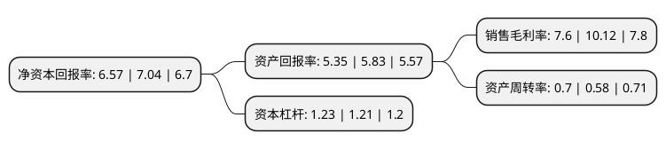

> 本页面由自动化程序生成于 2022年5月20日 01:08
> 内容可能存在错误，如有bug请提交issue至：https://github.com/Eroleice/doc-pi/issues
{.is-warning}

# 上市公司基本情况

## 基本资料

潜江永安药业股份有限公司（以下简称“永安药业”）成立于2001年06月18日，潜江市。于2010年03月05日在深交所中小板上市。

永安药业注册资本29,468.25万元，本公司主要从事牛磺酸产品的研发，生产和销售，公司主要产品为牛磺酸。以下是详细信息：

- 公司名称: 潜江永安药业股份有限公司
- 股票代码: 002365.SZ
- 所在地: 湖北 - 潜江市
- 成立日期: 2001年06月18日
- 注册资本: 29,468.25万元
- 法定代表人: 陈勇
- 主营业务: 本公司主要从事牛磺酸产品的研发，生产和销售，公司主要产品为牛磺酸
- 公司官网: www.chinataurine.com
- 公司介绍: 公司成立于2001年，是一家拥有自营进出口权的高新技术企业。公司主要产品为牛磺酸。凭借自主开发的“环氧乙烷法”牛磺酸生产工艺专利技术，公司生产规模是国内乃至全球牛磺酸行业的领先企业。公司具有雄厚的技术开发能力，技术中心被认定为省级企业技术中心和湖北功能性食品添加剂工程技术研究中心。公司具有完善的质量控制体系，已通过ISO9001∶2000国际质量管理体系认证和HACCP体系认证，并获得了KOSHER国际犹太洁食认证证书和国际伊斯兰营养委员会HALAL清真认证证书。历年来，公司多次被评为“全省医药行业十强企业”，湖北省“创汇二十强企业”，湖北省“百佳纳税人”。

## 股东及高管情况

上市公司第一大股东为陈勇，持股63,468,000股，占比21.54%，**疑似为**上市公司实际控制人。

截至2022年03月31日，上市公司的前十大股东中，共有6名自然人股东，2名机构股东，1个产品账户，1个海外主体，其中5%以上大股东共有1名。上市公司前十大股东明细如下：

> 未能通过持股比例判定出上市公司实际控制人（持股30%以上）
> 可能存在通过间接持股、联合持股、协议控制等方式拥有实际控制权的主体，具体请参考上市公司定期公告！
{.is-warning}

> 截至2022年03月31日，上市公司前十大股东信息如下：

| 股东名称 | 持股数量（股） | 持股比例 |
| --- | --- | --- |
| 陈勇 | 63,468,000 | 21.54% |
| 黄冈永安药业有限公司 | 10,529,232 | 3.57% |
| 中央汇金资产管理有限责任公司 | 7,610,350 | 2.58% |
| 李金秀 | 6,028,300 | 2.05% |
| 邹红波 | 3,423,391 | 1.16% |
| 周慧 | 2,465,450 | 0.84% |
| 宋颂 | 2,385,650 | 0.81% |
| 路艳斐 | 2,360,500 | 0.8% |
| 西安向日葵资产管理有限公司-向日葵雨露私募证券投资基金 | 2,140,100 | 0.73% |
| UBS AG | 1,261,679 | 0.43% |

## 利润表分析

上市公司2021年总收入为15.65亿元，净利润为1.19亿元，实现盈利。

## 杜邦分析

> 数据列示周期：2021年 | 2020年 | 2019年
{.is-info}

上市公司的净资产收益率在近一年有所下降，下降幅度为-6.68%，其变化情况分解如下：
- 上市公司的销售毛利率在近一年下降了-24.9%，可能是生产效率的下降、商品原材料价格上涨或商品价格的下跌所致。
- 上市公司的资产周转率在近一年上升了20.69%，可能是源自于更快的销售回款或库存管理效果提升。
- 上市公司的财务杠杆比率在近一年上升了1.65%，可能是增加负债扩大生产规模。

