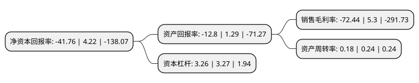

> 本页面由自动化程序生成于 2022年5月20日 01:08
> 内容可能存在错误，如有bug请提交issue至：https://github.com/Eroleice/doc-pi/issues
{.is-warning}

# 上市公司基本情况

## 基本资料

浙江亚太药业股份有限公司（以下简称“亚太药业”）成立于2001年12月31日，绍兴市。于2010年03月16日在深交所中小板上市。

亚太药业注册资本53,661.809万元，主营业务为化学制剂药的研发，生产和销售。公司产品目前共有89个药品规格，就药品大类而言，抗生素类药品是公司的主导产品种类。以下是详细信息：

- 公司名称: 浙江亚太药业股份有限公司
- 股票代码: 002370.SZ
- 所在地: 浙江 - 绍兴市
- 成立日期: 2001年12月31日
- 注册资本: 53,661.809万元
- 法定代表人: 沈依伊
- 主营业务: 主营业务为化学制剂药的研发，生产和销售公司产品目前共有89个药品规格，就药品大类而言，抗生素类药品是公司的主导产品种类
- 公司官网: www.ytyaoye.com
- 公司介绍: 公司是一家集科研、生产、销售于一体的专业化、规模化的国家高新技术企业和国家火炬计划重点高新技术企业，公司拥有片剂(含青霉素类)、硬胶囊剂(含头孢菌素类、青霉素类)、透皮贴剂(激素类)、冻干粉针剂、粉针剂(头孢菌素类)、阿奇霉素、罗红霉素等11个通过国家GMP质量体系认证的现代化制药生产车间，共拥有药品批准文号97个。目前公司是“国家高新技术企业”、“国家火炬计划重点高新技术企业”、“浙江省工商企业信用A级守合同重信用单位”。公司药物研发中心是“浙江省省级高新技术研究开发中心”、“浙江省省级企业技术中心”和“浙江省博士后科研工作站”。“雅泰”商标被评为“浙江省著名商标”。

## 股东及高管情况

上市公司第一大股东为宁波富邦控股集团有限公司，持股77,150,000股，占比14.38%，**疑似为**上市公司实际控制人。

截至2022年03月31日，上市公司的前十大股东中，共有6名自然人股东，3名机构股东，1个海外主体，其中5%以上大股东共有1名。上市公司前十大股东明细如下：

> 未能通过持股比例判定出上市公司实际控制人（持股30%以上）
> 可能存在通过间接持股、联合持股、协议控制等方式拥有实际控制权的主体，具体请参考上市公司定期公告！
{.is-warning}

> 截至2022年03月31日，上市公司前十大股东信息如下：

| 股东名称 | 持股数量（股） | 持股比例 |
| --- | --- | --- |
| 宁波富邦控股集团有限公司 | 77,150,000 | 14.38% |
| 吕旭幸 | 20,097,040 | 3.74% |
| 上海汉贵投资管理有限公司 | 19,525,566 | 3.64% |
| 沈依伊 | 18,087,336 | 3.37% |
| 浙江亚太集团有限公司 | 12,600,000 | 2.35% |
| 樊泓曦 | 2,587,602 | 0.48% |
| 金海波 | 2,457,800 | 0.46% |
| 钟婉珍 | 2,000,000 | 0.37% |
| JPMORGAN CHASE BANK,NATIONAL ASSOCIATION | 1,901,100 | 0.35% |
| 李海彬 | 1,857,732 | 0.35% |

## 利润表分析

上市公司2021年总收入为3.15亿元，净利润为-2.29亿元，**未实现盈利**。

## 杜邦分析

> 数据列示周期：2021年 | 2020年 | 2019年
{.is-info}

上市公司的净资产收益率在近一年有所下降，下降幅度为-1089.57%，其变化情况分解如下：
- 上市公司的销售毛利率在近一年下降了-1466.79%，可能是生产效率的下降、商品原材料价格上涨或商品价格的下跌所致。
- 上市公司的资产周转率在近一年下降了-25%，可能是源自于更慢的销售回款或库存管理效果下降。
- 上市公司的财务杠杆比率在近一年下降了-0.31%，可能是减少负债降低财务费用。

