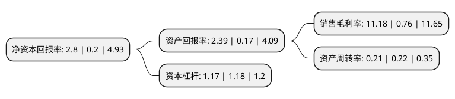

> 本页面由自动化程序生成于 2022年5月20日 01:08
> 内容可能存在错误，如有bug请提交issue至：https://github.com/Eroleice/doc-pi/issues
{.is-warning}

# 上市公司基本情况

## 基本资料

天津力生制药股份有限公司（以下简称“力生制药”）成立于1981年06月17日，天津市。于2010年04月23日在深交所中小板上市。

力生制药注册资本18,245.499万元，公司及其控股子公司主要从事化学药片剂，硬胶囊剂，滴丸剂，冻干粉针剂，水针剂，原料药等产品的生产销售。公司日常生产20多个类别，100多个品种规格的各剂型药品，主要有心脑血管系统用药(主要产品为抗高血压药“寿比山”牌吲达帕胺片)，抗感染药物(主要产品为抗真菌药“美扶”牌伊曲康唑胶囊)，糖皮质激素类药物(主要产品为“生化”牌氢化可的松琥珀酸钠)等多个优质品种。以下是详细信息：

- 公司名称: 天津力生制药股份有限公司
- 股票代码: 002393.SZ
- 所在地: 天津 - 天津市
- 成立日期: 1981年06月17日
- 注册资本: 18,245.499万元
- 法定代表人: 徐道情
- 主营业务: 公司及其控股子公司主要从事化学药片剂，硬胶囊剂，滴丸剂，冻干粉针剂，水针剂，原料药等产品的生产销售公司日常生产20多个类别，100多个品种规格的各剂型药品，主要有心脑血管系统用药(主要产品为抗高血压药“寿比山”牌吲达帕胺片)，抗感染药物(主要产品为抗真菌药“美扶”牌伊曲康唑胶囊)，糖皮质激素类药物(主要产品为“生化”牌氢化可的松琥珀酸钠)等多个优质品种
- 公司官网: www.lishengpharma.com
- 公司介绍: 公司是一家从事化学药片剂、硬胶囊剂、滴丸剂、冻干粉针剂、水针剂、原料药等产品的生产销售大型医药企业。日常生产20多个类别、100多个品种规格的各剂型药品，产品为高血压治疗药“寿比山”牌吲达帕胺片，广谱抗真菌治疗药“美扶”牌伊曲康唑胶囊，溃疡性结肠炎治疗药“畅美”牌奥沙拉嗪胶囊，哮喘病治疗药“盼得欣”牌富马酸福莫特罗片，解热镇痛药“三鱼”牌正痛片，老年痴呆症治疗药“阿海适”牌盐酸多奈派奇片，血栓疾病治疗药“益欣雪”胶囊，糖皮质激素类药“生化”牌注射用氢化可的松琥珀酸钠等多个优质品种。“寿比山”牌吲达帕胺片被授予“天津市名牌产品”,“寿比山”商标被认定为驰名商标。

## 股东及高管情况

上市公司第一大股东为天津金浩医药有限公司，持股93,710,608股，占比51.36%，为上市公司实际控制人。

截至2022年03月31日，上市公司的前十大股东中，共有7名自然人股东，2名机构股东，1个海外主体，其中5%以上大股东共有1名。上市公司前十大股东明细如下：

> 截至2022年03月31日，上市公司前十大股东信息如下：

| 股东名称 | 持股数量（股） | 持股比例 |
| --- | --- | --- |
| 天津金浩医药有限公司 | 93,710,608 | 51.36% |
| 天津市西青经济开发总公司 | 1,301,535 | 0.71% |
| 孙治明 | 890,300 | 0.49% |
| 蒋彩娟 | 850,448 | 0.47% |
| 钱菊芳 | 837,900 | 0.46% |
| 薛佩珊 | 760,600 | 0.42% |
| JPMORGAN CHASE BANK,NATIONAL ASSOCIATION | 705,391 | 0.39% |
| 阮彩友 | 649,300 | 0.36% |
| 罗育文 | 600,000 | 0.33% |
| 周雅美 | 502,800 | 0.28% |

## 利润表分析

上市公司2021年总收入为10.91亿元，净利润为1.22亿元，实现盈利。

## 杜邦分析

> 数据列示周期：2021年 | 2020年 | 2019年
{.is-info}

上市公司的净资产收益率在近一年有所上升，上升幅度为1300%，其变化情况分解如下：
- 上市公司的销售毛利率在近一年上升了1371.05%，可能是生产效率的提升、商品原材料价格下跌或商品价格的上涨所致。
- 上市公司的资产周转率在近一年下降了-4.55%，可能是源自于更慢的销售回款或库存管理效果下降。
- 上市公司的财务杠杆比率在近一年下降了-0.85%，可能是减少负债降低财务费用。

