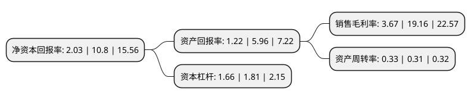

> 本页面由自动化程序生成于 2022年5月20日 01:08
> 内容可能存在错误，如有bug请提交issue至：https://github.com/Eroleice/doc-pi/issues
{.is-warning}

# 上市公司基本情况

## 基本资料

深圳市海普瑞药业集团股份有限公司（以下简称“海普瑞”）成立于1998年04月21日，深圳市。于2010年05月06日在深交所中小板上市。

海普瑞注册资本146,729.62万元，主营业务:肝素钠原料药的研究，生产和销售，主要产品:肝素钠原料药。以下是详细信息：

- 公司名称: 深圳市海普瑞药业集团股份有限公司
- 股票代码: 002399.SZ
- 所在地: 广东 - 深圳市
- 成立日期: 1998年04月21日
- 注册资本: 146,729.62万元
- 法定代表人: 李锂
- 主营业务: 主营业务:肝素钠原料药的研究，生产和销售，主要产品:肝素钠原料药
- 公司官网: www.hepalink.com
- 公司介绍: 公司产品肝素钠原料药，出口全球，客户包括世界知名的跨国医药企业，如Sanofi-Aventis，Fresenius Kabi，Novartis等。多年来，海普瑞在肝素钠产品研发生产的专业领域精耕细作，独创了世界领先的肝素钠“杂质与组合分离技术”、“基团完整性保护和活性释放技术”等核心工艺技术体系，建立了符合我国药品GMP规范以及美国和欧盟cGMP药品规范和理念的全面质量管理体系，公司不仅顺利通过了美国FDA及欧盟CEP的药政批准，还是美国药典标准修订的主要参与者和标准提供者。海普瑞还先后承担了国家生物高技术产业化示范工程项目、国家火炬计划项目、国家重点技术创新项目等国家级科技项目，为我国肝素产业的技术进步、产业升级、出口创汇能力的提高做出了重要贡献，公司先后取得“国家技术创新优秀新产品奖”、“深圳经济特区30年杰出贡献企业”、“深圳市优秀民营企业”、“深圳市优强中小企业”、“深圳市民营领军骨干企业”等荣誉，成为国家和深圳市的重点高新技术企业。

## 股东及高管情况

上市公司第一大股东为深圳市乐仁科技有限公司，持股474,029,899股，占比32.31%，为上市公司实际控制人。

截至2022年03月31日，上市公司的前十大股东中，共有1名自然人股东，4名机构股东，3个产品账户，2个海外主体，其中5%以上大股东共有3名。上市公司前十大股东明细如下：

> 截至2022年03月31日，上市公司前十大股东信息如下：

| 股东名称 | 持股数量（股） | 持股比例 |
| --- | --- | --- |
| 深圳市乐仁科技有限公司 | 474,029,899 | 32.31% |
| 乌鲁木齐金田土股权投资合伙企业(有限合伙) | 408,041,280 | 27.81% |
| 香港中央结算(代理人)有限公司 | 220,044,480 | 15% |
| 乌鲁木齐水滴石穿股权投资合伙企业(有限合伙) | 46,425,600 | 3.16% |
| 乌鲁木齐飞来石股权投资有限公司 | 40,320,000 | 2.75% |
| 香港中央结算有限公司(陆股通) | 24,240,734 | 1.65% |
| 深圳市海普瑞药业股份有限公司-第二期员工持股计划 | 15,118,035 | 1.03% |
| 黄权威 | 4,089,065 | 0.28% |
| 深圳市海普瑞药业集团股份有限公司-第三期员工持股计划 | 3,886,264 | 0.26% |
| 中国对外经济贸易信托有限公司-外贸信托-高毅晓峰鸿远集合资金信托计划 | 3,679,626 | 0.25% |

## 利润表分析

上市公司2021年总收入为63.65亿元，净利润为2.33亿元，实现盈利。

## 杜邦分析

> 数据列示周期：2021年 | 2020年 | 2019年
{.is-info}

上市公司的净资产收益率在近一年有所下降，下降幅度为-81.2%，其变化情况分解如下：
- 上市公司的销售毛利率在近一年下降了-80.85%，可能是生产效率的下降、商品原材料价格上涨或商品价格的下跌所致。
- 上市公司的资产周转率在近一年上升了6.45%，可能是源自于更快的销售回款或库存管理效果提升。
- 上市公司的财务杠杆比率在近一年下降了-8.29%，可能是减少负债降低财务费用。

