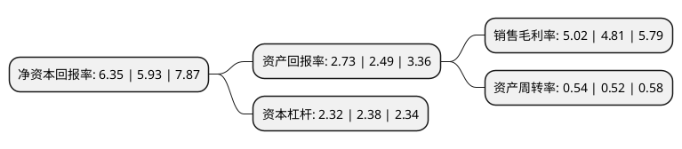

> 本页面由自动化程序生成于 2022年5月20日 01:09
> 内容可能存在错误，如有bug请提交issue至：https://github.com/Eroleice/doc-pi/issues
{.is-warning}

# 上市公司基本情况

## 基本资料

四川科伦药业股份有限公司（以下简称“科伦药业”）成立于2002年05月29日，成都市。于2010年06月03日在深交所中小板上市。

科伦药业注册资本142,542.286万元，主要产品:大输液产品。主营业务:大容量注射剂，片剂，胶囊剂，粉针剂，冻干粉针剂及中药口服液等制剂药品的研究，开发，生产及销售。以下是详细信息：

- 公司名称: 四川科伦药业股份有限公司
- 股票代码: 002422.SZ
- 所在地: 四川 - 成都市
- 成立日期: 2002年05月29日
- 注册资本: 142,542.286万元
- 法定代表人: 刘革新
- 主营业务: 主要产品:大输液产品主营业务:大容量注射剂，片剂，胶囊剂，粉针剂，冻干粉针剂及中药口服液等制剂药品的研究，开发，生产及销售
- 公司官网: www.kelun.com
- 公司介绍: 公司生产和销售包括大容量注射剂(输液)、小容量注射剂(水针)、注射用无菌粉针(含分装粉针及冻干粉针)、片剂、胶囊剂、颗粒剂、口服液、覆膜透析液以及原料药、医药包材、医疗器械，以及抗生素中间体等产品。公司是中国输液行业中品种最为齐全、包装形式最为完备的医药制造企业之一，公司连续被审定为“国家第三批创新型企业”；首批“国家技术创新示范企业”，成为四川省内唯一获此殊荣的医药企业“国家地方联合工程实验室”；首批“工业品牌培育示范企业”、“国家级信息化和工业化深度融合示范企业”。此外，“科伦”文字及图形商标“KLKELUN”均被国家工商行政管理总局商标局评定为“中国驰名商标”。公司还被四川省委组织部、省经信委、省国资委、省教育厅、省科技厅、省人社厅、省科协联合评定为四川省院士(专家)工作站。

## 股东及高管情况

上市公司第一大股东为刘革新，持股379,128,280股，占比26.6%，**疑似为**上市公司实际控制人。

截至2022年04月26日，上市公司的前十大股东中，共有5名自然人股东，3名机构股东，1个产品账户，1个海外主体，其中5%以上大股东共有2名。上市公司前十大股东明细如下：

> 未能通过持股比例判定出上市公司实际控制人（持股30%以上）
> 可能存在通过间接持股、联合持股、协议控制等方式拥有实际控制权的主体，具体请参考上市公司定期公告！
{.is-warning}

> 截至2022年04月26日，上市公司前十大股东信息如下：

| 股东名称 | 持股数量（股） | 持股比例 |
| --- | --- | --- |
| 刘革新 | 379,128,280 | 26.6% |
| 雅安市国有资产经营有限责任公司 | 93,801,074 | 6.58% |
| 潘慧 | 69,020,846 | 4.84% |
| 香港中央结算有限公司(陆股通) | 59,908,755 | 4.2% |
| 四川科伦药业股份有限公司回购专用证券账户 | 20,366,580 | 1.43% |
| 中信建投证券股份有限公司 | 16,872,097 | 1.18% |
| 刘亚光 | 15,119,962 | 1.06% |
| 尹凤刚 | 14,458,532 | 1.01% |
| 潘渠 | 14,167,440 | 0.99% |
| 泰康人寿保险有限责任公司-投连-创新动力 | 12,881,059 | 0.9% |

## 利润表分析

上市公司2021年总收入为172.77亿元，净利润为8.68亿元，实现盈利。

## 杜邦分析

> 数据列示周期：2021年 | 2020年 | 2019年
{.is-info}

上市公司的净资产收益率在近一年有所上升，上升幅度为7.08%，其变化情况分解如下：
- 上市公司的销售毛利率在近一年上升了4.37%，可能是生产效率的提升、商品原材料价格下跌或商品价格的上涨所致。
- 上市公司的资产周转率在近一年上升了3.85%，可能是源自于更快的销售回款或库存管理效果提升。
- 上市公司的财务杠杆比率在近一年下降了-2.52%，可能是减少负债降低财务费用。

