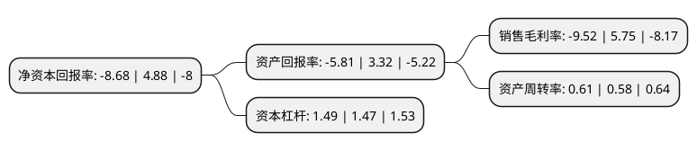

> 本页面由自动化程序生成于 2022年5月20日 01:09
> 内容可能存在错误，如有bug请提交issue至：https://github.com/Eroleice/doc-pi/issues
{.is-warning}

# 上市公司基本情况

## 基本资料

长江润发健康产业股份有限公司（以下简称“长江健康”）成立于1999年09月09日，苏州市。于2010年06月18日在深交所中小板上市。

长江健康注册资本123,598.302万元，医药制造业务，机械制造业务以下是详细信息：

- 公司名称: 长江润发健康产业股份有限公司
- 股票代码: 002435.SZ
- 所在地: 江苏 - 苏州市
- 成立日期: 1999年09月09日
- 注册资本: 123,598.302万元
- 法定代表人: 郁霞秋
- 主营业务: 医药制造业务，机械制造业务
- 公司官网: cjjkcy.com
- 公司介绍: 公司主要从事药物的研发、生产与销售、电梯导轨系统部件的研发、生产、销售及服务，为客户提供创新研发、电梯导轨系统解决方案的服务。公司为国家高新技术企业，建有省级工程技术研究中心、院士工作站、研究生工作站，是中国电梯协会副理事单位，具备为客户创新研发、提供电梯导轨解决方案的能力。2016年，公司通过重大资产重组，长江医药投资成为公司的全资子公司。公司在原有主营业务基础上新增抗感染药物研发、生产和销售业务。目前公司所有的生产线均通过GMP认证。

## 股东及高管情况

上市公司第一大股东为长江润发集团有限公司，持股470,667,365股，占比38.08%，为上市公司实际控制人。

截至2022年05月09日，上市公司的前十大股东中，共有4名自然人股东，6名机构股东，其中5%以上大股东共有4名。上市公司前十大股东明细如下：

> 截至2022年05月09日，上市公司前十大股东信息如下：

| 股东名称 | 持股数量（股） | 持股比例 |
| --- | --- | --- |
| 长江润发集团有限公司 | 470,667,365 | 38.08% |
| 中山松德张家港保税区医药产业股权投资企业(有限合伙) | 133,967,797 | 10.839% |
| 东吴创业投资有限公司-苏州苏上健康产业投资合伙企业(有限合伙) | 94,830,788 | 7.67% |
| 东吴创业投资有限公司-苏州苏上健康产业投资合伙企业(有限合伙) | 94,830,788 | 7.67% |
| 长江润发张家港保税区医药产业股权投资企业(有限合伙) | 30,965,390 | 2.51% |
| 李柏森 | 15,778,125 | 1.28% |
| 杨树恒康张家港保税区医药产业股权投资企业(有限合伙) | 13,160,909 | 1.06% |
| 郁霞秋 | 13,016,952 | 1.05% |
| 郁全和 | 11,833,594 | 0.96% |
| 邱其琴 | 8,875,194 | 0.72% |

## 利润表分析

上市公司2021年总收入为43.69亿元，净利润为-4.16亿元，**未实现盈利**。

## 杜邦分析

> 数据列示周期：2021年 | 2020年 | 2019年
{.is-info}

上市公司的净资产收益率在近一年有所下降，下降幅度为-277.87%，其变化情况分解如下：
- 上市公司的销售毛利率在近一年下降了-265.57%，可能是生产效率的下降、商品原材料价格上涨或商品价格的下跌所致。
- 上市公司的资产周转率在近一年上升了5.17%，可能是源自于更快的销售回款或库存管理效果提升。
- 上市公司的财务杠杆比率在近一年上升了1.36%，可能是增加负债扩大生产规模。

