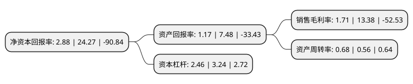

> 本页面由自动化程序生成于 2022年5月20日 01:09
> 内容可能存在错误，如有bug请提交issue至：https://github.com/Eroleice/doc-pi/issues
{.is-warning}

# 上市公司基本情况

## 基本资料

哈尔滨誉衡药业股份有限公司（以下简称“誉衡药业”）成立于2000年03月27日，哈尔滨市。于2010年06月23日在深交所中小板上市。

誉衡药业注册资本219,812.295万元，主营业务为药品生产及销售。公司主导产品为鹿瓜多肽注射液和注射用盐酸吉西他滨，分别应用于治疗骨科和肿瘤疾病，是公司利润的主要来源。以下是详细信息：

- 公司名称: 哈尔滨誉衡药业股份有限公司
- 股票代码: 002437.SZ
- 所在地: 黑龙江 - 哈尔滨市
- 成立日期: 2000年03月27日
- 注册资本: 219,812.295万元
- 法定代表人: 王东绪
- 主营业务: 主营业务为药品生产及销售公司主导产品为鹿瓜多肽注射液和注射用盐酸吉西他滨，分别应用于治疗骨科和肿瘤疾病，是公司利润的主要来源
- 公司官网: www.gloria.cc
- 公司介绍: 公司成立于2000年3月，是一家以医药大健康产业为主线，以制药业务为核心，涵盖科研、生产、营销等领域的高科技企业集团。自2010年上市以来，公司坚持“产品领先”战略，通过外延并购、合作代理、自主研发、海外引进等多种方式丰富公司产品线，实现了由上市初狭窄单一的骨科治疗领域向现有心脑血管等大治疗领域的拓展，形成了包括心脑血管领域、骨骼肌肉领域、营养用药领域等多个重磅级产品集群，多产品驱动业绩增长的新格局逐步显现。公司是国家科技部认定的“国家火炬计划新医药产业基地首批骨干企业”；黑龙江省政府认定的“高新技术企业”；中国医药工业信息中心评出的“2016年度中国医药工业百强”；中国医药企业管理协会评出的“中国最具竞争力医药上市公司20强”；中国化学制药工业协会等多家行业协会联合评出的“2017中国化学制药行业工业企业综合实力百强”，同时荣获“成长型优秀企业品牌”称号。

## 股东及高管情况

上市公司第一大股东为哈尔滨誉衡集团有限公司，持股706,248,522股，占比32.13%，为上市公司实际控制人。

截至2022年03月31日，上市公司的前十大股东中，共有3名自然人股东，3名机构股东，2个产品账户，2个海外主体，其中5%以上大股东共有1名。上市公司前十大股东明细如下：

> 截至2022年03月31日，上市公司前十大股东信息如下：

| 股东名称 | 持股数量（股） | 持股比例 |
| --- | --- | --- |
| 哈尔滨誉衡集团有限公司 | 706,248,522 | 32.13% |
| 国泰君安证券股份有限公司 | 94,531,800 | 4.3% |
| YU HENG INTERNATIONAL INVESTMENTS CORPORATION | 56,778,123 | 2.58% |
| ORIENTAL KEYSTONE INVESTMENT LIMITED | 42,904,599 | 1.95% |
| 吴顺水 | 11,080,153 | 0.5% |
| 王东绪 | 9,210,000 | 0.42% |
| 佛山市一路无忧贸易有限公司 | 7,215,100 | 0.33% |
| 于德兵 | 5,980,500 | 0.27% |
| 上海方圆达创投资合伙企业(有限合伙)-方圆-东方12号私募投资基金 | 5,000,000 | 0.23% |
| 上海方圆达创投资合伙企业(有限合伙)-方圆-东方6号私募投资基金 | 5,000,000 | 0.23% |

## 利润表分析

上市公司2021年总收入为31.45亿元，净利润为0.53亿元，实现盈利。

## 杜邦分析

> 数据列示周期：2021年 | 2020年 | 2019年
{.is-info}

上市公司的净资产收益率在近一年有所下降，下降幅度为-88.13%，其变化情况分解如下：
- 上市公司的销售毛利率在近一年下降了-87.22%，可能是生产效率的下降、商品原材料价格上涨或商品价格的下跌所致。
- 上市公司的资产周转率在近一年上升了21.43%，可能是源自于更快的销售回款或库存管理效果提升。
- 上市公司的财务杠杆比率在近一年下降了-24.07%，可能是减少负债降低财务费用。

