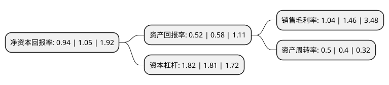

> 本页面由自动化程序生成于 2022年5月20日 01:10
> 内容可能存在错误，如有bug请提交issue至：https://github.com/Eroleice/doc-pi/issues
{.is-warning}

# 上市公司基本情况

## 基本资料

兄弟科技股份有限公司（以下简称“兄弟科技”）成立于2001年03月19日，嘉兴市。于2011年03月10日在深交所中小板上市。

兄弟科技注册资本106,287.535万元，主营业务:维生素和皮革化学品的研发，生产与销售等业务。以下是详细信息：

- 公司名称: 兄弟科技股份有限公司
- 股票代码: 002562.SZ
- 所在地: 浙江 - 嘉兴市
- 成立日期: 2001年03月19日
- 注册资本: 106,287.535万元
- 法定代表人: 钱志达
- 主营业务: 主营业务:维生素和皮革化学品的研发，生产与销售等业务
- 公司官网: www.brother.com.cn
- 公司介绍: 公司为全球皮革化学品的主流供应商、维生素行业的领导者、医药原料药和香精香料等产品的优质供应商。公司主要从事维生素和皮革化学品的研发、生产与销售等业务。公司的主要产品为维生素K3、维生素B1、铬鞣剂和皮革助剂。公司“维生素K3饲料添加剂”项目被科学技术部火炬高技术产业开发中心认定为国家级火炬计划项目；公司研制的维生素K3饲料添加剂被浙江省科学技术厅认定为浙江省高新技术产品。公司被科学技术部火炬高技术产业开发中心认定为“国家火炬计划重点高新技术企业”，承担了多项国家火炬计划项目。

## 股东及高管情况

上市公司第一大股东为钱志达，持股257,395,438股，占比24.22%，**疑似为**上市公司实际控制人。

截至2022年03月31日，上市公司的前十大股东中，共有8名自然人股东，2个产品账户，其中5%以上大股东共有2名。上市公司前十大股东明细如下：

> 未能通过持股比例判定出上市公司实际控制人（持股30%以上）
> 可能存在通过间接持股、联合持股、协议控制等方式拥有实际控制权的主体，具体请参考上市公司定期公告！
{.is-warning}

> 截至2022年03月31日，上市公司前十大股东信息如下：

| 股东名称 | 持股数量（股） | 持股比例 |
| --- | --- | --- |
| 钱志达 | 257,395,438 | 24.22% |
| 钱志明 | 214,182,400 | 20.15% |
| 白孝明 | 11,937,800 | 1.12% |
| 祁林荣 | 11,614,868 | 1.09% |
| 兄弟科技股份有限公司-第一期员工持股计划 | 6,791,240 | 0.64% |
| 国泰君安证券资管-山东铁路发展基金有限公司-国君资管2765单一资产管理计划 | 6,369,427 | 0.6% |
| 方丽平 | 5,335,400 | 0.5% |
| 方林 | 5,050,000 | 0.48% |
| 周中平 | 3,376,000 | 0.32% |
| 李健平 | 3,280,000 | 0.31% |

## 利润表分析

上市公司2021年总收入为27.32亿元，净利润为0.28亿元，实现盈利。

## 杜邦分析

> 数据列示周期：2021年 | 2020年 | 2019年
{.is-info}

上市公司的净资产收益率在近一年有所下降，下降幅度为-10.48%，其变化情况分解如下：
- 上市公司的销售毛利率在近一年下降了-28.77%，可能是生产效率的下降、商品原材料价格上涨或商品价格的下跌所致。
- 上市公司的资产周转率在近一年上升了25%，可能是源自于更快的销售回款或库存管理效果提升。
- 上市公司的财务杠杆比率在近一年上升了0.55%，可能是增加负债扩大生产规模。

